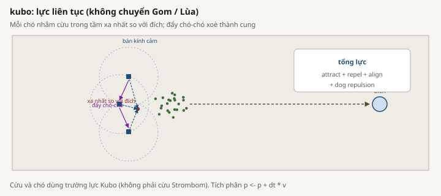
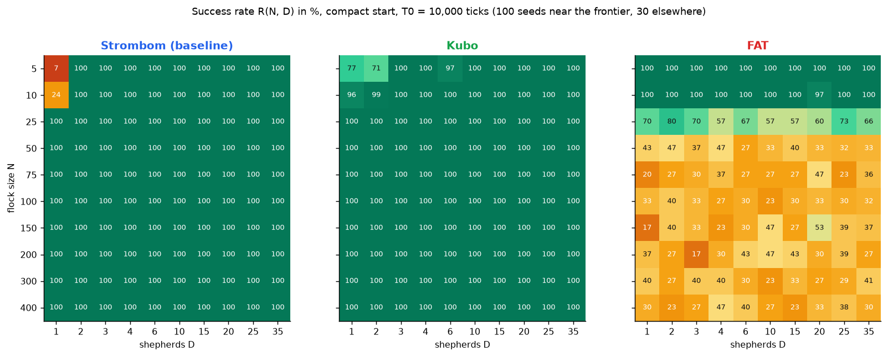
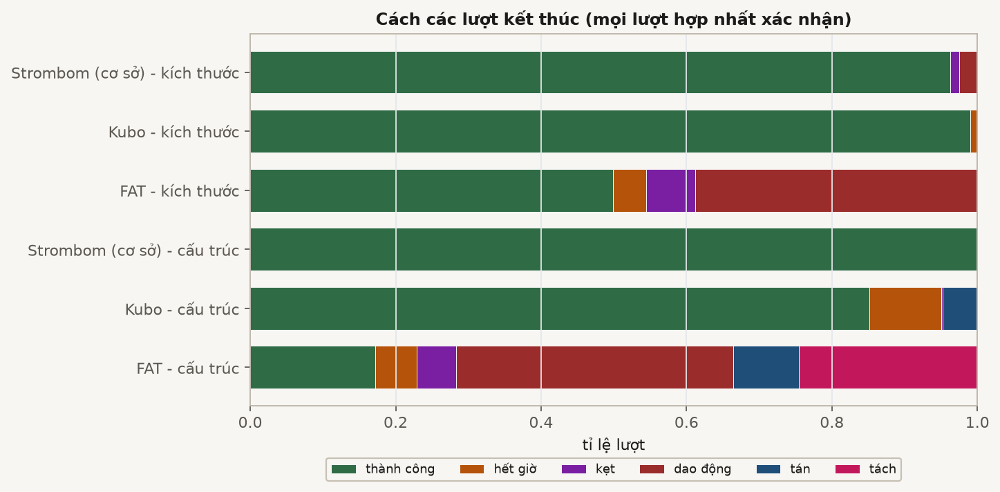
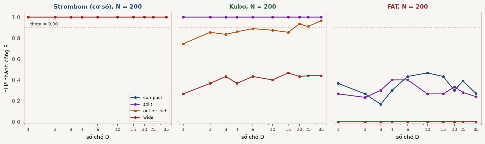
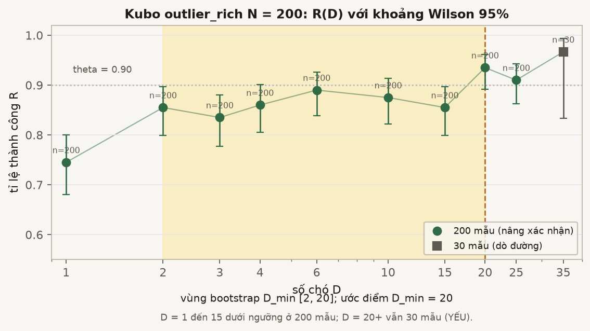

# Chăn đàn dựa trên lực Kubo

## Cảm hứng từ công bố

Kubo và cộng sự (2022) mô hình hóa cừu và nhiều chó bằng tổng lực liên tục, không dùng chuyển Collect/Drive rời rạc. Cừu kết hợp lực đẩy láng giềng, căn hướng vận tốc, kết dính, và đẩy khỏi chó. Mỗi chó nhắm con cừu trong tầm xa đích nhất, trong khi lực đẩy khỏi mục tiêu, đẩy khỏi đích, và đẩy giữa các chó tạo chuyển động. Lực đẩy giữa chó có thể xòe đội hình ở sau đàn.

Tài liệu: M. Kubo, M. Tashiro, H. Sato, và cộng sự, "Herd guidance by multiple sheepdog agents with repulsive force," Artificial Life and Robotics 27, 416-427, 2022. DOI: `10.1007/s10015-021-00726-7`.

## Hiện thực HerdSim chính xác

Bundle `kubo` kết hợp:

- `sheep_model=kubo`;
- `dog_controller=kubo_forces`;
- mặc định 40 cừu và 4 chó khi không có ghi đè thí nghiệm.

Phương pháp này không dùng cừu Strombom và không có trạng thái Collect/Drive.

### Bước lực của cừu

Với mỗi con cừu, HerdSim tìm cừu và chó trong `radius = 60`. Hiện thực tính:

- trung bình lực đẩy cừu nghịch đảo bình phương;
- trung bình hướng vận tốc đơn vị của láng giềng đang chạy;
- trung bình lực hút đơn vị về cừu láng giềng;
- trung bình lực đẩy khỏi chó nghịch đảo lập phương.

Vận tốc có trọng số dùng `K_s1..K_s4 = 10, 0.5, 2, 5000`. Độ lớn bị chặn tại `sheep_speed_max = 5`, và vị trí tăng `dt * velocity` với `dt = 0.05`.

### Bước lực của chó

Với mỗi chó đang hoạt động có quan sát không rỗng:

1. Tạo trạng thái cục bộ bị giới hạn bởi quan sát.
2. Giữ cừu trong `radius`.
3. Chọn con trong tầm xa đích nhất.
4. Kết hợp lực hút về mục tiêu, đẩy nghịch đảo lập phương khỏi mục tiêu, đẩy khỏi đích, và đẩy nghịch đảo lập phương khỏi chó khác trong tầm.
5. Dùng `K_f1..K_f4 = 10, 200, 8, 3000`.
6. Chặn tốc độ tại `dog_speed_max = 10` và tăng vị trí `dt * velocity`.

Nếu quan sát không có cừu, bộ điều khiển để chó đứng yên trong tick đó. Cừu cập nhật trước chó trong bước mô phỏng. HerdSim còn áp dụng đích của scenario, hành vi biên sân, hệ số đáp ứng và kết dính từng cá thể, cùng pipeline quan sát quanh các lực này.

Bằng chứng hiện thực:

- [`../../../core/methods.py`](../../../core/methods.py)
- [`../../../methods/kubo/config.py`](../../../methods/kubo/config.py)
- [`../../../methods/kubo/forces.py`](../../../methods/kubo/forces.py)
- [`../../../plugins/sheep/kubo.py`](../../../plugins/sheep/kubo.py)
- [`../../../plugins/dogs/kubo_forces.py`](../../../plugins/dogs/kubo_forces.py)

## Thiết lập `scaling_v2`

Kubo là phương pháp chuyển giao Giai đoạn 4, được so sánh với cơ sở `strombom_multi` trên cùng hình học nhiệm vụ.

- Bản đồ kích thước: compact trên toàn lưới `N` và `D`.
- Bản đồ cấu trúc: bốn bố cục tại `N = {50, 100, 200}`.
- Quan sát: global.
- Hạn: `T0 = 10000`.
- Ngưỡng tin cậy: `R >= 0.90`.
- Phân tầng: 30 seed scout, sau đó 100 seed claim trong cửa sổ đã chọn.
- Độ chính xác bổ sung: `outlier_rich`, `N = 200`, `D` trong `{1, 2, 3, 4, 6, 10, 15, 20, 25}` được tăng lên 200 seed. `D = 35` giữ 30 seed scout.

Thí nghiệm ghi đè số cá thể mặc định theo từng ô `(N, D)`. Các gain lực Kubo không được tinh chỉnh lại theo kích thước hay bố cục.

Bằng chứng cấu hình:

- [`../../configs/canonical_grid.yaml`](../../configs/canonical_grid.yaml)
- [`../../configs/protocols/phase4_kubo_size_claim.yaml`](../../configs/protocols/phase4_kubo_size_claim.yaml)
- [`../../configs/protocols/phase4_kubo_structure_claim.yaml`](../../configs/protocols/phase4_kubo_structure_claim.yaml)

## Kết quả hoàn tất đã quan sát

### Bản đồ kích thước compact

- `D_min = 3` tại `N = 5`.
- `D_min = 1` tại mọi kích thước đã thử từ `N = 10` đến 400.
- `D_max = 35` là trần lưới trong mọi ô kích thước.
- Không quan sát thấy overcrowding.
- Thành công toàn merge kích thước Kubo là 0.991, và mọi thất bại được ghi là timeout.

*Bề mặt R(N, D) trên xuất phát compact. Kubo gần cơ sở ở N lớn; khác biệt rõ ở đàn nhỏ và ở các bố cục khó hơn bên dưới.*

Vậy Kubo chia sẻ biên compact với cơ sở tại `N >= 25`, nhưng không chia sẻ mọi kết quả đàn nhỏ.

*Cách các lần chạy kết thúc trên bản đồ kích thước. Kubo chủ yếu timeout; FAT chủ yếu oscillation hoặc stuck.*

### Cấu trúc ban đầu

- Compact và split: `D_min = 1` tại `N = 50, 100, 200`.
- `outlier_rich`: `D_min = 1` tại `N = 50, 100`.
- `outlier_rich`, `N = 200`: ước lượng điểm `D_min = 20`.
- Wide: thất bại cứng ở cả ba kích thước. Độ tin cậy tốt nhất trên lưới chó khoảng 0.47 đến 0.54, dưới 0.90.

*R theo D tại N = 200 theo bố cục. Kubo wide không đạt 0.90; outlier_rich cần nhiều chó hơn.*

Với `outlier_rich`, `N = 200`, các ô 200 seed cho `R = 0.935` tại `D = 20` và `R = 0.910` tại `D = 25`. Khoảng bootstrap của `D_min` là `[2, 20]` vì vài mức chó thấp nằm gần ngưỡng. Ước lượng điểm phải luôn được báo cùng khoảng rộng này.

*R(D) kèm khoảng Wilson 95%. Điểm D_min = 20 nằm trên ngưỡng, nhưng bootstrap [2, 20] cho thấy biên thấp bất định.*

Bằng chứng:

- [`../../results/phase4/kubo_size/claim/packages/a/frontier.csv`](../../results/phase4/kubo_size/claim/packages/a/frontier.csv)
- [`../../results/phase4/kubo_structure/claim/packages/b/frontier_by_layout.csv`](../../results/phase4/kubo_structure/claim/packages/b/frontier_by_layout.csv)
- [`../../results/phase4/kubo_structure/claim/merged_dmin_bootstrap.csv`](../../results/phase4/kubo_structure/claim/merged_dmin_bootstrap.csv)
- [`../../results/phase4/kubo_structure/claim/outlier_rich_n200_window.json`](../../results/phase4/kubo_structure/claim/outlier_rich_n200_window.json)
- [`../../results/phase4/package_d/structure/frontier_by_method_layout.csv`](../../results/phase4/package_d/structure/frontier_by_method_layout.csv)

## Giới hạn và điều không khẳng định

- Cùng `D_min` trên compact không có nghĩa là chuyển giao toàn bộ. Kubo không đạt 90% trong mọi ô wide và dịch mạnh tại `outlier_rich`, `N = 200`.
- Khoảng bootstrap `[2, 20]` làm biên `D_min = 20` bất định về phía thấp.
- Thất bại cứng trên wide nghĩa là không `D <= 35` nào đạt ngưỡng. Nó không chứng minh thêm chó luôn làm Kubo tệ hơn.
- Tick Kubo không so sánh vật lý trực tiếp với tick họ Strombom vì Kubo dùng tích phân `dt`.
- Sân có biên, hình học sinh, đĩa đích, và số cá thể của HerdSim là lựa chọn nghiên cứu, không phải khẳng định về thiết lập chính xác của bài báo.
- Twin NetLogo Kubo có trong registry, nhưng báo cáo scaling hoàn tất không có kết quả parity định lượng. Registry: [`../../../integrations/netlogo/twins.json`](../../../integrations/netlogo/twins.json).
- Kết quả không tái tạo các bảng số của bài báo và không chứng minh hiệu năng ngoài nhiệm vụ mô phỏng này.
