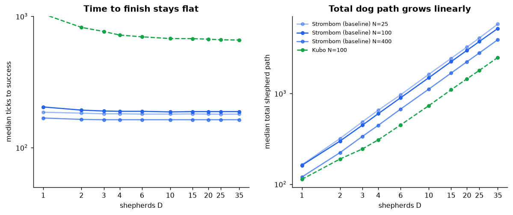
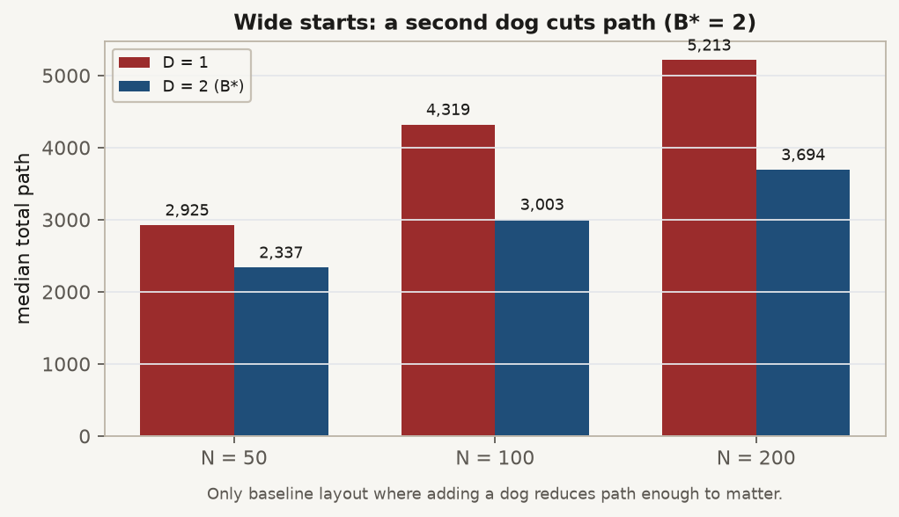

# Strombom Collect/Drive baseline

## Published inspiration

Strombom et al. (2014) describe a single shepherd that alternates between two actions. In Collect, it moves behind the sheep farthest from the flock center and pushes that outlier inward. In Drive, it moves behind the flock center relative to the goal and pushes the cohesive flock forward.

The switch uses:

```text
f(N) = r_a * N^(2/3)
```

If any sheep is farther than `f(N)` from the global center of mass, the flock is treated as spread and the shepherd collects. Otherwise it drives. The published model also supplies the sheep attraction, repulsion, inertia, grazing, noise, and shepherd stop rules used as the basis of HerdSim's Strombom sheep.

Reference: D. Strombom et al., "Solving the shepherding problem: heuristics for herding autonomous, interacting agents," Journal of The Royal Society Interface 11(100), 2014. DOI: `10.1098/rsif.2014.0719`.


## Exact HerdSim implementation

HerdSim separates sheep dynamics from the dog controller.

The named `strombom` preset combines:

- `sheep_model=strombom`;
- `dog_controller=collect_drive`;
- one shepherd by default.

The completed scaling study did not use that preset. It used `strombom_multi`, which combines the same Strombom sheep with `dog_controller=collect_drive_multi`.

### Sheep

When every active dog is farther than `r_s`, a sheep grazes. It normally stays still and takes a random step with probability `graze_move_prob`. When a dog is within `r_s`, the sheep combines previous heading, attraction to a neighbor center, short-range sheep repulsion, repulsion from active dogs, and random noise, then moves by `sheep_speed`.

Defaults used by the method bundle include `r_a = 2`, `r_s = 65`, `c = 1.05`, `inertia = 0.5`, `noise_strength = 0.3`, `sheep_speed = 1.0`, and `shepherd_speed = 1.5`.

### Multi-dog controller

Under the global observations used in the completed scaling phases, each active dog sees the full flock and computes the same centroid and threshold.

In Collect:

- sheep beyond `f(N)` are sorted by distance from the centroid;
- dog `i` is assigned outlier `i mod k`, where `k` is the number of outliers;
- its base target is `r_a` behind that sheep relative to the centroid;
- a tangential offset of `2 * r_a` per slot spreads dogs that approach the same outlier.

In Drive:

- the base target is `r_a * sqrt(N)` behind the centroid relative to the goal;
- dogs are placed at equal angles on a circle of radius `4 * r_a` around that base target.

Each dog stops when it is closer than `shepherd_stop_multiple * r_a` to any sheep in its working view. The default multiple is 3. Dog motion includes the Strombom angular noise.

The outlier assignment, tangential Collect spacing, and Drive circle are HerdSim additions. They are not part of the single-shepherd 2014 algorithm and are not claimed as a port of another published multi-shepherd controller.

Implementation evidence:

- [`../../../core/methods.py`](../../../core/methods.py)
- [`../../../plugins/sheep/strombom.py`](../../../plugins/sheep/strombom.py)
- [`../../../plugins/dogs/collect_drive_multi.py`](../../../plugins/dogs/collect_drive_multi.py)
- [`../../../methods/strombom/heuristics.py`](../../../methods/strombom/heuristics.py)
- [`../../../methods/strombom/config.py`](../../../methods/strombom/config.py)

## `scaling_v2` setup

`strombom_multi` is the baseline controller in the frozen protocol.

- Phase 1: compact layout, size grid `N = {5, 10, 25, 50, 75, 100, 150, 200, 300, 400}`.
- Phase 2: layouts `compact`, `wide`, `split`, and `outlier_rich` at `N = {50, 100, 200}`.
- Dog grid: `{1, 2, 3, 4, 6, 10, 15, 20, 25, 35}`.
- Observation mode in the completed comparison: global.
- Reliability threshold: `R >= 0.90`.
- Scout depth: 30 seeds per full-grid cell.
- Claim depth: 100 seeds in planned frontier windows.

The experiment overrides the preset dog count as it sweeps `D`. It keeps the controller equations and the Strombom defaults listed above.

Configuration evidence:

- [`../../configs/canonical_grid.yaml`](../../configs/canonical_grid.yaml)
- [`../../configs/protocols/phase1_claim.yaml`](../../configs/protocols/phase1_claim.yaml)
- [`../../configs/protocols/phase2_claim.yaml`](../../configs/protocols/phase2_claim.yaml)

## Observed completed results

### Compact size map

At the 90% reliability threshold:

- `D_min = 2` for `N = 5` and `N = 10`;
- `D_min = 1` for every tested `N` from 25 through 400;
- no overcrowding was observed;
- `D_max = 35` is the grid ceiling for every size, not a measured collapse.


*Each cell is R(N, D) on the Phase 1 claim merge (compact). Darker cells are below the 0.90 threshold.*

The Phase 1 claim merge contains 4,540 rows and has overall `R = 0.963`. Its 169 failures are concentrated mainly at one dog for the two smallest flocks.


*Baseline D_min by N, with the 2025 draft shown only for contrast. Two observed levels: 2 at N = 5 and 10; 1 from N = 25 upward.*

Median completion time across the merge is 183 ticks. For `N >= 25`, median path per dog is about 148 world units.



*Median total path against D on the compact size map. Extra dogs after D_min mostly add path waste; they do not produce reliability collapse inside the tested grid.*

### Starting structure

At `N = 50, 100, 200`, all four layouts have `D_min = 1`, with bootstrap width zero. Structure changed cost rather than the minimum reliable dog count:

- wide starts took about 11 to 20 times the compact completion time and about 19 to 36 times the compact path at one dog;
- `outlier_rich`, `N = 200` took a median 1,228 ticks and path 1,647 at one dog;
- on wide starts, the minimum-path reliable choice `B*` was two dogs for all three tested sizes.


*Median total path at D = 1 by layout. Wide and outlier_rich cost far more than compact even though one dog still reaches R = 1.00.*



*On wide starts, two dogs cut median path relative to one dog at N = 50, 100, and 200, so B* = 2 even though D_min stays 1.*

Evidence:

- [`../../results/phase1/claim/packages/a/frontier.csv`](../../results/phase1/claim/packages/a/frontier.csv)
- [`../../results/phase1/claim/merged_trials.csv`](../../results/phase1/claim/merged_trials.csv)
- [`../../results/phase2/claim/packages/b/frontier_by_layout.csv`](../../results/phase2/claim/packages/b/frontier_by_layout.csv)
- [`../../results/phase2/claim/merged_trials.csv`](../../results/phase2/claim/merged_trials.csv)

## Limitations and non-claims

- The claim-grade baseline is HerdSim's `strombom_multi`, not the published single-shepherd algorithm without modification.
- The easy compact task produces a ceiling effect. One dog succeeds for all tested `N >= 25`, so these data do not support a growing dog-count scaling law.
- `D_max = 35` means no upper collapse was found within the tested grid. It does not mean 35 is a biological or operational maximum.
- The split layout behaved much like compact in the completed analysis. The summary marks the intended initial separation as still needing generator confirmation, so no strong split-layout mechanism claim is made.
- The registered NetLogo twin is evidence that a counterpart exists, not evidence of tick-for-tick equality. Registry: [`../../../integrations/netlogo/twins.json`](../../../integrations/netlogo/twins.json).
- Results do not establish real-dog performance or reproduce the quantitative outcomes of the 2014 paper.
