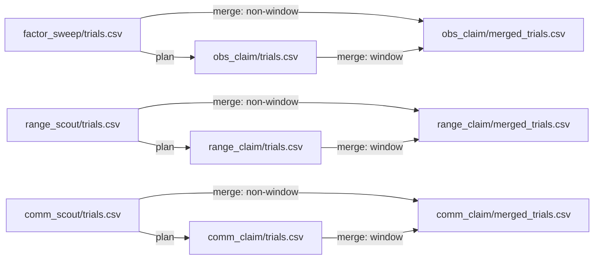

# RQ5: information vs shepherds

Can richer observation, sensing range, or communication lower the fewest-dogs answer at the same reliability?

Method: `strombom_multi`. Layout: compact. N in {100, 200}. Three separate ladders. Protocol: `scaling_v2`.

## This folder

| Path | Grade | What is here |
|------|-------|--------------|
| `factor_sweep/` | SCOUT | Observation ladder scout (1,080 trials) |
| `obs_claim/` | CLAIM | Observation claim windows (1,200; merge 1,920) |
| `range_scout/` | SCOUT | Sensing-range ladder scout (1,440 trials) |
| `range_claim/` | CLAIM | Range claim windows (1,600; merge 2,560) |
| `comm_scout/` | SCOUT | Communication ladder scout (1,080 trials) |
| `comm_claim/` | CLAIM | Communication claim windows (1,200; merge 1,920) |
| `run_all_ladders.sh` | helper | Sequential scout then claim for all three ladders |

Each stage has a Package E substitution export under `packages/e/`.

## Dependencies

Three independent ladders. Each claim plan reads only that ladder's scout `trials.csv`. No cross-ladder merge.

| Ladder | Scout writes | Claim plan reads | Merge writes |
|--------|--------------|------------------|--------------|
| Observation | `factor_sweep/trials.csv` | `../factor_sweep/trials.csv` | `obs_claim/merged_trials.csv` |
| Range | `range_scout/trials.csv` | `../range_scout/trials.csv` | `range_claim/merged_trials.csv` |
| Communication | `comm_scout/trials.csv` | `../comm_scout/trials.csv` | `comm_claim/merged_trials.csv` |

## Takeaway

Local sensing matches a full global view: both have `D_min` = 1 at N = 100 and 200. Bearing-only is a hard failure. Range and communication ladders stay flat at `D_min` = 1.

## Claims

| Claim | What it asks (supported when) | Verdict |
|-------|-------------------------------|---------|
| C5a | One ladder step lowers `D_min` by at least one D-grid step at N in {100, 200} | REJECTED |
| C5b | The second ladder step saves fewer dogs than the first | INCONCLUSIVE |
