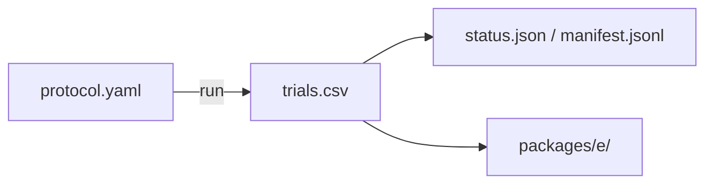

# phase5_factor_sweep

## Purpose

SCOUT observation ladder: three obs modes on compact starts. Used to plan obs claim windows. Not claim-grade by itself.

## Setup

- Protocol: `scaling_v2` (`phase5_factor_sweep`)
- Depends on: none for running. Starts the observation ladder. Writes `trials.csv`.
- Method: `strombom_multi`
- Layout: compact
- N: {100, 200}
- D: {1, 2, 3, 4, 6, 10}
- Seeds: 30
- Obs modes: bearing_only, local_positions, global
- Theta: 0.90
- T0: 10000
- Package export: E
- Command: `make -C scaling scaling-factor-sweep WORKERS=18`

## Completeness

1,080 / 1,080 trials (`status.json` complete). Paused overnight once; resume skipped finished manifest rows.

## Runtime

Started:  7 Oct 2026, 07:46 UTC
Finished: 8 Oct 2026, 05:42 UTC
Total:    21h 55m

## Results

Scout map for planning only. Claim-grade frontiers live in `../obs_claim/`.

## Files in this folder

### Dependencies



```
.
|-- manifest.jsonl
|-- protocol.yaml
|-- status.json
|-- trials.csv
`-- packages/
    `-- e/
```

**Config**
- `protocol.yaml`: Run settings (method, layouts, N/D grid, seeds, grade).

**Auto-generated (run)**
- `manifest.jsonl`: Per-cell progress log; enables resume without re-running ok cells.
- `status.json`: Planned vs done counts, complete flag, start/finish, elapsed.
- `trials.csv`: One row per seed (success, ticks, path/effort, layout, N, D, ...).

**Auto-generated (analysis packages)**
- `packages/e/`: Package E (substitution / ladder tables).

Trajectory parquet written during the run is not retained here.

## Limits

SCOUT (30 seeds). Not for claims.
