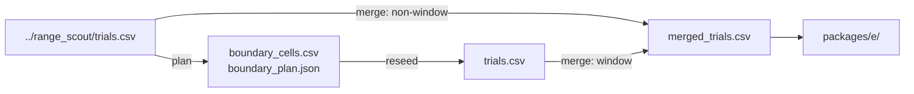

# phase5_range_claim

## Purpose

CLAIM reseed for the sensing-range information ladder. Tests whether longer sensing range lowers `D_min` at N in {100, 200}.

## Setup

- Protocol: `scaling_v2` (`phase5_range_claim`); upstream `phase5_range_scout`
- Depends on: Range scout.
  - Reads (plan): `../range_scout/trials.csv`
  - Writes: `boundary_cells.csv`, `boundary_plan.json`, then `trials.csv`
  - Merge: `merged_trials.csv` = claim `trials.csv` + non-window `../range_scout/trials.csv`
- Method: `strombom_multi`
- Layout: compact
- N: {100, 200}
- D: claim windows (16 cells in `boundary_cells.csv`)
- Seeds: 100 on window cells
- Sensing ranges: 32.5, 65.0, 97.5, 130.0
- Theta: 0.90
- T0: 10000
- Package export: E
- Commands (run in this order):
  1. Plan: `make -C scaling scaling-phase5-range-claim-plan`
     Must run after this method's scout. Chooses scout cells near the reliability edge and writes `boundary_cells.csv` / `boundary_plan.json` (no claim sims yet).
  2. Reseed: `make -C scaling scaling-phase5-range-claim-reseed WORKERS=18`
     Runs the claim sims (100 seeds) on those planned cells.

## Completeness

1,600 / 1,600 claim trials (`status.json` complete). Merge 2,560 rows.

## Runtime

Started:  8 Oct 2026, 10:07 UTC

Finished: 8 Oct 2026, 10:37 UTC

Total:    30m

## Results

Columns are sensing range (config), not flock size. Rows are N.

| N | sensing range 32.5 | sensing range 65.0 | sensing range 97.5 | sensing range 130.0 |
|---|--------------------|--------------------|--------------------|---------------------|
| 100 | D_min = 1 | D_min = 1 | D_min = 1 | D_min = 1 |
| 200 | D_min = 1 | D_min = 1 | D_min = 1 | D_min = 1 |

Package E summary (from `packages/e/substitution_summary_range.csv`):

- `median_delta_dmin = 0`: median over N of (`D_min` at richest range minus `D_min` at poorest range). Negative would mean longer range needs fewer dogs.
- `supports_substitution = False`: C5a flag; true only when that median is negative (information substitutes for dogs).
- `supports_diminishing_returns = False`: C5b flag; true only when the first ladder step saves dogs and the second step saves fewer.

## Interpretation

Sensing range does not change `D_min` on this compact baseline task: one dog already clears theta at every tested range.

## Claims update

| Claim | What it asks (supported when) | Verdict | Evidence |
|-------|-------------------------------|---------|----------|
| C5a | One ladder step lowers `D_min` by at least one D-grid step at N in {100, 200} | REJECTED | flat `D_min` = 1 across ranges |
| C5b | The second ladder step saves fewer dogs than the first | INCONCLUSIVE | no first-step dog saving |

## Files in this folder

### Dependencies



```
.
|-- boundary_cells.csv
|-- boundary_plan.json
|-- dmin_bootstrap.csv
|-- manifest.jsonl
|-- merged_dmin_bootstrap.csv
|-- merged_trials.csv
|-- protocol.yaml
|-- scout_dmin_bootstrap_preview.csv
|-- status.json
|-- trials.csv
`-- packages/
    `-- e/
```

**Config**
- `protocol.yaml`: Run settings (method, layouts, N/D grid, seeds, grade).

**Planning (auto before claim / T1)**
- `boundary_cells.csv`: Cells chosen for 100-seed claim reseed (from scout).
- `boundary_plan.json`: Planner metadata for the claim window (theta, params).
- `scout_dmin_bootstrap_preview.csv`: Scout-side D_min bootstrap preview used while planning.

**Auto-generated (run)**
- `manifest.jsonl`: Per-cell progress log; enables resume without re-running ok cells.
- `merged_trials.csv`: Claim-window 100-seed rows + non-window scout 30-seed rows.
- `status.json`: Planned vs done counts, complete flag, start/finish, elapsed.
- `trials.csv`: One row per seed (success, ticks, path/effort, layout, N, D, ...).

**Auto-generated (analysis)**
- `dmin_bootstrap.csv`: Bootstrap of D_min / CI from claim trials only.
- `merged_dmin_bootstrap.csv`: Same bootstrap schema on merged_trials.csv.

**Auto-generated (analysis packages)**
- `packages/e/`: Package E (substitution / ladder tables).

Trajectory parquet written during the run is not retained here.

## Limits

Baseline method, compact only, low-D band.
