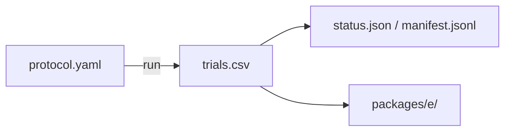

# phase5_range_scout

## Purpose

SCOUT sensing-range ladder. Used to plan range claim windows. Not claim-grade by itself.

## Setup

- Protocol: `scaling_v2` (`phase5_range_scout`)
- Depends on: none for running. Starts the range ladder. Writes `trials.csv`.
- Method: `strombom_multi`
- Layout: compact
- N: {100, 200}
- D: {1, 2, 3, 4, 6, 10}
- Seeds: 30
- Sensing ranges: 32.5, 65.0, 97.5, 130.0
- Package export: E
- Command: `make -C scaling scaling-phase5-range-scout WORKERS=18`

## Completeness

1,440 / 1,440 trials (`status.json` complete).

## Runtime

Started:  8 Oct 2026, 09:42 UTC
Finished: 8 Oct 2026, 10:07 UTC
Total:    24m

## Results

Scout map for planning only. Claim-grade frontiers live in `../range_claim/`.

## Files in this folder

### Dependencies



```
.
|-- manifest.jsonl
|-- protocol.yaml
|-- status.json
|-- trials.csv
`-- packages/
    `-- e/
```

**Config**
- `protocol.yaml`: Run settings (method, layouts, N/D grid, seeds, grade).

**Auto-generated (run)**
- `manifest.jsonl`: Per-cell progress log; enables resume without re-running ok cells.
- `status.json`: Planned vs done counts, complete flag, start/finish, elapsed.
- `trials.csv`: One row per seed (success, ticks, path/effort, layout, N, D, ...).

**Auto-generated (analysis packages)**
- `packages/e/`: Package E (substitution / ladder tables).

Trajectory parquet written during the run is not retained here.

## Limits

SCOUT (30 seeds). Not for claims.
