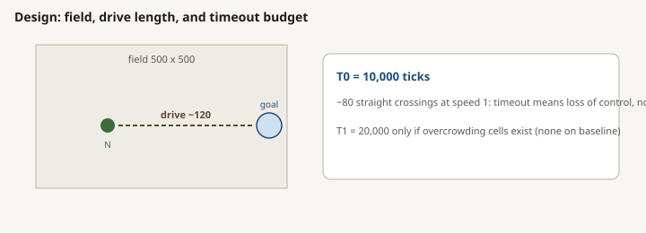
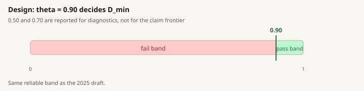
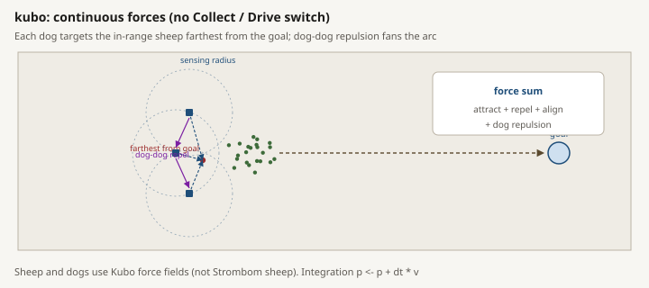
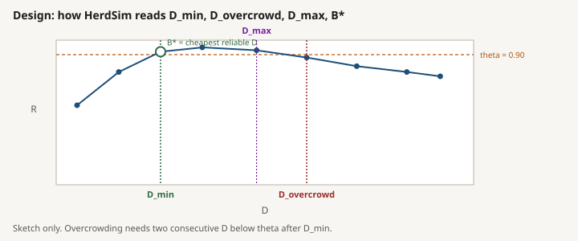
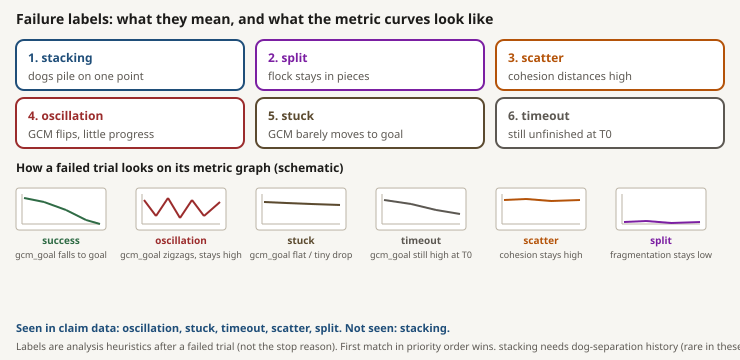
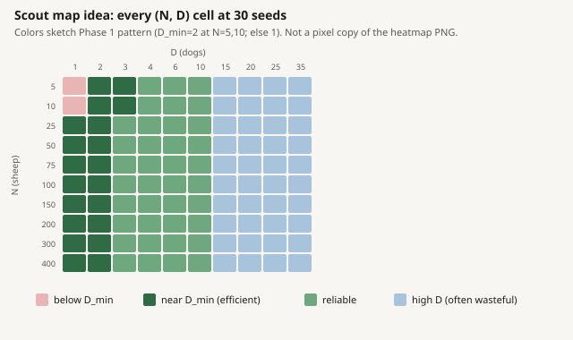
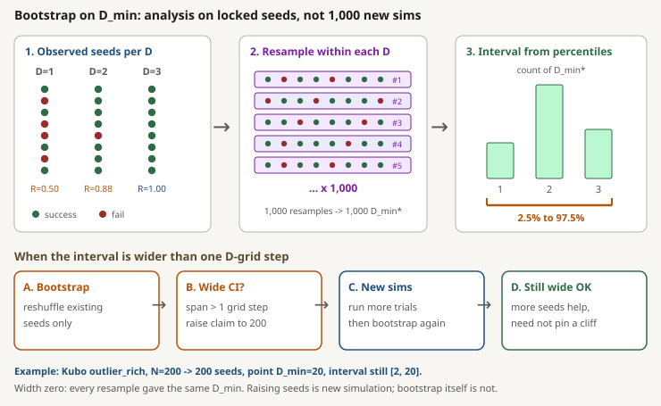
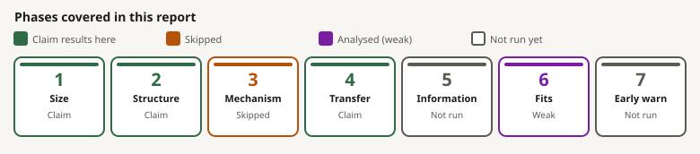

# Scaling setup and reference

This directory is the operator reference for protocol `scaling_v2`. It explains the frozen experiment setup, parameters, terminology, and campaign commands without changing the research plan.

## Read in this order

1. [Experiment setup](experiment_setup.md): task, arena, layouts, staging, rationale, implementation caps, and study boundaries.
2. [Parameter reference](parameter_reference.md): frozen values, controller defaults, metrics, frontiers, and analysis settings.
3. [Run guide](run_guide.md): test, run, resume, plan, reseed, T1, analyse, outputs, and provenance.
4. [Glossary](glossary.md): symbols and operational definitions.

Vietnamese versions:

- [Thiet lap thi nghiem](experiment_setup_vi.md)
- [Tham chieu tham so](parameter_reference_vi.md)
- [Huong dan chay](run_guide_vi.md)
- [Bang thuat ngu](glossary_vi.md)

## Source precedence

Use the following precedence when sources differ:

1. [`scaling/configs/canonical_grid.yaml`](../../configs/canonical_grid.yaml) is authoritative for frozen machine-readable `scaling_v2` defaults.
2. A resolved protocol YAML in [`scaling/configs/protocols/`](../../configs/protocols/) defines a particular campaign and may narrow the canonical grid.
3. The copied `protocol.yaml` in a results directory records the exact resolved recipe used for that run.
4. [`scaling/docs/main_scaling_plan.md`](../main_scaling_plan.md) defines the research questions, dependencies, frontier and regime rules, claim criteria, budgets, and decision gates.
5. [`scaling/docs/experiment_run_strategy.md`](../experiment_run_strategy.md) defines staging and operator intent.
6. [`scaling/Makefile`](../../Makefile) and `uv run scaling/scripts/campaign.py help` define current command wiring.
7. [`scaling/results/README.md`](../../results/README.md) and the summary reports describe produced artifacts and actual run status. Results never redefine the frozen protocol.

Parameter tables and simulation-quantity definitions formerly kept in Summary Report Appendices A and B are now maintained in the [parameter reference](parameter_reference.md) and [glossary](glossary.md).

If a copied protocol and a planning document disagree about a completed run, use the copied protocol plus `provenance.json`, `manifest.jsonl`, and `status.json` for that run. Do not silently edit a frozen value. A protocol change requires updating the canonical rationale and the main plan, and normally a new protocol identifier.

## Schematics

Full set also embedded in context in [experiment setup](experiment_setup.md). Gallery below keeps every setup schematic in one place.

## Scope

These pages document setup and operation only. Claim verdicts remain in the tracker and claim-grade reports. The setup supports conclusions inside this simulation, task, tested grids, and discrete tick resolution. It does not establish a universal law for other tasks or real farms, and it cannot resolve a dog-count difference smaller than one local grid step.
