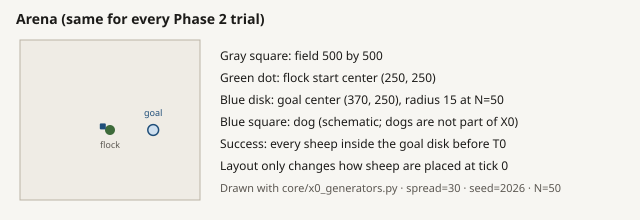
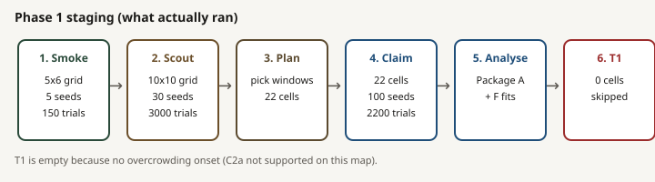
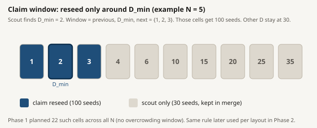

# Experiment setup

Protocol: `scaling_v2`. Frozen values come from [`scaling/configs/canonical_grid.yaml`](../../configs/canonical_grid.yaml). Scientific rules and rationale come from [`scaling/docs/main_scaling_plan.md`](../main_scaling_plan.md).

## Task and arena

The task is `drive_to_goal`. A trial succeeds when every sheep is inside the goal disk before the time limit.

- Continuous arena: 500 by 500 world units.
- Initial flock centre: `(250, 250)`.
- Goal centre: `(370, 250)`.
- Centre-to-centre drive: 120 units for every flock size.
- Goal radius: `15 * sqrt(N/50)`.
- Baseline deadline T0: 10,000 discrete ticks.
- Conditional long deadline T1: 20,000 ticks.

The square 500 field accommodates a wide three-sigma draw with reach 180 and the approximate N = 400 outlier reach of 174 while leaving about 70 units of margin. A 150 field cannot contain those starts, a 400 field leaves only about 20 units on the wide draw, and a 1000 field adds unused space. The midline goal keeps vertical margins equal. The 120-unit drive is outside the compact start and past one wide sigma even at the large goal; 80 would sit inside the wide cloud, while 200 would put the far goal edge on the wall.

At N = 50 the radius is 15, matching the application goal and exceeding the approximate packed radius of 8. A radius of 8 risks jamming and 30 makes the target much easier. Square-root scaling keeps goal area per sheep constant. A fixed radius would jam large flocks. The Strombom collect switch `r_a * N^(2/3)` is controller-specific and is not used as the goal radius.

The interactive application's 150-field corner-goal default is unchanged. Scaling protocols override the arena only for these experiments.

## Experimental factors

The frozen flock-size grid is `{5, 10, 25, 50, 75, 100, 150, 200, 300, 400}`. N = 5 is the floor because smaller groups do not support the same collective quantities. The grid is denser near 100, includes 300 and 400 for large-N behavior, and omits 250 and 350 because every extra N requires a complete dog-count sweep.

The frozen dog-count grid is `{1, 2, 3, 4, 6, 10, 15, 20, 25, 35}`. Unit steps cover the likely low-D frontier; larger steps test whether large additions help or hurt. The cap of 35 preserves the intended few-shepherd range. It is a tested-grid ceiling, not a physical or farm limit.

The baseline controller is `strombom_multi`. Required transfer controllers are `strombom_multi`, `kubo`, and `fat`. `communication_free` is recommended but outside the minimum transfer claim.

Structure experiments use N in `{50, 100, 200}` and all four initial layouts. These sizes are large enough for split clusters and outliers to represent flock structure. N below 12 uses only two split clusters, and tiny compact flocks are already covered by Phase 1. N = 300 and 400 may be added only after the three-size claim map, mainly if every layout remains at the D_min floor.

Information experiments use N in `{100, 200}`. N = 50 is omitted because a D_min already at one cannot decrease by a grid step.

## Initial layouts

All layouts use `initial_spread = 30`.

| Layout | Construction | Validation gate |
|---|---|---|
| `compact` | Gaussian with sigma `0.3 * spread = 9` | Lower cohesion distance than `wide` |
| `wide` | Gaussian with sigma `2.0 * spread = 60` | Higher cohesion distance than `compact` |
| `split` | Two clusters below N = 12, otherwise three; gap at least `2 * measurement_radius = 10` | Lower largest-component fraction than `compact` |
| `outlier_rich` | Core about 80 percent; about 20 percent beyond `r_a * N^(2/3)` | Higher outlier count than `compact` |

Compact sigma 9 approximates a packed N = 50 flock. Wide sigma 60 creates a clear cohesion contrast while fitting the field. A sigma of 120 would not fit. Split avoids three implausibly tiny subflocks below N = 12. Twenty percent outliers creates a real minority without becoming a second flock. Points outside the field or inside the goal are redrawn, not clipped to a boundary.

The measurement radius is 5. It links compact neighbors normally separated by about 2 to 4 units, but does not bridge split gaps of at least 10.

## Controllers

`strombom_multi` is a coordinated collect-and-drive controller. Its collect switch is `r_a * N^(2/3)`. This switch is wider than the goal, so a Strombom failure is not interpreted as a packing failure.

`kubo` uses continuous force terms, local sensing, `dt` integration, and speed clamps. It has no collect-and-drive switch. Dogs press the sensed sheep farthest from the goal, and dog-dog repulsion spreads them.

`fat` retains the Strombom sheep model. Each dog independently selects the observed sheep farthest from itself and stands off behind that sheep toward the goal. Phases 1, 2, and 4 use global observation.

Controller constants and meanings are listed in [parameter_reference.md](parameter_reference.md).

## Staged design

Runs are staged because claim precision is valuable near D_min and possible overcrowding, not throughout obvious interior cells.

| Grade | Purpose | Typical seed count | Claim use |
|---|---|---:|---|
| SMOKE or Pilot | Check host, paths, metrics, and resume behavior | Tiny grid, normally 5 seeds | Never |
| SCOUT | Map the full or factor grid and plan windows | 30 | Planning and diagnostics only |
| CLAIM | Reseed planned frontier windows | 100 | Yes, after run documentation |
| T1 | Test overcrowding cells at 20,000 ticks | 100 | Yes, if such cells exist |

For each method, layout, and N, the claim planner selects:

1. Scout D_min and its previous and next D-grid neighbors.
2. If two consecutive D values after a candidate fall below theta, those two and the last D still at or above theta.
3. If no D reaches theta, the two largest tested D values.

Claim rows replace scout rows for reseeded cells. They are not stacked. Unselected cells retain their scout rows. If the bootstrap interval for D_min covers more than one grid step, raise that window to 200 seeds before the structure claim.

A Phase 1 planning estimate is about 3,000 scout trials plus up to about 6,000 claim trials. A structure contrast is about 3,600 scout plus 7,200 claim trials. These are planning figures and must be recomputed after scout selection.

## Phases and dependencies

| Phase | Purpose | Run status dependency |
|---|---|---|
| 0 | Freeze protocol | Canonical YAML and plan agree |
| 1 | Baseline size map | Pilot, scout, claim, optional T1 |
| 2 | Initial structure | Scout and claim at N 50, 100, 200 |
| 3 | Mechanism | Analysis of already collected contrast cells |
| 4 | Controller transfer | Size and structure maps for Kubo and FAT |
| 5 | Information ladders | Observation, range, and communication campaigns |
| 6 | Scaling fits | Analysis of merged claim maps |
| 7 | Early warning | Analysis requiring claim timeseries |

Phases 3, 6, and 7 are mainly analysis phases and are blocked until their matching merged claim data exist. Phase 7 additionally requires timeseries. Phase 5 follows the same scout and claim pattern but is a later campaign.

In the completed baseline results, no overcrowding cell was found, so Phase 1 T1 was planned but not run. This is recorded in [`scaling/results/phase1/t1/README.md`](../../results/phase1/t1/README.md). An absent T1 run means the trigger did not exist, not that a 20,000-tick result was observed.

## Implementation caps and paths

| Cap | Responsibility | Exact path |
|---|---|---|
| I1 | Grid run, resume, provenance | `scaling/services/scaling/runner.py` |
| I2 | Frontiers, claim windows, bootstrap | `analysis/scaling/frontier.py` |
| I3 | Regimes | `analysis/scaling/regimes.py` |
| I4 | Spread, extent, perimeter, hull area, density, aspect ratio | `plugins/metrics/` metric modules |
| I5 | Layout generators | `core/x0_generators.py` |
| I6 | State model versus N,D model | `analysis/scaling/predictors.py` |
| I7 | Directional interference and coverage | `plugins/metrics/shepherd_interference.py`, `plugins/metrics/shepherd_coverage.py` |
| I8 | Mechanism tests | `analysis/scaling/mechanism.py` |
| I9 | Transfer table | `analysis/scaling/transfer.py` |
| I10 | Information factor sweeps | `scaling/scripts/run_factor_sweep.py`, `analysis/scaling/substitution.py` |
| I11 | Scaling fits | `analysis/scaling/fits.py` |
| I12 | Early warning | `analysis/scaling/early_warning.py` |
| I13 | Canonical configuration and export | `scaling/configs/canonical_grid.yaml`, `analysis/scaling/export.py` |
| I14 | Parquet timeseries | Runner output path |

Primary directories are `analysis/scaling/`, `scaling/services/scaling/`, `scaling/configs/`, `scaling/scripts/`, and `scaling/results/phase{k}/{protocol}/`.

## Study boundaries

Do not change the application's default arena, sheep models, or dog force laws as part of this protocol. Intended-velocity extension E1 remains unbuilt unless claim-grade evidence shows directional-interference spikes occur only at walls.

The baseline alone cannot establish a method-general scaling law. The study is one simulated task at discrete tick resolution with sheep speed 1 for Strombom-family runs. Report task, controller, tested grid, and resolution with every interpretation.
