# Thiết lập thí nghiệm

Giao thức: `scaling_v2`. Giá trị đóng băng lấy từ [`scaling/configs/canonical_grid.yaml`](../../configs/canonical_grid.yaml). Quy tắc khoa học và lý do lấy từ [`scaling/docs/main_scaling_plan_vi.md`](../main_scaling_plan_vi.md).

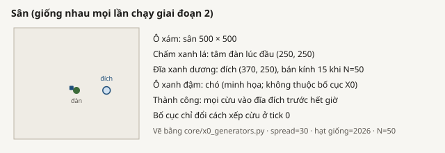

## Nhiệm vụ và sân

Nhiệm vụ là `drive_to_goal`. Một lần thử thành công khi mọi cừu nằm trong đĩa đích trước hạn thời gian.

- Sân liên tục: 500 nhân 500 đơn vị thế giới.
- Tâm đàn ban đầu: `(250, 250)`.
- Tâm đích: `(370, 250)`.
- Quãng đường tâm-đến-tâm: 120 đơn vị cho mọi kích thước đàn.
- Bán kính đích: `15 * sqrt(N/50)`.
- Hạn cơ sở T0: 10.000 tick rời rạc.
- Hạn dài có điều kiện T1: 20.000 tick.

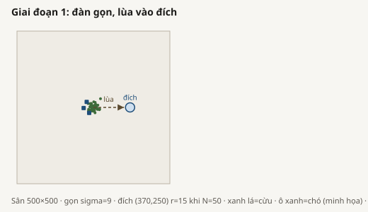

*Chó đứng sau đàn, đối diện đích.*

Sân vuông 500 chứa được rút wide ba sigma với tầm với 180 và tầm với outlier xấp xỉ 174 tại N = 400, còn khoảng 70 đơn vị biên. Sân 150 không chứa được các điểm xuất phát đó; sân 400 chỉ còn khoảng 20 đơn vị trên rút wide; sân 1000 thêm khoảng trống không cần thiết. Đích trên đường giữa giữ biên trên và dưới bằng nhau. Quãng 120 nằm ngoài điểm xuất phát compact và vượt một sigma wide ngay cả với đích lớn; 80 sẽ nằm trong đám wide, còn 200 sẽ đưa mép xa của đích sát tường.

Tại N = 50 bán kính là 15, khớp đích ứng dụng và lớn hơn bán kính xếp xấp xỉ 8. Bán kính 8 có nguy cơ kẹt, còn 30 làm đích dễ hơn nhiều. Scale theo căn bậc hai giữ diện tích đích trên mỗi cừu không đổi. Bán kính cố định sẽ kẹt đàn lớn. Công tắc thu thập Strombom `r_a * N^(2/3)` thuộc bộ điều khiển và không được dùng làm bán kính đích.

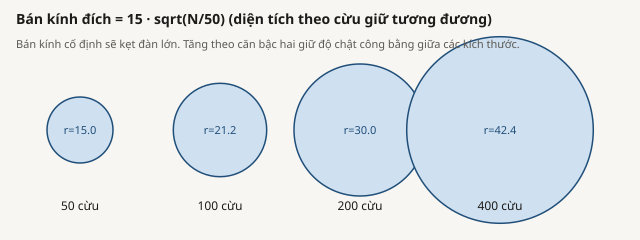

*Quy tắc bán kính đích `15 * sqrt(N/50)`.*

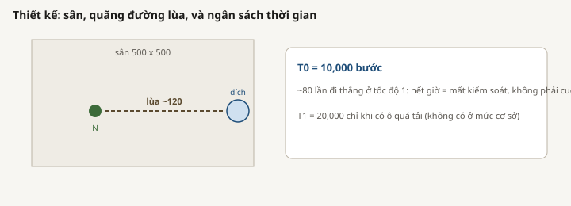

*Hình học và ngân sách thời gian đóng băng cùng giao thức.*

Mặc định ứng dụng tương tác với sân 150 và đích góc không đổi. Giao thức scaling chỉ ghi đè sân cho các thí nghiệm này.

## Nhân tố thí nghiệm

Lưới kích thước đàn đóng băng là `{5, 10, 25, 50, 75, 100, 150, 200, 300, 400}`. N = 5 là sàn vì nhóm nhỏ hơn không hỗ trợ cùng các đại lượng tập thể. Lưới dày hơn gần 100, gồm 300 và 400 cho hành vi N lớn, và bỏ 250 cùng 350 vì mỗi N thêm đòi hỏi một quét số chó đầy đủ.

Lưới số chó đóng băng là `{1, 2, 3, 4, 6, 10, 15, 20, 25, 35}`. Bước đơn vị phủ biên D thấp khả dĩ; bước lớn hơn kiểm tra việc thêm nhiều chó có lợi hay có hại. Trần 35 giữ miền ít người chăn dự kiến. Đó là trần lưới đã thử, không phải giới hạn vật lý hay nông trại.

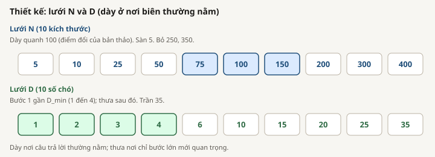

*Dày hơn nơi biên thường nằm.*

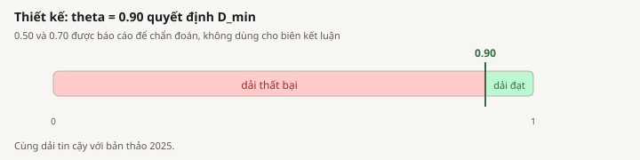

*Ngưỡng tin cậy cho mọi biên claim.*

Bộ điều khiển cơ sở là `strombom_multi`. Các bộ điều khiển chuyển giao bắt buộc là `strombom_multi`, `kubo`, và `fat`. `communication_free` được khuyến nghị nhưng nằm ngoài claim chuyển giao tối thiểu.

Thí nghiệm cấu trúc dùng N trong `{50, 100, 200}` và cả bốn bố cục ban đầu. Các kích thước này đủ lớn để cụm tách và outlier thể hiện cấu trúc đàn. N dưới 12 chỉ dùng hai cụm tách, và đàn compact rất nhỏ đã được phủ bởi Giai đoạn 1. N = 300 và 400 chỉ có thể thêm sau bản đồ claim ba kích thước, chủ yếu nếu mọi bố cục vẫn ở sàn D_min.

Thí nghiệm thông tin dùng N trong `{100, 200}`. Bỏ N = 50 vì D_min đã bằng một thì không thể giảm thêm một bước lưới.

## Bố cục ban đầu

Mọi bố cục dùng `initial_spread = 30`.

| Bố cục | Cách tạo | Cổng kiểm tra |
|---|---|---|
| `compact` | Gaussian với sigma `0.3 * spread = 9` | Khoảng cách kết dính thấp hơn `wide` |
| `wide` | Gaussian với sigma `2.0 * spread = 60` | Khoảng cách kết dính cao hơn `compact` |
| `split` | Hai cụm dưới N = 12, ngược lại ba; khe cách ít nhất `2 * measurement_radius = 10` | Tỷ lệ thành phần lớn nhất thấp hơn `compact` |
| `outlier_rich` | Lõi khoảng 80 phần trăm; khoảng 20 phần trăm ngoài `r_a * N^(2/3)` | Số outlier cao hơn `compact` |

Sigma compact 9 xấp xỉ đàn xếp N = 50. Sigma wide 60 tạo đối lập kết dính rõ trong khi vẫn vừa sân. Sigma 120 sẽ không vừa. Split tránh ba tiểu đàn quá nhỏ dưới N = 12. Hai mươi phần trăm outlier tạo thiểu số thật mà không thành đàn thứ hai. Điểm ngoài sân hoặc trong đích được rút lại, không bị ép vào biên.

Bán kính đo là 5. Nó nối các láng giềng compact thường cách khoảng 2 đến 4 đơn vị, nhưng không bắc cầu khe tách ít nhất 10.

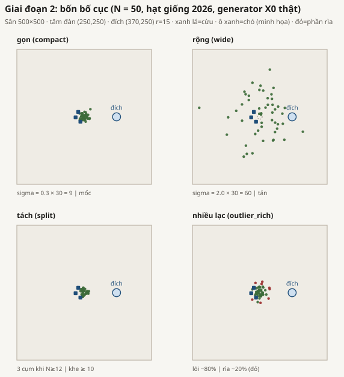

*Cách đặt cừu và chó lúc bắt đầu theo từng họ X0.*

## Bộ điều khiển

`strombom_multi` là bộ điều khiển thu thập-và-đẩy có phối hợp. Công tắc thu thập là `r_a * N^(2/3)`. Công tắc này rộng hơn đích, nên thất bại Strombom không được diễn giải là thất bại xếp chặt.

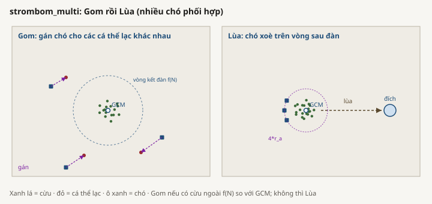

`kubo` dùng hạng tử lực liên tục, cảm biến cục bộ, tích phân `dt`, và kẹp tốc độ. Không có công tắc thu thập-và-đẩy. Chó ép cừu cảm nhận được xa đích nhất, và lực đẩy chó-chó trải chúng ra.

`fat` giữ mô hình cừu Strombom. Mỗi chó độc lập chọn cừu quan sát được xa chính nó nhất và đứng lùi sau cừu đó theo hướng về đích. Giai đoạn 1, 2, và 4 dùng quan sát toàn cục.

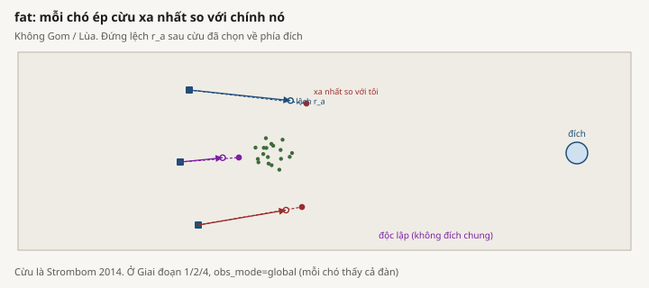

*Strombom Collect: xa nhất so với tâm đàn. Kubo: xa nhất so với đích. FAT: xa nhất so với chó.*

Hằng số bộ điều khiển và ý nghĩa được liệt kê trong [parameter_reference_vi.md](parameter_reference_vi.md). Hướng dẫn phương pháp chi tiết: [methods/](../methods/README_vi.md).

## Biên, chế độ, và nhãn thất bại

Số chó thực sự thử: `1, 2, 3, 4, 6, 10, 15, 20, 25, 35`. Không phải mọi số nguyên. "Trần lưới" nghĩa là **35**, số lớn nhất trên danh sách đó.

| Đại lượng | Định nghĩa |
|---|---|
| D_min | D nhỏ nhất có R >= theta |
| D_overcrowd | D nhỏ nhất sau D_min mà D đó và D lưới kế tiếp đều dưới theta |
| D_max | D lớn nhất vẫn đạt hoặc vượt theta và dưới D_overcrowd; nếu không thì trần lưới |
| B* | (D, T) đạt R >= theta với trung vị đường đi nhỏ nhất |
| Thất bại cứng | Không D nào đã thử đạt R >= theta |

**Lãng phí so với quá tải.** Lãng phí: R vẫn >= 0.90; chó chỉ đi nhiều hơn. Quá tải: sau một dải thắng tốt, R lại rơi dưới 90% trong hai bước liên tiếp trên danh sách.

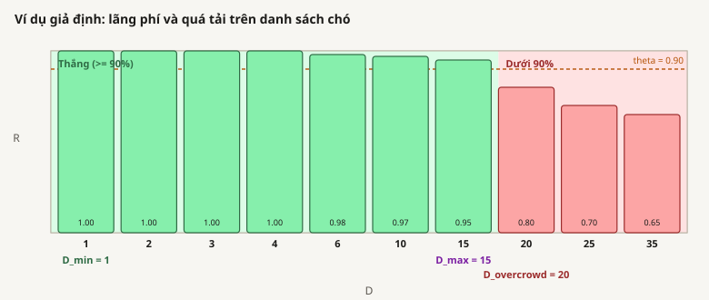

*Cột xanh vẫn >= 90%; cột đỏ dưới 90%. Hai cột đỏ liên tiếp => D_overcrowd = 20, D_max = 15.*

*Phác thảo khái niệm về D_min, D_overcrowd, D_max và B-star.*

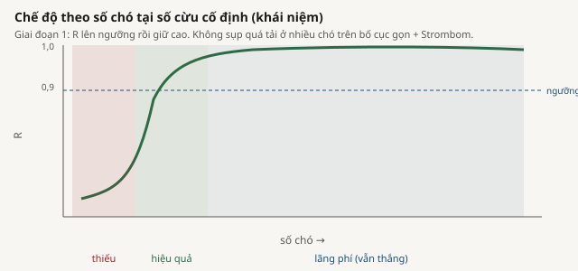

*Cách các nhãn chế độ nằm dọc trục số chó.*

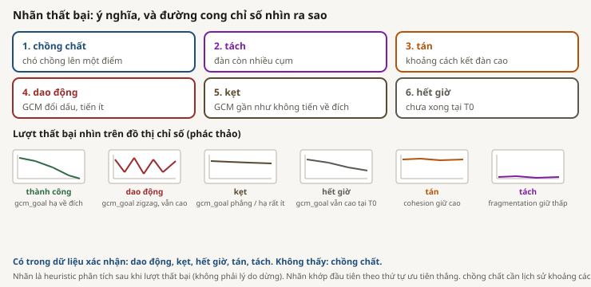

*Sau khi thất bại, heuristic gắn nhãn cách thất bại (chỉ để phân tích).*

## Thiết kế phân tầng

*Khảo sát lập bản đồ rẻ; claim gieo lại cửa sổ biên; T1 chỉ khi có ô quá tải.*

Các lần chạy được phân tầng vì độ chính xác claim có giá trị gần D_min và quá tải có thể xảy ra, không phải trên mọi ô nội suy hiển nhiên.

| Cấp độ | Mục đích | Số seed điển hình | Dùng cho claim |
|---|---|---:|---|
| SMOKE hoặc Pilot | Kiểm tra máy chủ, đường dẫn, chỉ số, và hành vi tiếp tục | Lưới rất nhỏ, thường 5 seed | Không bao giờ |
| SCOUT | Lập bản đồ lưới đầy đủ hoặc nhân tố và lập cửa sổ | 30 | Chỉ lập kế hoạch và chẩn đoán |
| CLAIM | Gieo lại cửa sổ biên đã lập kế hoạch | 100 | Có, sau tài liệu chạy |
| T1 | Thử ô quá tải tại 20.000 tick | 100 | Có, nếu tồn tại ô đó |

*Độ tin cậy R là tỷ lệ seed hoàn thành trước T0.*

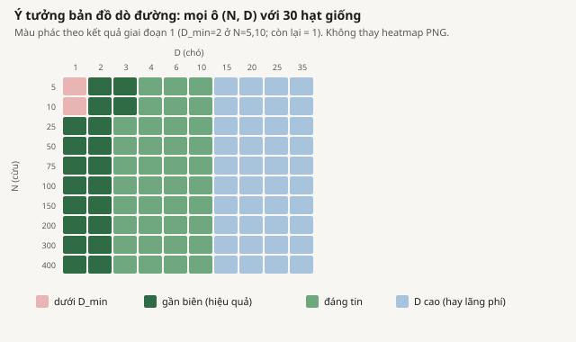

*Mọi ô đóng băng nhận một ước lượng R rẻ.*

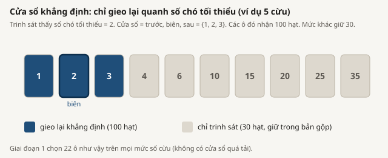

*Độ chính xác được dành nơi D_min được quyết định.*

Với mỗi phương pháp, bố cục, và N, bộ lập kế hoạch claim chọn:

1. D_min từ scout cùng hàng xóm D trước và sau trên lưới.
2. Nếu hai giá trị D liên tiếp sau một ứng viên rơi dưới theta, chọn hai giá trị đó và D cuối vẫn đạt hoặc vượt theta.
3. Nếu không D nào đạt theta, chọn hai giá trị D lớn nhất đã thử.

Dòng claim thay dòng scout tại ô gieo lại. Chúng không được chồng. Ô không chọn giữ dòng scout. Nếu khoảng bootstrap của D_min phủ hơn một bước lưới, nâng cửa sổ đó lên 200 seed trước claim cấu trúc.

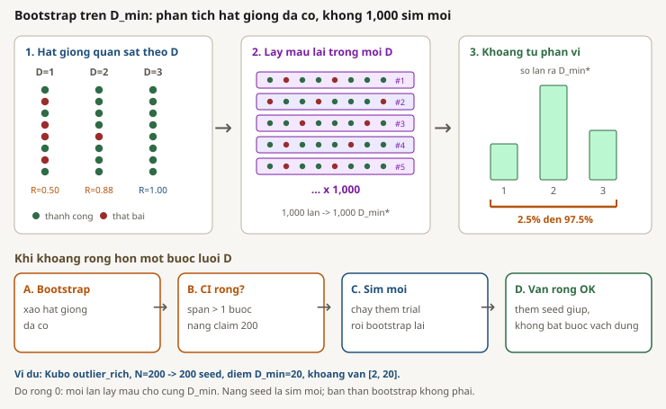

*Tren: gieo lai seed da khoa trong moi D (1.000 lan); phan vi 2,5% va 97,5% tao khoang. Duoi: neu khoang rong hon mot buoc luoi, nang claim len 200 seed roi bootstrap lai.*

Ước lượng lập kế hoạch Giai đoạn 1 khoảng 3.000 lần thử scout cộng tới khoảng 6.000 lần thử claim. Một đối sánh cấu trúc khoảng 3.600 scout cộng 7.200 claim. Đây là số lập kế hoạch và phải tính lại sau khi chọn scout.

## Giai đoạn và phụ thuộc

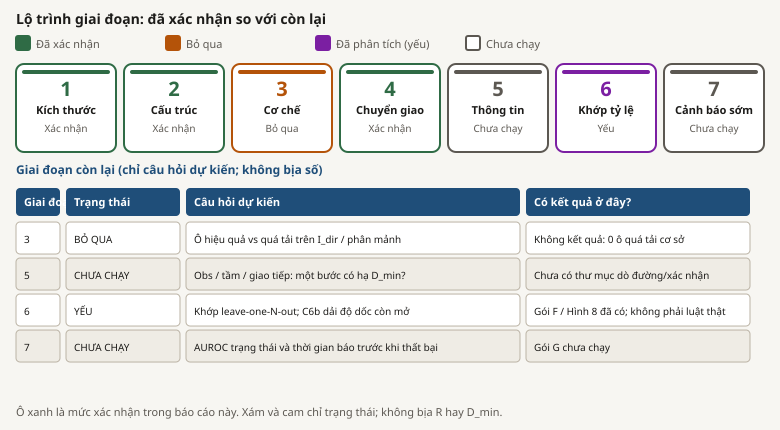

| Giai đoạn | Mục đích | Phụ thuộc trạng thái chạy |
|---|---|---|
| 0 | Đóng băng giao thức | YAML chuẩn và kế hoạch thống nhất |
| 1 | Bản đồ kích thước cơ sở | Pilot, scout, claim, T1 tùy chọn |
| 2 | Cấu trúc ban đầu | Scout và claim tại N 50, 100, 200 |
| 3 | Cơ chế | Phân tích các ô đối sánh đã thu |
| 4 | Chuyển giao bộ điều khiển | Bản đồ kích thước và cấu trúc cho Kubo và FAT |
| 5 | Thang thông tin | Chiến dịch quan sát, tầm, và giao tiếp |
| 6 | Khớp scaling | Phân tích bản đồ claim đã hợp nhất |
| 7 | Cảnh báo sớm | Phân tích cần chuỗi thời gian claim |

Giai đoạn 3, 6, và 7 chủ yếu là giai đoạn phân tích và bị chặn cho đến khi dữ liệu claim đã hợp nhất tương ứng tồn tại. Giai đoạn 7 còn cần chuỗi thời gian. Giai đoạn 5 theo cùng mẫu scout và claim nhưng là chiến dịch sau.

Trong kết quả cơ sở đã hoàn thành, không tìm thấy ô quá tải, nên T1 Giai đoạn 1 đã được lập kế hoạch nhưng không chạy. Điều này được ghi trong [`scaling/results/phase1/t1/README.md`](../../results/phase1/t1/README.md). Không có lần chạy T1 nghĩa là điều kiện kích hoạt không tồn tại, không phải đã quan sát kết quả 20.000 tick.

## Lớp triển khai và đường dẫn

| Lớp | Trách nhiệm | Đường dẫn chính xác |
|---|---|---|
| I1 | Chạy lưới, tiếp tục, nguồn gốc | `scaling/services/scaling/runner.py` |
| I2 | Biên, cửa sổ claim, bootstrap | `analysis/scaling/frontier.py` |
| I3 | Chế độ | `analysis/scaling/regimes.py` |
| I4 | Trải, extent, chu vi, diện tích bao, mật độ, tỷ lệ khung hình | các mô-đun chỉ số trong `plugins/metrics/` |
| I5 | Bộ sinh bố cục | `core/x0_generators.py` |
| I6 | Mô hình trạng thái so với mô hình N,D | `analysis/scaling/predictors.py` |
| I7 | Nhiễu hướng và độ phủ | `plugins/metrics/shepherd_interference.py`, `plugins/metrics/shepherd_coverage.py` |
| I8 | Kiểm định cơ chế | `analysis/scaling/mechanism.py` |
| I9 | Bảng chuyển giao | `analysis/scaling/transfer.py` |
| I10 | Quét nhân tố thông tin | `scaling/scripts/run_factor_sweep.py`, `analysis/scaling/substitution.py` |
| I11 | Khớp scaling | `analysis/scaling/fits.py` |
| I12 | Cảnh báo sớm | `analysis/scaling/early_warning.py` |
| I13 | Cấu hình chuẩn và xuất | `scaling/configs/canonical_grid.yaml`, `analysis/scaling/export.py` |
| I14 | Chuỗi thời gian Parquet | đường dẫn đầu ra của bộ chạy |

Thư mục chính là `analysis/scaling/`, `scaling/services/scaling/`, `scaling/configs/`, `scaling/scripts/`, và `scaling/results/phase{k}/{protocol}/`.

## Giới hạn nghiên cứu

Không đổi sân mặc định của ứng dụng, mô hình cừu, hay luật lực chó như một phần của giao thức này. Mở rộng vận tốc dự định E1 vẫn chưa xây trừ khi bằng chứng cấp claim cho thấy đỉnh nhiễu hướng chỉ xảy ra tại tường.

Riêng cơ sở không thiết lập được quy luật scaling tổng quát cho mọi phương pháp. Nghiên cứu là một nhiệm vụ mô phỏng tại độ phân giải tick rời rạc với tốc độ cừu 1 cho các lần chạy họ Strombom. Báo cáo nhiệm vụ, bộ điều khiển, lưới đã thử, và độ phân giải kèm mọi diễn giải.
