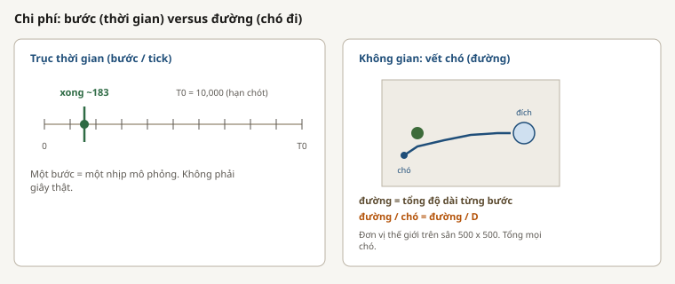
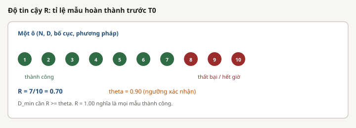
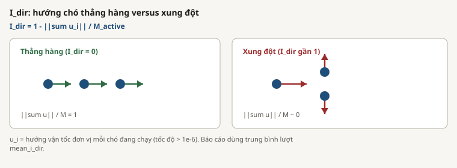
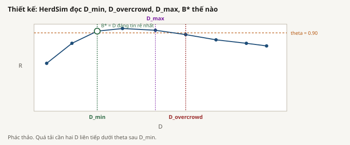

# Bảng thuật ngữ

| Thuật ngữ | Định nghĩa |
|---|---|
| B* | Cặp `(D, T)` tin cậy có trung vị tổng đường đi của chó nhỏ nhất; hòa thì ưu tiên D nhỏ hơn, rồi thời gian thành công trung vị nhanh hơn |
| C, độ phủ | Tỷ lệ cừu ngoại vi nằm trong bán kính ảnh hưởng của lần thử |
| ô (cell) | Một tổ hợp cố định của phương pháp, bố cục, N, D, và mọi nhân tố thông tin, lặp qua các seed |
| CLAIM | Cấp độ chính xác, thường 100 seed tại các ô đã lập kế hoạch; đủ điều kiện cho claim sau khi có tài liệu |
| độ kết dính (cohesion) | Trung bình khoảng cách từ cừu tới tâm khối của đàn |
| D | Số chó hoặc người chăn |
| lưới D | Các giá trị đã thử `{1, 2, 3, 4, 6, 10, 15, 20, 25, 35}` |
| D_max | D tin cậy cuối trước quá tải, hoặc trần lưới đã thử khi chưa quan sát sụp đổ |
| D_min | D nhỏ nhất đã thử có độ tin cậy đạt theta |
| D_overcrowd | Phần tử đầu của hai giá trị lưới liên tiếp sau D_min đều dưới theta |
| vận hành hiệu quả | Ô tin cậy có trung vị đường đi dưới ngưỡng lãng phí |
| extent | Căn bậc hai trung bình bình phương khoảng cách cừu tới tâm |
| thời gian kết thúc, `t_s` | Tick đầu tiên mà mọi cừu nằm trong đích |
| phân mảnh | Thành phần liên thông lớn nhất (bán kính 5) chia cho N |
| GCM | Tâm khối hình học của đàn |
| cấp độ (grade) | Mức bằng chứng: SMOKE, SCOUT, CLAIM, hoặc T1 có điều kiện |
| trần lưới | Giá trị lớn nhất đã thử, D = 35; không phải giới hạn vật lý |
| thất bại cứng | Không D nào trên lưới đã thử đạt theta |
| diện tích bao lồi | Diện tích bao lồi của đàn cừu |
| I | Điều kiện thông tin, ví dụ quan sát, tầm cảm biến, hoặc giao tiếp |
| `I_dir` | Xung đột hướng giữa các chó đang chuyển động; không là cùng hướng, một là triệt tiêu hoàn toàn |
| bố cục, X0 | Sắp xếp cừu ban đầu: compact, wide, split, hoặc outlier_rich |
| m, phương pháp | Bộ điều khiển của chó |
| manifest | `manifest.jsonl`, nhật ký chỉ thêm dùng để bỏ qua khóa lần thử đã xong khi tiếp tục |
| mean spread | Điểm trải đàn được xuất cho phân tích bố cục và dự báo |
| lần thử đã hợp nhất | Các dòng claim tại ô gieo lại cộng các dòng scout tại mọi ô còn lại |
| N | Số cừu |
| lưới N | Các kích thước đã thử `{5, 10, 25, 50, 75, 100, 150, 200, 300, 400}` |
| sụp đổ quá tải | Ô không tin cậy tại hoặc sau D_overcrowd sau một dải tin cậy |
| đường đi, `shepherd_path` | Tổng quãng đường Euclidean cộng dồn trên mọi chó |
| đường đi mỗi chó | Tổng đường đi chia cho D |
| chu vi | Chu vi bao lồi của đàn cừu |
| Pilot, SMOKE | Kiểm tra đường ống nhỏ, không phải bằng chứng cho claim |
| giao thức | Công thức đã resolve định nghĩa nhân tố, seed, cấp độ, đầu ra, và thiết lập chuẩn kế thừa |
| nguồn gốc (provenance) | Bản ghi máy đọc về giao thức, danh sách seed, trạng thái mã, máy chủ, chỉ số, và dấu thời gian |
| R | Tỷ lệ seed độc lập trong một ô thành công trước hạn |
| chế độ (regime) | Phân loại thiếu nguồn lực, hiệu quả, lãng phí, quá tải, hoặc thất bại cứng |
| SCOUT | Bản đồ rộng 30 seed dùng để lập kế hoạch và chẩn đoán, không dùng cho kết luận claim |
| seed | Lần lặp ngẫu nhiên độc lập; danh sách gốc bắt đầu từ seed chủ 2026 |
| thành công | Mọi cừu nằm trong đĩa đích trước hạn |
| T0 | Hạn chính, 10.000 tick |
| T1 | Hạn dài có điều kiện, 20.000 tick, chỉ cho ô quá tải |
| theta | Ngưỡng độ tin cậy, mặc định 0,90; 0,50 và 0,70 là độ nhạy |
| tick | Một bước cập nhật mô phỏng rời rạc, không phải giây đồng hồ tường |
| chuỗi thời gian | Lịch sử Parquet theo lần thử dùng cho phân tích quỹ đạo và cảnh báo sớm |
| thất bại thiếu nguồn lực | R dưới theta trước một dải tin cậy hoặc quá tải |
| chi tiêu lãng phí | Ô tin cậy có trung vị đường đi vượt B* theo dung sai đã cấu hình |
| X0 | Họ bố cục ban đầu |

## Nhãn thất bại

Các lần thử thất bại có thể nhận nhãn chỉ dùng cho phân tích: `stacking`, `split`, `scatter`, `oscillation`, `stuck`, hoặc `timeout`. Các nhãn này mô tả chế độ thất bại heuristic và không thay đổi quy tắc thành công nhị phân.

## Tên bộ điều khiển

| Tên | Mô tả ngắn |
|---|---|
| `strombom_multi` | Cơ sở thu thập-và-đẩy nhiều chó có phối hợp |
| `kubo` | Bộ điều khiển cừu và chó dựa trên lực cục bộ, có cảm biến và tích phân |
| `fat` | Cừu Strombom với chọn mục tiêu xa chó nhất độc lập |
| `communication_free` | Bộ điều khiển chuyển giao khuyến nghị, ngoài tập ba phương pháp bắt buộc |
