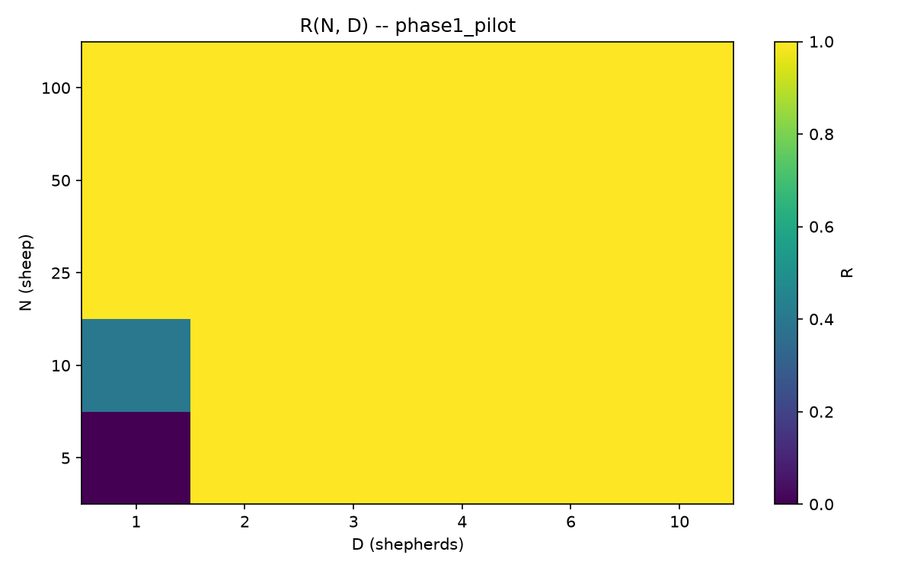
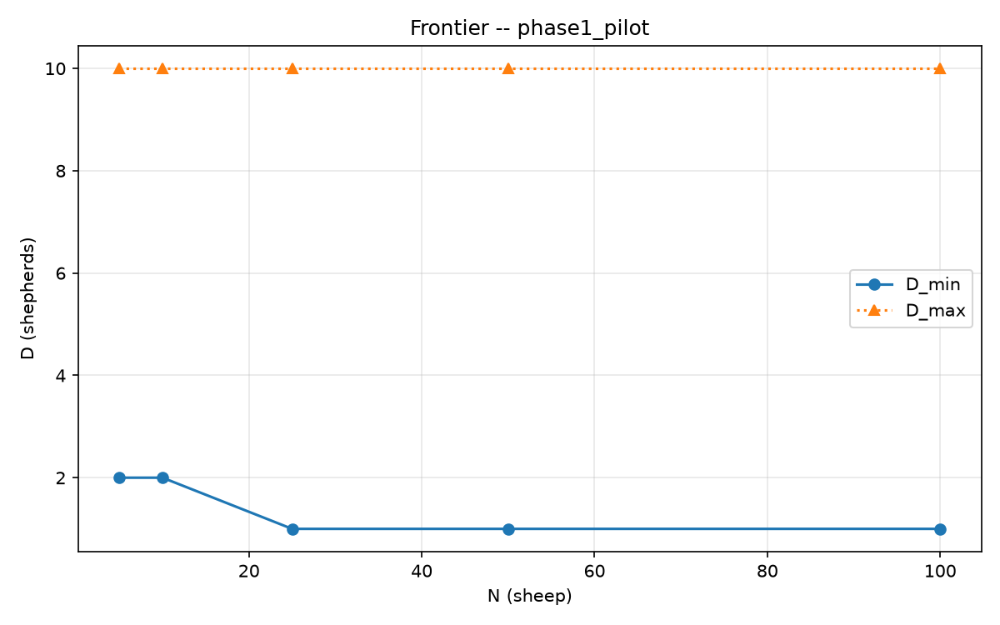
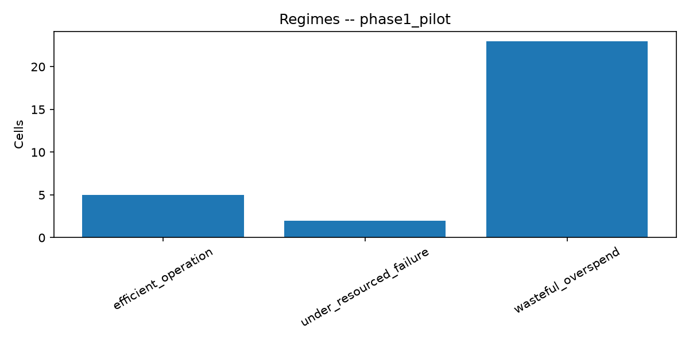

# Package A -- Herdability map (phase1_pilot)

Auto-generated evidence package. Interpretation belongs in the protocol `REPORT.md`.

## Setup

- Protocol id: `scaling_v2`
- Reliability theta: 0.9
- Methods: ['strombom_multi']
- Layouts: ['compact']
- N grid: [5, 10, 25, 50, 100]
- D grid: [1, 2, 3, 4, 6, 10]
- Seeds in export: 5 unique
- Trial rows: 150
- Frontier rows: 5

## Diagnostics

- Trial rows: 150
- Overall success rate: 0.947
- Top failure_mode counts:
  - none: 142
  - oscillation: 5
  - stuck: 3
- Ticks: median=185, p90=201, max=10000
- Regime counts:
  - wasteful_overspend: 23
  - efficient_operation: 5
  - under_resourced_failure: 2

## Claim stubs (auto, not final)

- C2a (overcrowding at theta=0.9): UNEVALUABLE on this export (no overcrowding regime / D_overcrowd).
- C2b (hard ceiling at T1): not evaluated here (requires extended-time campaign).
- C6 (scaling): frontier varies with N; run Package F fits before deciding C6a/C6b.

## Frontier summary

initial_layout  n_sheep  d_min d_overcrowd  d_max  b_star_d  b_star_t  b_star_effort  hard_failure
       compact        5      2        None     10         2   10000.0     337.265689         False
       compact       10      2        None     10         2   10000.0     329.670470         False
       compact       25      1        None     10         1   10000.0     162.000000         False
       compact       50      1        None     10         1   10000.0     157.500000         False
       compact      100      1        None     10         1   10000.0     157.777109         False

## Regime counts

regime
wasteful_overspend         23
efficient_operation         5
under_resourced_failure     2

## Figures

- heatmap: `figures/reliability_heatmap.png`
  

- frontier: `figures/frontier_dmin.png`
  

- regimes: `figures/regime_counts.png`
  

## Artefacts

- trials.csv
- reliability.csv
- frontier.csv
- regimes.csv
- dmin_bootstrap.csv
- provenance.json
- figures/

