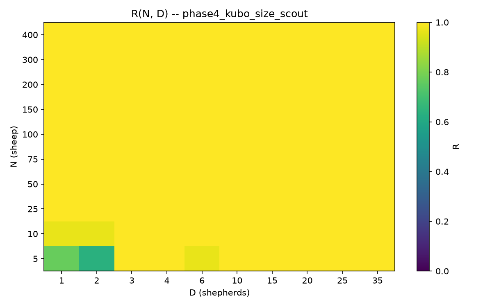
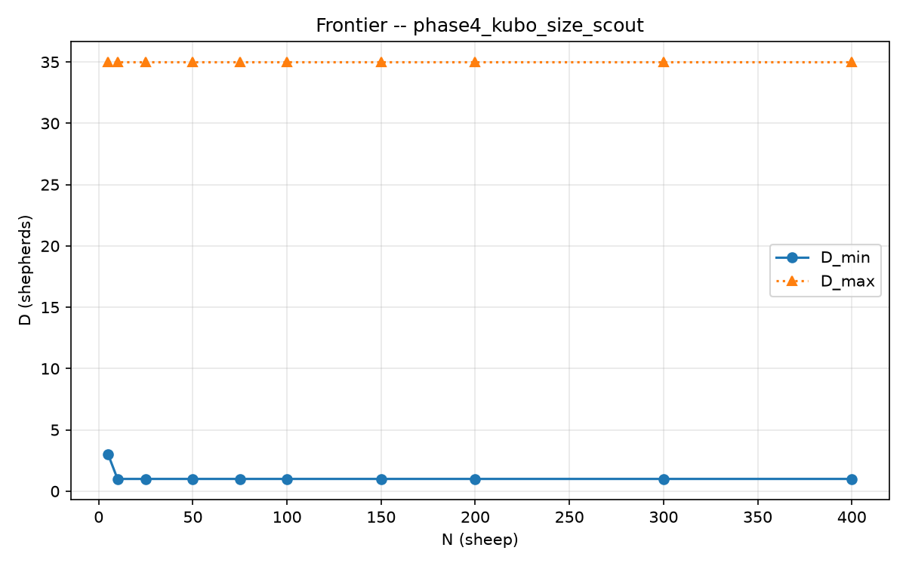
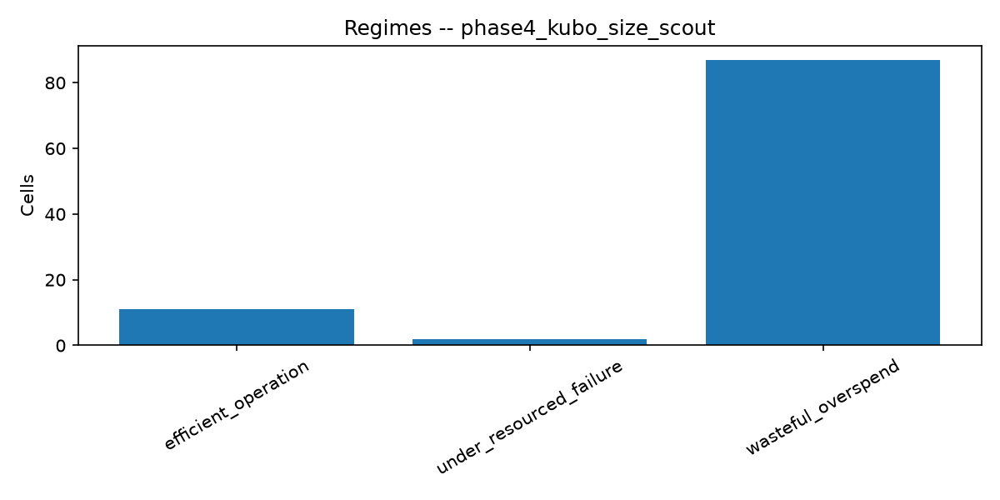

# Package A -- Herdability map (phase4_kubo_size_scout)

Auto-generated evidence package. Interpretation belongs in the protocol `REPORT.md`.

## Setup

- Protocol id: `scaling_v2`
- Reliability theta: 0.9
- Methods: ['kubo']
- Layouts: ['compact']
- N grid: [5, 10, 25, 50, 75, 100, 150, 200, 300, 400]
- D grid: [1, 2, 3, 4, 6, 10, 15, 20, 25, 35]
- Seeds in export: 30 unique
- Trial rows: 3000
- Frontier rows: 10

## Diagnostics

- Trial rows: 3000
- Overall success rate: 0.993
- Top failure_mode counts:
  - none: 2979
  - timeout: 21
- Ticks: median=722, p90=1856, max=10000
- Regime counts:
  - wasteful_overspend: 87
  - efficient_operation: 11
  - under_resourced_failure: 2

## Claim stubs (auto, not final)

- C2a (overcrowding at theta=0.9): UNEVALUABLE on this export (no overcrowding regime / D_overcrowd).
- C2b (hard ceiling at T1): not evaluated here (requires extended-time campaign).
- C6 (scaling): frontier varies with N; run Package F fits before deciding C6a/C6b.

## Frontier summary

initial_layout  n_sheep  d_min d_overcrowd  d_max  b_star_d  b_star_t  b_star_effort  hard_failure
       compact        5      3        None     35         3   10000.0     991.225887         False
       compact       10      1        None     35         1   10000.0     121.125718         False
       compact       25      1        None     35         1   10000.0     118.216176         False
       compact       50      1        None     35         1   10000.0     117.232644         False
       compact       75      1        None     35         1   10000.0     115.884142         False
       compact      100      1        None     35         1   10000.0     112.326770         False
       compact      150      1        None     35         1   10000.0     108.677254         False
       compact      200      1        None     35         1   10000.0     109.627163         False
       compact      300      1        None     35         1   10000.0     106.838741         False
       compact      400      1        None     35         1   10000.0     104.535235         False

## Regime counts

regime
wasteful_overspend         87
efficient_operation        11
under_resourced_failure     2

## Figures

- heatmap: `figures/reliability_heatmap.png`
  

- frontier: `figures/frontier_dmin.png`
  

- regimes: `figures/regime_counts.png`
  

## Artefacts

- trials.csv
- reliability.csv
- frontier.csv
- regimes.csv
- dmin_bootstrap.csv
- provenance.json
- figures/

