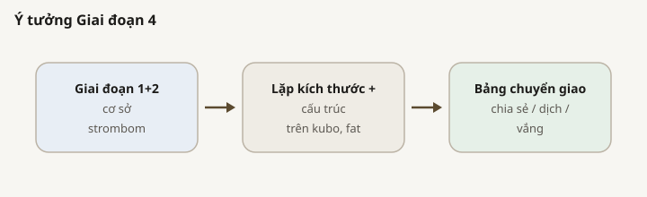
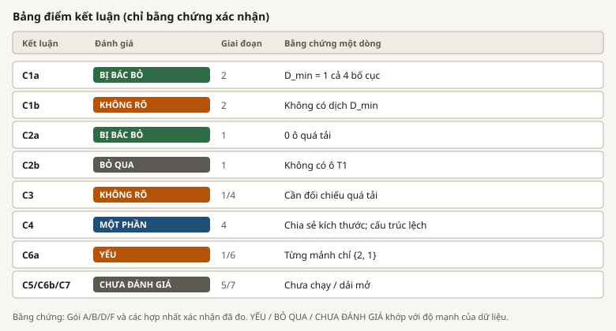

# Nghiên cứu này nói về điều gì

## 1. Câu hỏi chính

> Nếu chỉ có vài con chó để lùa một đàn cừu vào vùng đích, cần bao nhiêu chó khi đàn đông hơn, hoặc khi lúc đầu cừu đứng rải hơn?

Nói đơn giản: chúng tôi muốn một con số rõ ràng cho **bao nhiêu chó là đủ**, và muốn biết con số đó có tăng khi đàn lớn hơn không, có đổi khi cách xếp cừu lúc bắt đầu khác không, và có giữ nguyên không nếu đổi "bộ não" của chó (bộ điều khiển).

| Điều chúng tôi cố đo | Ký hiệu | Ý nghĩa |
|------------------------|--------|------------------|
| Ít chó nhất mà vẫn thường thành công | `D_min` | Số chó nhỏ nhất thắng ít nhất 90% lần lặp |
| Nhiều chó nhất mà vẫn thường thành công | `D_max` | Số chó cao nhất vẫn còn >= 90%. Nếu không bao giờ sụp, con số này chỉ là **35** (số lớn nhất ta có chạy), không phải "35 là giới hạn thật" |
| Chỗ thêm chó bắt đầu làm hại | `D_overcrowd` | Chỗ trên danh sách số chó nơi quá nhiều chó làm tỉ lệ thắng tụt dưới 90% (xem ví dụ bên dưới) |
| Cách làm rẻ mà vẫn đủ tin cậy | `B*` | Trong các cách đạt 90%, cách chó đi ít nhất |
| Thêm chó hữu ích hay lãng phí | chế độ | Thêm chó có thể chỉ đi nhiều hơn (lãng phí), hoặc làm tỉ lệ thắng tụt (quá tải) |

**Danh sách số chó đã thử.** Chúng tôi không chạy mọi số nguyên (5 chó, 7 chó, ...). Chỉ chạy một danh sách cố định:

`1, 2, 3, 4, 6, 10, 15, 20, 25, 35`

"Đỉnh danh sách đã thử" / "trần lưới" = **35**: số cuối cùng trên danh sách đó. Nếu đến 35 chó mà vẫn thắng >= 90%, ta ghi `D_max = 35` và để trống `D_overcrowd`. Nghĩa là trong phạm vi đã chạy chưa thấy chỗ sụp; không chứng minh 36 hay 50 chó cũng ổn, cũng không chứng minh 35 là chỗ bắt đầu hỏng.

**Vì sao dừng ở 35.** Cùng trần với bản thảo 2025 (dải "ít chó"), và nếu dày thêm nhiều điểm D cao thì ngân sách thử nghiệm nổ. Đây **không** phải chối bỏ số chó lớn hơn mãi mãi: hỏi chuyện gì xảy ra ở 50+ chó là **câu hỏi khác**, nằm ngoài phạm vi bản đồ này, để một giai đoạn sau nếu vẫn cần tìm chỗ sụp phía trên.

**Quá tải và `D_overcrowd` (ví dụ + hình).**

- **Lãng phí:** 1 chó đã thắng ~100% lần lặp. 10 chó cũng thắng ~100%, nhưng chó đi nhiều hơn. Vẫn ổn về tỉ lệ thắng; chỉ tốn đường.
- **Quá tải:** đã có dải chạy tốt (ví dụ 1 đến 15 chó đều >= 90%), rồi khi thử thêm chó trên danh sách, tỉ lệ thắng **lại xuống dưới 90%**. "Rớt" = R (phần trăm lần lặp thắng) tụt.
- **Cách gắn `D_overcrowd`:** cần **hai bậc liên tiếp trên danh sách** đều dưới 90%. Ví dụ giả định: 15 chó OK, rồi 20 chó R = 0.80 và 25 chó R = 0.70. Khi đó `D_overcrowd = 20`, `D_max = 15`. Nếu chỉ 20 chó tụt rồi 25 chó lại OK, không gọi là quá tải.

*Cột xanh: vẫn thắng >= 90% (chạy tốt hoặc lãng phí). Cột đỏ: R dưới 90%. Cần hai cột đỏ liền nhau mới gắn D_overcrowd.*

Chúng tôi giữ cùng kiểu bài toán với bản thảo NetLogo 2025 (chó so với kích thước đàn), nhưng chặt hơn: tách kích thước khỏi hình dạng lúc bắt đầu, kiểm tra bộ điều khiển khác, và không coi "hai số cùng lên xuống" là đã chứng minh nguyên nhân. HerdSim là **phòng thí nghiệm mô phỏng**, không phải bản sao nông trại đầy đủ.

### Hiện nay đã nói được gì

| Chủ đề | Câu trả lời hiện tại (cơ sở trừ khi ghi chú) |
|-------|----------------------------------------|
| Cần bao nhiêu chó khi đàn lớn hơn (xuất phát chặt) | Đàn rất nhỏ (5 hoặc 10 cừu) cần 2 chó; từ 25 cừu trở lên, 1 chó là đủ |
| Xuất phát lộn xộn hơn có cần thêm chó không? | Trên luật chó cơ sở: không. Vẫn 1 chó. Nhưng lâu hơn và đi nhiều hơn |
| Thêm chó có giúp khi đã đủ tin cậy chưa? | Phần lớn không: thời gian gần như đứng yên; chó chỉ đi nhiều hơn |
| Luật chó khác có giống vậy không? | Chỉ một phần. Xuất phát chặt thì Kubo thường khớp; FAT và xuất phát rộng thường thất bại; một số bố cục khó của Kubo cần nhiều chó hơn |

### Điều chúng tôi **không** trả lời (chưa, hoặc cố ý)

| Không trả lời | Vì sao |
|--------------|-----|
| "Quá nhiều chó làm hỏng" như giới hạn trên thật | Trên bản đồ cơ sở, từ 1 đến 35 chó vẫn >= 90%. `D_max = 35` chỉ nói "vẫn ổn ở số lớn nhất đã chạy." Mở rộng quá 35 là câu hỏi giai đoạn sau |
| Vì sao quá tải xảy ra | Cần các trường hợp thêm chó thật sự làm hỏng; cơ sở không có |
| Cảm biến hoặc nói chuyện giữa chó có giảm được số chó không? | Giai đoạn 5 chưa chạy |
| Có cảnh báo sớm trước khi hết giờ không? | Giai đoạn 7 chưa chạy |
| Luật cho nông trại thật hoặc nhiệm vụ NetLogo của bản thảo | Chúng tôi chỉ khẳng định trong nhiệm vụ mô phỏng này |
| Khác biệt mịn hơn bước số chó đã chọn | Chỉ thử một danh sách số chó cố định |

*Các giai đoạn đã có số chắc trong báo cáo kết quả: 1 (kích thước đàn), 2 (hình dạng lúc bắt đầu), 4 (luật chó khác). Giai đoạn 3 cần trường hợp quá tải; Giai đoạn 5 và 7 vẫn mở.*

## 2. Các câu hỏi chi tiết và tình trạng

| ID | Ý nghĩa | Giai đoạn / gói | Tình trạng |
|----|-------------------|-----------------|------------|
| RQ2 | Đàn lớn hơn thì cần bao nhiêu chó, và thêm chó thì sao? | Giai đoạn 1 / A | **Xong**. Cơ sở: 1 chó từ 25 cừu trở lên; không quá tải |
| RQ6 | Có đường cong đơn giản nào cho "số chó theo kích thước đàn" không? | Giai đoạn 1 / F | **Đã kiểm, yếu**: câu trả lời gần như phẳng, ít đường cong để khớp |
| RQ1 | Cùng kích thước đàn, xếp cừu lúc đầu khác thì có đổi số chó cần không? | Giai đoạn 2 / B | **Xong**. Cơ sở: vẫn 1 chó; thời gian và quãng đường đổi nhiều |
| RQ3 | Khi thêm chó làm hại, nhiễu giữa chó hoặc đàn vỡ có khác không? | Giai đoạn 3 / C | **Bỏ qua / chưa rõ**: cơ sở không hiện "thêm chó làm hại" |
| RQ4 | Cùng câu trả lời có hiện với luật chó khác (Kubo, FAT) không? | Giai đoạn 4 / D | **Một phần**: xuất phát chặt thường khớp Strombom/Kubo; rộng và FAT thường thất bại; Kubo outlier_rich ở 200 cừu dịch sang D_min = 20 (200 mẫu; bootstrap [2, 20]) |
| RQ5 | Cảm biến hoặc giao tiếp tốt hơn có dùng ít chó hơn không? | Giai đoạn 5 / E | **Chưa chạy** |
| RQ7 | Tín hiệu đàn có báo trước khi hết giờ không? | Giai đoạn 7 / G | **Chưa chạy** |

Phần lõi nhỏ nhất chúng tôi muốn: khóa luật chơi, trả lời kích thước, trả lời hình dạng lúc bắt đầu, rồi giải thích quá tải. Quá tải không xuất hiện trên bản đồ cơ sở, nên bước giữa không chạy được như dự kiến. Kiểm luật chó khác (Giai đoạn 4) đã xong cho các phương pháp bắt buộc.

## 3. Cách quyết định "thành công" và "bao nhiêu chó"

Một **lượt** là một lần mô phỏng với hạt giống riêng. Một **ô** là một công thức cố định (kích thước đàn, số chó, hình dạng lúc bắt đầu, luật chó) lặp lại nhiều lần.

*R là tỉ lệ lần lặp xong trước hạn. Với câu trả lời chính thức, chúng tôi thường đòi R ít nhất 0.90 (90%).*

| Từ | Nghĩa ở đây |
|------|----------------|
| Thành công | Mọi cừu nằm trong vòng đích trước hạn |
| R | Việc đó xảy ra bao nhiêu phần trăm qua các lần lặp |
| theta | Thanh "đủ tin cậy" (mặc định 0.90) |
| D_min | Ít chó nhất trên danh sách vượt thanh đó |
| B* | Trong các cách vượt thanh, cách chó đi ít nhất |
| Lãng phí | Đã tin cậy (R >= 0.90), nhưng chó đi nhiều hơn hẳn cách rẻ mà vẫn tốt |
| Quá tải | Sau dải còn chạy tốt, R lại dưới 0.90 ở hai bậc liên tiếp trên danh sách (xem mục 1) |

*Hình ít chó nhất, quá tải, nhiều chó nhất vẫn ổn, và điểm rẻ mà tốt. Các bậc trên trục là các số trong danh sách đã thử, không phải mọi số nguyên.*

Về thời gian và quãng đường đi, xem thêm [SUMMARY_REPORT_vi.html](SUMMARY_REPORT_vi.html) Phụ lục B (bước, đường, nhiễu).

## 4. Nhiệm vụ và sân cố định

Mọi so sánh chính thức dùng **cùng** luật nhiệm vụ, để kiểm kích thước, hình dạng lúc bắt đầu, và luật chó vẫn công bằng.

| Mục | Giá trị |
|---------|-------|
| Nhiệm vụ | Lùa mọi cừu vào một vòng đích |
| Sân | 500 x 500; đàn bắt đầu ở giữa; tâm đích (370, 250) |
| Quãng đến đích | 120 đơn vị (mọi kích thước đàn đều vậy) |
| Cỡ đích | Lớn theo đàn: `15 * sqrt(N/50)` (15 ở 50 cừu; khoảng 42 ở 400) |
| Hạn giờ | 10,000 bước (20,000 dài hơn chỉ khi có quá tải) |
| Luật chó chính | `strombom_multi` |
| Luật chó khác để kiểm | `kubo`, `fat` |
| Kích thước đàn thử | 5, 10, 25, 50, 75, 100, 150, 200, 300, 400 |
| Số chó thử | 1, 2, 3, 4, 6, 10, 15, 20, 25, 35 |
| Cỡ kiểm hình dạng lúc bắt đầu | 50, 100, 200 cừu trên bốn bố cục |

**Hình dung sân.** Cừu bắt đầu ngoài đích, trong sân. Ứng dụng bấm chơi vẫn có thế giới đích góc nhỏ hơn riêng; nghiên cứu scaling **không** dùng thế giới đó cho khẳng định. Thành công nghĩa là mọi cừu nằm trong vòng đích của scaling.

**Hai khoảng cách dễ lẫn (Strombom).** Nghiên cứu dùng hai độ dài khác nhau. Chúng trả lời hai câu hỏi khác nhau.

| Độ dài | Công thức (điển hình) | Câu hỏi nó trả lời |
|--------|-------------------|---------------------|
| Vòng đích (thắng) | `15 * sqrt(N/50)` (15 ở 50 cừu; khoảng 42 ở 400) | Mọi cừu đã vào vùng thắng trước hết giờ chưa? |
| Ngưỡng chuyển gom/lùa của Strombom | `f(N) = r_a * N^(2/3)` (khoảng 27 ở 50 cừu; khoảng 109 ở 400, với `r_a = 2`) | Đàn đã đủ chặt để luật chó này thôi gom và bắt đầu đẩy chưa? |

`f(N)` là quy tắc nội bộ của "bộ não" chó Strombom. **Không** phải kích thước chuồng. Vòng đích luôn nhỏ hơn. Chúng tôi giữ vậy cố ý: nếu nới chuồng cho khớp `f(N)`, đàn lớn sẽ dễ thắng theo heuristic của một luật chó, và mọi phương pháp khác cũng hưởng thiên vị đó. Vì vậy nếu Strombom thất bại ở đây, chúng tôi đọc "không đưa hết cừu vào vòng đích nhỏ hơn kịp giờ," **không** đọc "cừu không vừa chuồng."

*Chó đứng sau đàn, hướng về đích. Không phải xuất phát góc của bản thảo.*

### Vì sao chọn các số này

Mỗi hàng: cái chúng tôi khóa, cái chúng tôi bỏ, và lý do. Đây là lý do thiết kế từ plan giao thức, không phải số khớp sau khi đã thấy kết quả.

#### Cỡ đích và khoảng cách

| Chọn gì | Bỏ gì | Vì sao |
|---------------|---------------------|-----|
| Bán kính đích 15 ở 50 cừu | Bán kính đóng chặt (~8), hoặc đích "đồng cỏ" rất lớn (30) | 15 khớp đích thường của app. Quá nhỏ thì kẹt đàn. Quá lớn thì việc dễ hơn và có thể giả tạo số chó cần thấp hơn |
| Phóng bán kính theo `sqrt(N/50)` | Cùng bán kính mọi kích thước; hoặc lấy khoảng gom của Strombom làm chuồng | Giữ khoảng chỗ mỗi cừu gần ổn định. Bán kính cố định kẹt đàn lớn. Dùng khoảng gom của một luật chó làm chuồng sẽ thiên vị đàn lớn với mọi phương pháp |
| Quãng lùa 120 | 80 hoặc 200 | Ở tốc độ cừu 1, đi thẳng hết 120 bước. Ngắn hơn nằm trong đám xuất phát rộng. Dài hơn đẩy mép xa đích vào tường |

#### Sân

| Chọn gì | Bỏ gì | Vì sao |
|---------------|---------------------|-----|
| Sân 500 x 500, đích (370, 250) | Sân app 150; sân 400; sân 1000 | Đủ chỗ cho xuất phát rộng và cá thể lạc. 150 quá nhỏ. 400 chật. 1000 chủ yếu trống. Đích giữa đường giữ lề trên dưới đều |

#### Kích thước đàn và số chó nào

| Chọn gì | Bỏ gì | Vì sao |
|---------------|---------------------|-----|
| Đàn nhỏ nhất 5 (giữ 5 và 10) | Bắt đầu từ 20, hoặc từ 1 | Dưới 5 gần như không còn "đàn." Đàn rất nhỏ đáng quan tâm, không phải nhiễu |
| Mười kích thước, dày quanh 100; bỏ 250 và 350 | Bước 50 từ 50 đến 400 | Bản thảo trông chờ đổi quanh 100. Mỗi kích thước thêm tốn một quét chó đầy đủ, nên bỏ 250 và 350 |
| Bước số chó 1 đến 4, rồi nhảy lớn hơn; dừng ở 35 | Mọi số nguyên đến 35 | Câu trả lời "ít chó nhất" thường nằm ở 1 đến 4. Về sau ta quan tâm nhảy **lớn** có giúp hay hại. Thử mọi số nguyên sẽ làm bản đồ rẻ đắt gấp khoảng ba |

#### Chắc chắn thế nào, chạy bao lâu, lặp bao nhiêu

| Chọn gì | Bỏ gì | Vì sao |
|---------------|---------------------|-----|
| Thanh thành công 90% | 50% làm thanh chính; 99% ở 100 lần lặp | Cùng thanh "thường được" với bản thảo. 50% quá lỏng cho "đủ chó." 99% ở 100 lần quá khắt với ô vốn ổn |
| Hạn 10,000 bước | Mặc định kịch bản 3,000 | Đủ dài để "hết giờ" nghĩa là mất kiểm soát, không phải cắt một lần thắng chậm |
| Bản đồ rẻ 30 lần; bản đồ kỹ 100; nâng 200 nếu còn mơ hồ | Chỉ 10; hoặc 100 mọi nơi | 30 đủ tách ô hỏng và ô vững. 100 cho mép quan trọng. 200 khi câu "ít chó nhất" còn mờ |
| Lấy lại mẫu 1,000 lần để ước không chắc | Chỉ 100 lần | Dải không chắc trên câu "ít chó nhất" ổn định hơn |

#### Hình dạng lúc bắt đầu và các ngưỡng liên quan

| Chọn gì | Bỏ gì | Vì sao |
|---------------|---------------------|-----|
| Xuất phát chặt và rộng vẫn còn trong sân | Xuất phát cực rộng tràn sân | Rộng phải rõ hơn chặt, nhưng vẫn nằm trên sân |
| Chia 2 cụm nếu dưới 12 cừu, không thì 3; khe ít nhất 10 | Luôn 3 cụm rất nhỏ; khe tí hon | "Cụm" tí không phải đàn con thật. Khe phải tách rõ |
| Khoảng 20% cá thể lạc | 50% hoặc 5% | 50% gần như đàn thứ hai; 5% chưa đủ một cừu ở kích thước 5 |
| "Lãng phí" nếu đi nhiều hơn 20% so với cách rẻ mà tốt | Chỉ 10%, hoặc chỉ 50% | 10% là nhiễu; 50% chỉ bắt cực đoan |

#### Cỡ nào để kiểm hình dạng lúc bắt đầu, và chỗ nào bỏ tiền lặp kỹ

| Chọn gì | Bỏ gì | Vì sao |
|---------------|---------------------|-----|
| Kiểm hình dạng ở 50, 100, 200 cừu | Thêm 5, 10, 25 trước; hoặc nhảy 300, 400 trước | Các cỡ giữa này trên xuất phát chặt đã chỉ cần 1 chó. Đủ lớn để bố cục chia và lạc có nghĩa. Cỡ rất nhỏ đã có ở Giai đoạn 1 |
| Lặp kỹ chỉ gần mép "ít chó nhất" | Chỉ một ô; hoặc lặp kỹ mọi ô | Một ô mỏng có thể đặt sai mép. Lặp kỹ mọi nơi đốt ngân sách vào ô không đổi câu trả lời |
| Quá tải cần hai bước kém liên tiếp | Một điểm tụt; hoặc "cả nửa lưới trên phải kém" | Một điểm có thể là nhiễu. Đòi cả nửa trên luôn kém có thể bỏ sót chỗ sụp rồi hồi |

#### Dự kiến sau (chưa chạy)

| Lựa chọn | Vì sao (khi chạy Giai đoạn 5 / 7) |
|--------|----------------------------|
| Chỉ nhìn 100 bước đầu cho tín hiệu sớm | Ngắn hơn một lần lùa thẳng, nên chiến thắng dễ không nằm sẵn trong đặc trưng |
| Kiểm cảnh báo sớm từ bước 1,000 đến 8,000 | Bắt đầu sau khi bố cục ổn; dừng khi còn chỗ trước hạn |
| Bậc thông tin theo tầm cảm biến của từng luật chó | Cùng thang cho các luật chó khác nhau |

Cài đặt máy đọc được nằm ở `scaling/configs/canonical_grid.yaml`. Bảng số cũng có ở Phụ lục A của SUMMARY_REPORT.

## 5. "Hình dạng lúc bắt đầu" nghĩa là gì

Ở đây hỏi: cùng kích thước đàn, xếp cừu lúc đầu khác thì có đổi số chó cần không?

| Bố cục | Trông như thế nào | Kiểm nhanh |
|--------|--------------------|-------------|
| compact | Đám chặt | Chặt hơn wide |
| wide | Cùng tâm, rải hơn nhiều | Rải hơn compact |
| split | Hai hoặc ba cụm tách nhau | Vỡ hơn compact |
| outlier_rich | Lõi chặt cộng khoảng 20% cừu xa | Nhiều cá thể lạc hơn compact |

Nếu lần gieo ngẫu nhiên đưa cừu ra ngoài sân hoặc vào đích, chúng tôi gieo lại (không dán lên tường).

*Trên luật chó cơ sở, số chó ít nhất vẫn là 1 với mọi bố cục này. Thời gian và quãng đường thì không.*

## 6. Cách tiêu ngân sách mô phỏng

Chúng tôi **không** chạy mọi công thức ở độ sâu kỹ. Lặp rẻ phủ cả lưới; lặp kỹ chỉ gần các mép quyết định câu trả lời.

| Giai đoạn | Số lần lặp điển hình | Được trích như câu trả lời chắc? |
|-------|-----------------|--------------------------------|
| Kiểm khói | rất nhỏ | Không |
| Bản đồ rẻ (dò đường) | 30 trên mọi ô | Không (chỉ để lập kế hoạch) |
| Bản đồ kỹ (xác nhận) | 100 trên mép đã chọn | Có |
| Thêm cẩn thận | 200 nếu câu "ít chó nhất" còn mờ | Có, cho mép đó |
| Hạn dài (T1) | 100 ở 20,000 bước trên số chó quá tải | Có, khi chạy |

Quy tắc gộp: ô đã có lặp kỹ thì chỉ phân tích các lần đó. Ô khác giữ lặp rẻ. Chúng tôi cũng lấy lại mẫu trong từng số chó (1,000 lần) để xem câu "ít chó nhất" có ổn định không.

## 7. Luật chó khác (chuyển giao)

Chuyển giao hỏi: phát hiện nào thuộc về **nhiệm vụ lùa này**, và phát hiện nào thuộc về **một luật chó**?

Chúng tôi so ba luật chó. Cùng nhiệm vụ, cùng sân, cùng luật thắng. Chỉ "bộ não" chó đổi.

**`strombom_multi` (cơ sở).** Cả đội dùng chung một chế độ: **gom** cá thể lạc, hoặc **lùa** đàn về đích. Chuyển chế độ dùng `f(N)` ở mục 4 (rộng hơn vòng đích; chúng tôi không nới đích cho khớp). Nhiều chó thì HerdSim gán các cá thể lạc khác nhau khi gom, và xoè chó sau đàn khi lùa, để chúng không chồng một điểm. Cừu theo luật Strombom 2014.

**`kubo`.** Không có chuyển gom/lùa. Cừu và chó chuyển động theo tổng lực liên tục trong bán kính cảm (tích phân `dt`, không phải một bước cố định mỗi tick như Strombom). Mỗi chó ép con cừu trong tầm **xa đích nhất**; lực đẩy giữa chó làm chúng xoè thành cung. Cừu là cừu Kubo, không phải cừu Strombom.

**`fat`.** Cũng không gom/lùa. Cừu vẫn Strombom 2014. Mỗi chó độc lập ép con cừu **xa chính nó nhất** (không phải xa đích, không phải xa tâm đàn), rồi đứng lệch sau con đó về phía đích. Ở Giai đoạn 1, 2 và 4 ở đây, mỗi chó thấy cả đàn (`obs_mode=global`).

| Luật chó | Vai trò trong nghiên cứu này |
|----------|--------------------|
| `strombom_multi` | Cơ sở chính |
| `kubo` | Kiểm theo lực |
| `fat` | Kiểm kiểu "ép cừu xa tôi nhất" đơn giản |

*Từ "xa nhất" trỏ vào ba con cừu khác nhau tùy luật chó.*

Chúng tôi gắn nhãn **chia sẻ** (cùng đáp án), **dịch** (số chó khác), hoặc **vắng** (một phía không bao giờ đạt 90%, hoặc không thấy quá tải). Hiện nay: xuất phát chặt thường khớp Strombom và Kubo; FAT và xuất phát rộng thường thất bại; Kubo outlier_rich tại N = 200 dịch sang D_min = 20 ở 200 mẫu (bootstrap [2, 20]; không quá tải). Số liệu: [SUMMARY_REPORT_vi.html](SUMMARY_REPORT_vi.html) mục 5; snapshot `../phase4/kubo_structure/claim/outlier_rich_n200_window.json`.

## 8. Điều được phép khẳng định

Một "claim" là phát biểu đúng/sai khoa học với quy tắc ủng hộ cố định. Chỉ cập nhật phán quyết sau bằng chứng cấp kỹ.

| Claim | Ý nghĩa | Phán quyết hiện tại |
|-------|----------------------|-------------|
| C1a | Hình dạng lúc bắt đầu đổi số chó cần thiết ít nhất một bước trên danh sách | BỊ BÁC BỎ (cơ sở) |
| C1b | Trạng thái đàn dự đoán tốt hơn kích thước+số chó khi số chó ít nhất đổi | KHÔNG RÕ RÀNG |
| C2a | Cơ sở có quá tải ở mức 90% thành công | BỊ BÁC BỎ |
| C2b | Quá tải vẫn còn khi hạn giờ dài hơn | BỎ QUA |
| C3 | Ô quá tải khác trên nhiễu / đàn vỡ | KHÔNG RÕ RÀNG |
| C4 | Số chó ít nhất hoặc quá tải chia sẻ giữa ba luật chó | ĐƯỢC ỦNG HỘ (một phần) |
| C5a / C5b | Thông tin tốt hơn cắt số chó ít nhất | CHƯA ĐÁNH GIÁ |
| C6a | Đường cong lũy thừa thua khớp gãy khúc hoặc theo bố cục | ĐÃ ĐÁNH GIÁ (khớp yếu) |
| C6b | Số chó tăng chậm hơn tuyến tính theo đàn (trong một dải nêu rõ) | CHƯA ĐÁNH GIÁ |
| C7a / C7b | Chất lượng cảnh báo sớm và thời gian báo trước | CHƯA ĐÁNH GIÁ |

*Màu khớp bảng điểm kết quả.*

## 9. Ngân sách này nâng được gì và không nâng được gì

Chi phí lõi thô: bản đồ kích thước cơ sở cộng bản đồ hình dạng lúc bắt đầu cỡ khoảng 20,000 lần mô phỏng; mỗi luật chó khác lặp lại cả hai bản đồ.

| Ngân sách này nâng được | Tự nó không nâng được |
|-------------------------|-----------------------------|
| Câu trả lời chắc về ít chó nhất và nhãn lãng phí/quá tải trên lưới của chúng tôi | Luật cho mọi luật chó chỉ từ bản đồ cơ sở |
| Kiểm hình dạng lúc bắt đầu ở 50, 100, 200 cừu | Luật phổ quát nông trại hoặc nhiệm vụ NetLogo |
| Kiểm cơ chế **khi** đã có ô đối chiếu | Khác biệt số chó mịn hơn bước danh sách |
| Bảng so sánh cạnh nhau cho các luật chó bắt buộc | "Nhiễu gây thất bại" chỉ từ tương quan |

### Giới hạn giữ lộ rõ

| Giới hạn | Cách xử lý |
|-------|-----------------|
| Chỉ một nhiệm vụ | Đổi luật chó ở Giai đoạn 4; nhiệm vụ thứ hai tùy chọn sau |
| Khoảng gom Strombom rộng hơn đích | Bảng mục 4; thất bại không đọc là không vừa chuồng |
| Thời gian rời rạc, tốc độ cừu 1 | Kết quả ở độ phân giải này |
| Luật chó mô phỏng | Khẳng định nằm trong mô phỏng |
| Mép "ít chó nhất" còn mềm | Nếu dải không chắc phủ hơn một bước số chó, nâng mép đó lên 200 lần lặp |
