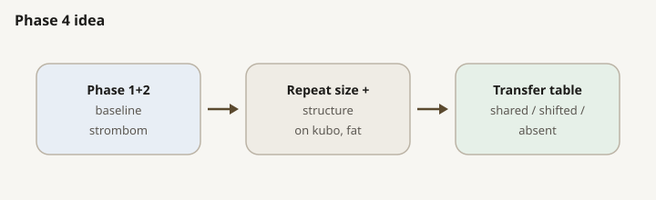
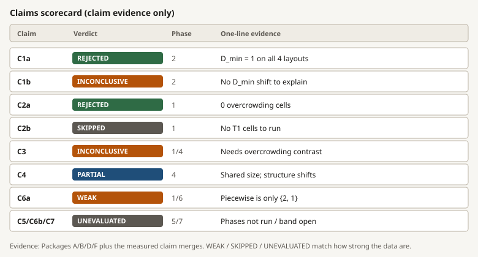
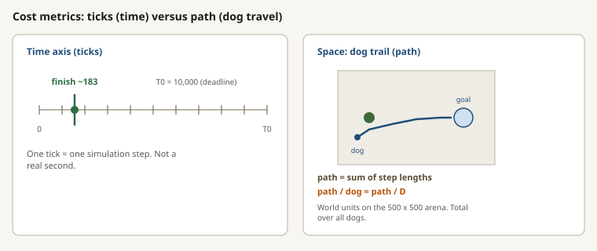
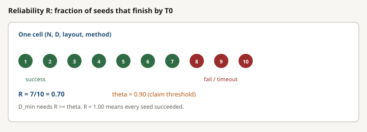

# How many dogs does a flock need?

## 1. Summary

We ask three questions. The answers we can stand behind here come from Phases **1**, **2**, and **4**.

| # | Question | Answered in |
|---|---|---|
| Q1 | As the flock gets bigger, how many dogs do we need? | Phase 1 (flock size) |
| Q2 | If flock size is fixed, does a different start shape change that answer? | Phase 2 (start shape) |
| Q3 | Do the same answers show up with other dog rules? | Phase 4 (other dog rules) |

| Verdict | Finding | Key numbers |
|---|---|---|
| D_min = 1 | D_min is the fewest dogs that usually work (at least 90% of repeats). On the baseline dog rule with a tight start, flocks from 25 to 400 sheep already succeed with **one** dog. | Tiny flocks are harder: 5 and 10 sheep need 2 dogs. With only one dog, success is just 0.07 (5 sheep) and 0.24 (10 sheep), about 7% and 24% of repeats finishing by the deadline. |
| Waste | Once the run already works with few dogs, adding more dogs on a tight start does **not** finish faster; the dogs just walk more. | Typical finish about 183 time steps; walking per dog about 148 when the flock has 25 or more sheep. Of 100 (flock size, dog count) cells, 88 are wasteful (already reliable; extra dogs only add walking). Time and walking definitions: Appendix B. |
| Not reproduced | The 2025 draft predicted a steep rise in required dogs as the flock grows. That rise does **not** appear in these runs. | The draft suggested about 20 to 35 dogs when the flock has 200 or more sheep. Here one dog still finishes 400 sheep in a typical 168 time steps (details in section 7). |
| Cost only | Changing how sheep are placed at the start (tight / wide / many stragglers) changes **how expensive** the run is (time, walking), but **not** baseline D_min: still one dog. | Wide starts take about 11x to 20x more time and 19x to 36x more walking than a tight start. Layouts with many stragglers reach about 6x time / 11x walking at 200 sheep. |
| Partial | Switching the dog rule (Kubo, FAT) does **not** carry over evenly from baseline: some settings match, others collapse. | Kubo roughly matches baseline on tight starts, but fails on wide (best success only about 0.47 to 0.54). FAT reaches 90% success only for small flocks of 10 sheep or fewer; larger flocks never hit the bar. |

**Caveat:** ceiling effect. Reliability R is the share of independent repeats that finish the task by the deadline (T0). R = 1.00 means every repeat succeeded. At one dog that holds on almost every baseline cell, so the job barely looks harder as the flock grows. Section 9 lists harder knobs. Full definitions of time steps, walking, R, and other simulation quantities: Appendix B.

## 2. Study design

What the study asks and how it is set up (separate from these results): [RESEARCH_PLAN.html](RESEARCH_PLAN.html). Side-by-side protocol with the 2025 draft: Table 1. Draft story and outcome comparison: section 7. Trust and NetLogo positioning: section 8.

### Protocol freeze vs 2025 draft

| Item | 2025 draft | HerdSim `scaling_v2` |
|---|---|---|
| Engine | NetLogo 7.0.3 (patch grid) | HerdSim (continuous space, discrete ticks) |
| Task | Collect, hold 800 ticks, exit through gate | `drive_to_goal`: every sheep inside a goal disk |
| Success | All sheep through the gate | Fraction of sheep in the goal disk >= 1.0 |
| Arena | 101 x 71 patches, pen at centre | 500 x 500, flock at (250, 250), goal at (370, 250) |
| Goal / containment | `rc = clamp(2.5 * sqrt(N), 23, 27)` | Radius `15 * sqrt(N/50)` (15 at N = 50) |
| Drive length | Collect to centre, then exit | Centre-to-goal 120 units at every N |
| Sheep start | Random scatter (wall and dog buffers) | Layout family: compact / wide / split / outlier_rich |
| Dog start | Top-left corner grid | Behind the flock, opposite the goal (offset 50, jitter +/-5) |
| Speeds (Strombom family) | Paper Table A1 | Sheep 1.0, dog 1.5 per tick |
| Speeds (Kubo) | n/a | Integration `dt = 0.05`, sheep max 5, dog max 10 |
| Timeout | 10,000 ticks | T0 = 10,000 (T1 = 20,000 planned for overcrowding cells) |
| D grid | {1, 2, 3, 4, 6, 10, 15, 20, 25, 35} | Same |
| N grid | Includes 250, 350; no 75 | Includes 75; no 250, 350 |
| Seeds | 100 every cell | Scout 30 on every cell; 100 on claim windows |
| Master seed | not stated | 2026; trial seeds are `2026 + i` |
| Reliability | SR >= 90% | theta = 0.90 (also report 0.50, 0.70) |
| D_min uncertainty | none | Bootstrap over seeds (1,000 resamples) |
| Controllers | One NetLogo collect/drive family | Baseline `strombom_multi`; transfer `kubo`, `fat` |
| Structure factor | Emergent spread; correlate `S_bar` | Set X0 families (four layouts) |
| Metrics | Success, ticks, phase, `S_bar`, path, lost sheep | Success, ticks, path, cohesion, fragmentation, mean_spread, I_dir, failure labels |

*Table 1. Draft versus current protocol. Full parameter grids: Appendix A.*

**Figure labels.** `S1`, `S2`, ... are **schematics** (concept diagrams under `figures/schematics/`). `Figure 1`, `Figure 2`, ... are **data plots** from measured CSVs. Cross-references like "see S16" mean the schematic with that caption number.

*S1. Compact start on the 500 x 500 field. Dogs stand behind the flock, opposite the goal.*

*S2. Goal radius rule `15 * sqrt(N/50)`.*

### Starting layouts

| Layout | Definition |
|--------|------------|
| compact | Gaussian, sigma = 0.3 x 30 = 9 |
| wide | Gaussian, sigma = 2.0 x 30 = 60 |
| split | 2 clusters if N < 12, else 3; separation at least 10 |
| outlier_rich | Core ~80% (sigma = 12); ~20% outliers beyond `r_a * N^(2/3)` |

*S3. How sheep and dogs are placed at the start under each X0 family.*

### Controllers

Three dog rules on the same task. Parameters: Appendix A2 to A4. Plain roles and the Strombom goal-versus-switch table: [RESEARCH_PLAN.html](RESEARCH_PLAN.html) sections 4 and 7.

**`strombom_multi` (baseline).** Shared team mode: gather stragglers, or drive the flock to the goal. The gather/drive switch uses `f(N) = r_a * N^(2/3)`, which is wider than our goal circle; we do not enlarge the goal to match it (so a failure is not "sheep did not fit"). Multi-dog spacing (different outliers; drive circle) is a HerdSim design. Sheep: Strombom 2014.

**`kubo`.** No gather/drive switch. Continuous forces inside a sensing radius (`dt` integration). Each dog presses the in-range sheep farthest from the **goal**; dog-dog repulsion fans the arc. Sheep: Kubo, not Strombom.

**`fat`.** No gather/drive switch. Sheep stay Strombom 2014. Each dog independently presses the sheep farthest from **itself**, then stands off behind that sheep toward the goal. Phases 1/2/4 use `obs_mode=global` (full flock in view).

*S13. Strombom Collect: farthest from the flock centre. Kubo: farthest from the goal. FAT: farthest from the dog.*

### Design choices

*S14. Denser where frontiers usually sit.*

*S15. Reliability threshold for every claim frontier.*

*S16. Geometry and time budget frozen with the protocol.*

| Quantity | Draft | HerdSim |
|----------|-------|---------|
| D_min | Smallest D with SR >= 90% | Smallest D with R >= theta |
| D_overcrowd | Smallest D > Dmin where SR starts decreasing | Smallest D > D_min where this D and the next grid D are both below theta (two steps in a row) |
| D_max | Smallest D > Dmin with SR < 90%, else ceiling | Largest D still at or above theta and below D_overcrowd; else **grid ceiling** (largest tested D, here 35) |
| B* | not defined | (D, T) with R >= theta and minimum median path |
| Hard failure | (implicit) | No tested D reaches R >= theta: D_min / D_max / D_overcrowd are undefined |

**Dog counts we actually test.** We only run `1, 2, 3, 4, 6, 10, 15, 20, 25, 35`. Not every integer. "Grid ceiling" / "top of the tested list" = **35**, the largest number on that list.

**Why stop at 35.** Same cap as the 2025 draft (few-shepherd range), and packing many more high-D points blows up the trial budget. Not a forever refusal of larger dog counts: asking what happens at 50+ dogs is a different question for a later stage if we still need an upper collapse.

**Overcrowding vs waste.** Waste: R stays >= 0.90; dogs just walk more. Overcrowding: there was a good winning band, then as we move up the list, the **share of winning repeats (R) falls under 90% again**. We set `D_overcrowd` only when **two consecutive** steps on the list are both under 0.90 (toy: 20 and 25 both weak => `D_overcrowd = 20`). One lone dip does not count.

**Grid ceiling.** If from D_min through 35 we stay >= 0.90, we write `D_max = 35` and leave `D_overcrowd` empty. That means we never saw a collapse inside the range we ran; **not** "35 is where things start to break."

*S17a. Green bars still >= 90%; red bars under 90%. Two red bars in a row => D_overcrowd = 20, D_max = 15. Real baseline map has no red band up to 35.*

*S17. Conceptual sketch of D_min, D_overcrowd, D_max and B-star. When there is no overcrowding, D_max sits on the right edge of the grid (ceiling).*

*S18. After a fail, heuristics label how it failed (analysis only). Aggregate shares: Figure 7.*

### Staging: pilot, scout, claim, T1

*S4. Scout maps cheaply; claim reseeds frontier windows; T1 skipped (no overcrowding cells).*

| Grade | Role | Typical seeds | Cite for claims? |
|-------|------|---------------|------------------|
| Pilot (smoke) | Pipeline check | tiny grid | No |
| Scout | Broad map; choose windows | 30 | No (planning only) |
| Claim | Precision on planned cells | 100 | Yes |
| T1 | Long horizon on overcrowding cells | 100 at 20,000 ticks | Yes, when run |

*S5. Reliability R is the fraction of seeds that finish by T0 (1.00 = all seeds succeed).*

*S6. Every frozen cell gets a cheap estimate of R.*

*S7. Precision is spent where D_min is decided.*

**Merge rule.** On a cell that received claim seeds, analysis uses those claim seeds only. Other cells keep scout rows.

*S20. Resample seeds within each D (1,000 times); 2.5% and 97.5% percentiles form the interval. Width zero means every resample agreed.*

**T1.** Planned at 20,000 ticks on overcrowding cells. Baseline had zero overcrowding cells, so no T1 simulations ran (`../phase1/t1/README.md`).

| Phase | Question | Method | Layout | Pilot | Scout | Claim |
|---|---|---|---|---|---|---|
| 1 | Size map | strombom_multi | compact | 150 | 3,000 | 2,200 |
| 2 | Structure | strombom_multi | 4 layouts | 600 | 3,600 | 2,400 |
| 4a | Transfer: size | kubo | compact | - | 3,000 | 2,100 |
| 4a | Transfer: size | fat | compact | - | 3,000 | 2,000 |
| 4b | Transfer: structure | kubo | 4 layouts | - | 3,600 | 4,000 |
| 4b | Transfer: structure | fat | 4 layouts | - | 3,600 | 2,400 |
|  | **Total simulations** |  |  |  |  | **35,650** |

*Table 2. Trials per stage (rows of `trials.csv`). Claim analysis merges hold 30,670 rows in total, fewer than 35,650, because scout rows are dropped on reseeded cells. Kubo structure claim has 4,000 rows (outlier_rich N = 200 at 200 seeds for D in {1,2,3,4,6,10,15,20,25}).*

## 3. Phase 1: how many dogs does a flock of size N need?

Goal: map how often the run succeeds for each flock size and dog count, R(N, D), for the baseline dog rule `strombom_multi` on tight starts, and from that read D_min (fewest dogs that usually work), D_overcrowd (where more dogs start to hurt), D_max (most dogs that still usually work), and the cheapest reliable dog count. Evidence: `../phase1/claim/README.md`, `packages/a/`, `packages/f/`.

*Figure 1. Phase 1 is the left panel; Kubo and FAT are Phase 4 (section 5). Source: `../phase1/claim/packages/a/reliability.csv`, `../phase4/{kubo,fat}_size/claim/packages/a/reliability.csv`.*

### What we see (baseline)

| Flock size N | D_min | D_max | D_overcrowd | Meaning |
|---|---|---|---|---|
| 5, 10 | 2 | 35 (grid ceiling) | none | One dog is not reliable; still reliable from D = 2 through D = 35 |
| 25 to 400 | 1 | 35 (grid ceiling) | none | One dog reaches R >= 0.90; still reliable through D = 35 |

Bootstrap intervals on every baseline D_min have width zero. Source: `../phase1/claim/packages/a/frontier.csv`.

### D_max on this map (read carefully)

| Fact | Reading |
|------|---------|
| Reported D_max | **35 for every N** on Phase 1 baseline |
| Why 35? | No overcrowding: R stays >= 0.90 from D_min all the way to the largest tested D |
| What 35 is **not** | Not a measured collapse ("too many dogs fail"). It is the **grid ceiling**: the top of `{1,2,3,4,6,10,15,20,25,35}` |
| Hard failure here? | **No** on baseline Phase 1. Hard failure means *no* D on the grid reaches theta; then D_min and D_max are left empty |

**Why this happens.** On a tight start with `drive_to_goal` and the baseline dog rule `strombom_multi`, once D_min is met the flock stays gatherable: extra dogs add walking (wasteful) but do not push success back below 90% inside the dog counts we tested. That is the same ceiling effect as R = 1.00 at one dog for flocks of 25 or more sheep.

**What to do with D_max = 35.**

| Goal | Action |
|------|--------|
| Cite lower dog need | Use **D_min** (and B*); that is the solid answer |
| Cite "still reliable up to our grid" | Report D_max = 35 **and** say grid ceiling / no overcrowding |
| Find a true upper collapse | Need a harder task or knobs that create `D_overcrowd`, or extend dog counts past 35 and re-measure; do not treat 35 as that collapse |
| Mechanism of overcrowding (C3) | Blocked on baseline until overcrowding cells exist |

Overall success across Phase 1 merge is 0.963 (169 failures / 4540 rows). Almost only at one dog on the two tiny flocks:

| Cell | R at D = 1 | R at D = 2 | Main failure labels |
|---|---|---|---|
| N = 5, D = 1 | 0.07 | 1.00 | oscillation: 93 |
| N = 10, D = 1 | 0.24 | 1.00 | stuck: 58, oscillation: 18 |

| Regime | Count of cells | Plain meaning |
|---|---|---|
| Wasteful overspend | 88 | Already reliable; more dogs only add path |
| Efficient | 10 | Near the useful D |
| Under-resourced | 2 | The two tiny-flock cells at D = 1 |

*S8. How regime labels sit along the dog-count axis.*

*Figure 2. Time to finish is flat; path is proportional to D. Source: `../phase1/claim/merged_trials.csv`.*

Median finish time is 183 ticks (p90 = 198); on successes only: median 182, p90 195. For N >= 25, median path per dog (total `shepherd_path` divided by D) is about 148 world units. That is why 88 cells are wasteful.

*Figure 3. Source: `../phase1/claim/packages/a/frontier.csv`, `../phase4/*/size/claim/packages/a/frontier.csv`, draft Table A3.*

| N | Strombom | Kubo | FAT | 2025 draft |
|---|---|---|---|---|
| 5 | 2 | 3 | 1 | 1 |
| 10 | 2 | 1 | 1 | 1 |
| 25 | 1 | 1 | none <= 35 | 1 |
| 50 | 1 | 1 | none <= 35 | 1 |
| 75 | 1 | 1 | none <= 35 | n/a |
| 100 | 1 | 1 | none <= 35 | 1 |
| 150 | 1 | 1 | none <= 35 | 3 |
| 200 | 1 | 1 | none <= 35 | 20 |
| 300 | 1 | 1 | none <= 35 | 20 |
| 400 | 1 | 1 | none <= 35 | 35 |

*Table 3. D_min at theta = 0.90 by flock size (compact start). Baseline bootstrap width zero. Kubo at N = 5 has bootstrap [1, 3]; R is 0.77 at D = 1, 0.71 at D = 2, 0.97 at D = 6. Sources: frontiers and `dmin_bootstrap.csv` as above.*

### Scaling fits (Package F)

Observed D_min is only a two-level step: 2 for N in {5, 10}, 1 for N >= 25. Leave-one-N-out RMSE:

| Model | Leave-one-N RMSE | Plain reading |
|---|---|---|
| Constant | 0.44 | One flat D_min for every N |
| Linear | 0.44 | Straight line in N |
| Power law | 0.25 | Smooth curve on log-log |
| Piecewise | 0.13 | Two levels with a break at N = 10 |

*Figure 4. Piecewise looks best only because it hard-codes the step. Source: `../phase1/claim/packages/f/scaling_cv.csv`. Claim C6b cannot be tested: there is no growth to fit.*

## 4. Phase 2: does the starting structure change the answer?

Goal: hold flock size at 50, 100, or 200 sheep and change only the start shape (X0). Test whether D_min (fewest dogs that usually work) moves by at least one step on our dog-count list (claim C1a). Evidence: `../phase2/claim/README.md`, `packages/b/`.

**Short answer.** Start shape does **not** change D_min on the baseline. It **does** change cost (time and walking).

D_min = 1 for all 12 (layout, N) cells; bootstrap width zero. At D = 1 every cell has R = 1.00 (all seeds succeed; floor effect). **D_max = 35 (grid ceiling) on every cell**; no D_overcrowd. Same reading as Phase 1: still reliable through the top of the tested D grid, not a measured collapse.

*Figure 5. Source: `../phase2/claim/merged_trials.csv` (D = 1).*

| Layout | N | R at D=1 | Median ticks | vs compact | Median path | vs compact |
|---|---|---|---|---|---|---|
| compact | 50 | 1.00 | 195 | 1.0x | 157 | 1.0x |
| compact | 100 | 1.00 | 204 | 1.0x | 161 | 1.0x |
| compact | 200 | 1.00 | 191 | 1.0x | 144 | 1.0x |
| split | 50 | 1.00 | 195 | 1.0x | 158 | 1.0x |
| split | 100 | 1.00 | 205 | 1.0x | 162 | 1.0x |
| split | 200 | 1.00 | 193 | 1.0x | 144 | 1.0x |
| outlier_rich | 50 | 1.00 | 224 | 1.1x | 209 | 1.3x |
| outlier_rich | 100 | 1.00 | 501 | 2.5x | 554 | 3.4x |
| outlier_rich | 200 | 1.00 | 1,228 | 6.4x | 1,647 | 11.4x |
| wide | 50 | 1.00 | 2,138 | 11.0x | 2,925 | 18.6x |
| wide | 100 | 1.00 | 3,074 | 15.1x | 4,319 | 26.8x |
| wide | 200 | 1.00 | 3,870 | 20.3x | 5,213 | 36.2x |

*Table 4. Baseline cost of one dog by layout (100 seeds per cell).*

| Layout | What happens |
|---|---|
| wide | Collect a spread-out flock first: 11x to 20x ticks; 19x to 36x path vs compact |
| outlier_rich | Cheap at small N; expensive with many stragglers (6.4x ticks / 11x path at N = 200) |
| split | Looks like compact here (medians match; mean fragmentation ~0.99). Treat as a check, not a finding |
| compact | Reference |

**Second dog on wide.** B* = 2 (not 1) at N = 50, 100 and 200: path 2,337 vs 2,925; 3,003 vs 4,319; 3,694 vs 5,213. That is the only baseline **layout** where adding a dog reduces total path enough to matter. Source: `../phase2/claim/packages/b/frontier_by_layout.csv`.

*Figure 6. Source: `../phase2/claim/merged_trials.csv` (wide layout).*

## 5. Phase 4: do the findings transfer to other controllers?

Goal: repeat the flock-size and start-shape maps with Kubo and FAT. A feature is **shared** if both have the same D_min (fewest dogs that usually work), **shifted** if the dog count differs, **absent** if one side never reaches 90% success. Evidence: `../phase4/README.md`, `../phase4/kubo_structure/claim/README.md`, `package_d/`, `outlier_rich_n200_window.json`.

*S9. Same grids and layouts; label each frontier feature shared, shifted, or absent.*

### Size map (compact start)

**Kubo:** D_min = 3 at N = 5; D_min = 1 for N = 10 to 400. **D_max = 35 (grid ceiling)** on every size cell; no overcrowding. Overall success 0.991; all failures are timeouts.

**FAT:** D_min = 1 at N in {5, 10}, and those two cells also have **D_max = 35 (grid ceiling)**. For N >= 25, **hard failure**: no D <= 35 reaches R >= 0.90, so D_min and D_max are **undefined** (empty in `frontier.csv`). Best R per N for N = 50 to 400 is 0.40 to 0.53 (cell R values also dip as low as about 0.17). About half of FAT size trials fail: oscillation 39%, stuck 7%.

**Hard failure versus grid-ceiling D_max.**

| Case | Frontier fields | Meaning | What to do |
|------|-----------------|---------|------------|
| D_max = 35, no D_overcrowd | D_min present | Still reliable at top of grid; upper collapse not found | Cite D_min; say D_max is ceiling only |
| Hard failure | D_min / D_max empty | Controller never hits theta on this grid | Do not invent a D_max; report best R and failure modes; optional harder/easier knobs or different task only if that is the science goal |
| True overcrowding | D_overcrowd set; D_max below ceiling | Upper end of the viable range is measured | Use that D_max; mechanism contrast (C3) becomes possible |

**Why hard failure shows up (Phase 4).** On this task, FAT (and Kubo on wide structure) often never collect or finish by T0: reliability stays below theta at every tested D. That is a **missing lower frontier** (no D_min), not an upper collapse. Kubo outlier_rich N = 200 is different: D_min = 20 with D_max still 35 (ceiling); low D fails, high D in the grid still meets theta.

**Transfer labels (Package D size).** 8 shared, 7 shifted, 29 absent. The large "absent" count is mostly overcrowding rows (no controller overcrowds on compact starts). Source: `../phase4/package_d/size/transfer_summary.csv`.

*Figure 7. Source: `failure_mode` in claim `merged_trials.csv` for phase1, kubo_size, fat_size.*

### Structure at N = 50, 100, 200

| Layout | N | Strombom | Kubo | FAT |
|---|---|---|---|---|
| compact | 50 | 1 | 1 | none (best R=0.47) |
| compact | 100 | 1 | 1 | none (best R=0.40) |
| compact | 200 | 1 | 1 | none (best R=0.47) |
| split | 50 | 1 | 1 | none (best R=0.50) |
| split | 100 | 1 | 1 | none (best R=0.47) |
| split | 200 | 1 | 1 | none (best R=0.40) |
| outlier_rich | 50 | 1 | 1 | none (best R=0.10) |
| outlier_rich | 100 | 1 | 1 | none (best R=0.00) |
| outlier_rich | 200 | 1 | 20 | none (best R=0.00) |
| wide | 50 | 1 | none (best R=0.49) | none (best R=0.00) |
| wide | 100 | 1 | none (best R=0.54) | none (best R=0.00) |
| wide | 200 | 1 | none (best R=0.47) | none (best R=0.00) |

*Table 5. D_min by layout and controller. 'none' = no D <= 35 reaches 0.90. Source: `../phase4/package_d/structure/frontier_by_method_layout.csv`.*

*Figure 8. From current structure merges. Source: structure claim `merged_trials.csv` files.*

**Kubo outlier_rich N = 200.**

| D | Seeds | R | R >= 0.90? |
|---|------:|----:|:----------:|
| 1 | 200 | 0.745 | no |
| 2 | 200 | 0.855 | no |
| 3 | 200 | 0.835 | no |
| 4 | 200 | 0.860 | no |
| 6 | 200 | 0.890 | no |
| 10 | 200 | 0.875 | no |
| 15 | 200 | 0.855 | no |
| 20 | 200 | 0.935 | yes |
| 25 | 200 | 0.910 | yes |
| 35 | 30 | 0.967 | yes |

| Item | Value |
|------|-------|
| D_min | 20 (first grid D with R >= 0.90 at 200 seeds) |
| Bootstrap on D_min | [2, 20] (`merged_dmin_bootstrap.csv`, `n_seeds_ref` = 200) |
| Overcrowding | none |
| Note on the interval | Wide on the low side: several D < 20 sit near 0.90, so bootstraps can dip below 20 |

*Figure 9. Source: `../phase4/kubo_structure/claim/merged_trials.csv`, `merged_dmin_bootstrap.csv`, `outlier_rich_n200_window.json`.*

| Finding | Plain reading |
|---|---|
| Kubo + wide | Best R 0.47 to 0.54; failures timeout/scatter; more dogs raise R toward ~0.5 but not to 0.90 |
| Kubo + outlier_rich N = 200 | Shifted; see Figure 9 |
| FAT on structure | No layout at N >= 50 reaches 0.90 |

**Interference (I_dir).** Definition and formula: Appendix B4 (schematic S34). Mean I_dir rises with D then levels off. Snapshot at N = 100:

| Controller | Mean I_dir at D = 35 | Mean I_dir over all D at N = 100 |
|------------|---------------------:|--------------------------------:|
| Baseline (`strombom_multi`) | ~0.09 | ~0.05 |
| Kubo | ~0.15 | ~0.10 |
| FAT | ~0.48 | ~0.40 |

| Association check | Value | Reading |
|-------------------|------:|---------|
| Pearson r(I_dir, success) on FAT size merge | ~-0.87 | Strong negative association |
| Causal claim? | no | Likely mostly "FAT fails where I_dir is high," not a proved mechanism |
| Study type | observational | Interpretation only; not a controlled mechanism experiment |

*Figure 10. Source: `mean_i_dir` in claim `merged_trials.csv` files.*

**Interpretation.** Once a method cannot collect or finish, the dog rule matters more than how many dogs you add. Looking only at the flock-size map makes transfer look better than it is; the start-shape map is where the comparison breaks.

## 6. Synthesis and claims scorecard

*S31. Verdict colours match the table below. Evidence paths: Packages A/B/D/F and `../../docs/progress_tracker.md`.*

| Claim | Verdict | Evidence | Comment |
|---|---|---|---|
| C1a | REJECTED | Phase 2 Package B: D_min = 1 for all 4 layouts at N = 50, 100, 200 (bootstrap width 0) | True for baseline. Kubo structure shifts: see section 5 |
| C1b | INCONCLUSIVE | No D_min shift on baseline, so state-vs-(N, D) has nothing to explain | Package B reports NaN likelihoods. Cost does depend on layout (section 4) |
| C2a | REJECTED | Phase 1 Package A: 0 overcrowding cells at theta = 0.90 | None in Phase 4 either |
| C2b | SKIPPED | No overcrowding cell for T = 20,000 |  |
| C3 | INCONCLUSIVE | Mechanism contrast needs overcrowding; none on baseline | Optional contrast: Kubo wide / outlier_rich N = 200 (section 5); not a completed Package C |
| C4 | SUPPORTED (partial) | Package D: shared D_min for N >= 25 on compact (Strombom/Kubo); FAT absent; Kubo wide absent; outlier_rich N = 200 shifted | Tracker and `discuss/phase4.md` say partial |
| C6a | EVALUATED, weak | Package F: piecewise RMSE 0.13 vs power 0.25 | Fit is only levels {2, 1}; not a scaling law |
| C5a/b, C6b, C7a/b | UNEVALUATED | Phases 5 and 7 not run; C6b has no stated N band |  |

## 7. The 2025 draft and how outcomes compare

Sources: [sheep-scaling_paper2025.pdf](../../../docs/papers/sheep-scaling_paper2025.pdf); note [sheep-scaling_paper2025.md](../../docs/notes/sheep-scaling_paper2025.md). Protocol differences: Table 1. Task sketch:

*S19. Same broad science theme (dogs vs N), different task and starts. Main reason the draft's steep D_min(N) need not appear here.*

*S24. Draft-reported task only; not re-run in HerdSim.*

*S26. Flat 100 seeds x 110 cells = 11,000 simulations. HerdSim claim totals: Table 2.*

*S27. Visual summary from draft Table A3. HerdSim D_min: Table 3 and Figure 3.*

| N | Draft Dmin | Draft Dmax | Max SR |
|---|---|---|---|
| 5 | 1 | not reached | 100% |
| 10 | 1 | 15 | 100% |
| 25 | 1 | 25 | 100% |
| 50 | 1 | 25 | 100% |
| 100 | 1 | not reached | 100% |
| 150 | 3 | not reached | 99% |
| 200 | 20 | 35 | 94% |
| 250 | 25 | not reached | 93% |
| 300 | 20 | not reached | 93% |
| 350 | 35 | not reached | 91% |
| 400 | 35 | not reached | 91% |

*Draft Table A3 at SR >= 90%. Not re-run here.*

*S28. From draft Tables VIII to X.*

| Draft finding | HerdSim here | Comment |
|---|---|---|
| One dog suffices up to N ~ 100, then collapses | One dog suffices up to N = 400 (R = 1.00 at N = 150 and 400) | Not reproduced |
| D_min rises to 20 to 35 for N >= 200 | D_min = 1 | Not reproduced |
| Overcrowding at high D on small N | R = 1.00 at D = 35 for N = 5 to 400 (baseline) | Not reproduced |
| Time falls with D; distance saturates | Time flat; path linear in D | Different shape |
| Spread correlates with failure | Not tested (Phase 3 blocked) | Metrics recorded; no claim-grade analysis |
| Single scheme, no D_min uncertainty | Bootstrap; three controllers; four layouts | New evidence HerdSim adds |

*Table 6. Which draft findings carry over. Protocol elements: Table 1.*

**Why outcomes may diverge (interpretation, not tested).** Hard phases (hold + gate), random sheep starts, dogs in a corner, and tighter time pressure in the draft versus drive-to-goal with dogs already behind the flock and median finish ~183 of 10,000 ticks here. No controlled swap experiment was run.

## 8. Trust and positioning

Keep three layers separate: **HerdSim** (Python claim stack), **NetLogo** (general ABM platform), **2025 draft** (one NetLogo model; section 7).

*S22. Left: general ABM toolkit. Right: domain experiment stack.*

| Twin? | Method | Claim-grade here? |
|---|---|---|
| Yes | `strombom_multi` | Yes (Phases 1 and 2) |
| Yes | `kubo` | Yes (Phase 4) |
| No | `fat` | Yes (Phase 4), HerdSim only |

The 2025 draft model is not a twin and was not re-run.

*S30. Layer 4 is part of the argument: saying what we do not claim.*

| We do claim | We do not claim |
|---|---|---|
| Shared methods reuse published controller ideas | HerdSim equals NetLogo tick-for-tick |
| Twins support behaviour checks where they exist | A published quantitative twin-parity score already exists |
| Claim numbers come from frozen `scaling_v2`, seeds, scout/claim, bootstrap, open CSVs | FAT has a NetLogo twin |
| Draft vs HerdSim differences are protocol/task differences | The 2025 draft was re-run or twin-validated here |

*S21. Theme mapping only. Not bit-for-bit replication of published tables.*

| Theme / paper | Classic focus (short) | What HerdSim found here | Where |
|---|---|---|---|
| Strombom et al. 2014 | Collect/Drive; one dog herds moderate flocks | D_min = 1 for N = 25 to 400; N = 5, 10 need 2 | Section 3; Table 3 |
| Kubo et al. 2022 | Dog-dog repulsion; multi-dog guidance | Compact shared; wide fails; outlier_rich N = 200 shifts | Section 5; Table 5 |
| Tsunoda et al. 2018 (FAT idea) | Farthest visible sheep under local sensing | On this task with global obs: R >= 0.90 only for N <= 10 | Section 5; Figure 1 |
| 2025 draft | Steep D_min(N); overcrowding; hold+exit | Not reproduced under drive_to_goal + controlled starts | Section 7 |
| Structure / herdability | Starting state matters | Cost shifts 10x to 36x; baseline D_min stays 1 | Section 4; Table 4 |

## 9. Limits and suggested next steps

| Tag | Meaning |
|---|---|
| OK | Observation is correct; no re-run needed for this point |
| READY | Data already exists; analysis can proceed without new sims |
| WEAK | Claim or label is stronger than the fit or data support |
| UNVERIFIED | Suspected issue; needs a check, not yet confirmed |
| SKIPPED | Planned, but blocked by missing contrast |
| NOT RUN | Phase or experiment never executed |

| Status | Topic | What is true now | What to do |
|---|---|---|---|
| OK | Ceiling effect | R = 1.00 (all seeds succeed) at D = 1 on almost every baseline cell (section 1) | Optional later: harder task knobs (none tried yet) |
| OK | D_max = 35 is grid ceiling | Phase 1/2 and reliable Phase 4 cells: no overcrowding; D_max is top of D grid, not a collapse (section 3) | Cite with that wording; to measure a real upper end, create D_overcrowd or extend D |
| OK | Hard failure empties D_max | FAT N >= 25 (size) and FAT / Kubo-wide (structure): no D_min, so no D_max (section 5) | Report best R and failure modes; do not fill a fake D_max |
| WEAK | Kubo outlier_rich N = 200 D_min interval | Point D_min = 20 at 200 seeds (R = 0.935); bootstrap still [2, 20] because several lower D sit near theta (section 5 / Figure 9) | Keep the point estimate; cite the wide interval |
| WEAK | C6a / Package F | EVALUATED but degenerate two-level fit (section 3) | Keep numbers; wording stays "evaluated, weak" |
| READY | Mechanism contrast for C3 | No overcrowding; contrast cells still exist in section 5 | Analyse those cells; do not fill in R without new runs |
| UNVERIFIED | Split layout | Cost and D_min match compact | Confirm generator creates separated clusters at t = 0 |
| SKIPPED | Phase 3 / C2b | 0 overcrowding cells | Optional READY analysis above |
| NOT RUN | Phase 5 | No `phase5/` yet | Obs / range / comm after harder baseline |
| NOT RUN | Phase 7 | Package G not run | Needs timeseries + held-out AUROC / lead time |
| OK | Per-phase reports | Phase 1/2/4 `README.md` match current merges | Keep in sync if merges change |
| OK | Scope | One task, simulated controllers, one theta | Keep claims limited to this simulation |

## 10. Where the numbers come from

Paths relative to `scaling/results/summary/`.

### Documents and protocol

| In report | Source |
|---|---|
| Section 7 draft PDF | `../../../docs/papers/sheep-scaling_paper2025.pdf` |
| Draft note (Table A3) | `../../docs/notes/sheep-scaling_paper2025.md` |
| Protocol freeze | `../../configs/canonical_grid.yaml`, `../../docs/main_scaling_plan.md` |
| What the study asks (plain guide) | [RESEARCH_PLAN.html](RESEARCH_PLAN.html) (from `RESEARCH_PLAN.md`) |
| Staging narrative | `../../docs/experiment_run_strategy.md` |
| Claims scorecard (section 6) | `../../docs/progress_tracker.md`; `../../docs/discuss/phase{1,2,4}.md` |

### Phase 1

| In report | Source |
|---|---|
| Table 2 trial counts | `../phase*/**/trials.csv` |
| Figure 1 heatmaps (left) | `../phase1/claim/packages/a/reliability.csv` |
| Table 3, Figure 3 | `../phase1/claim/packages/a/frontier.csv`, `dmin_bootstrap.csv` |
| Regimes 88 / 10 / 2 | `../phase1/claim/packages/a/regimes.csv` |
| Failures, ticks, path; Figure 2 | `../phase1/claim/merged_trials.csv` |
| Figure 4 Package F | `../phase1/claim/packages/f/scaling_cv.csv` |
| Folder README | `../phase1/claim/README.md` |

### Phase 2

| In report | Source |
|---|---|
| Table 4, Figure 5 | `../phase2/claim/merged_trials.csv` |
| B* / Figure 6 | `../phase2/claim/packages/b/frontier_by_layout.csv` |
| Folder README | `../phase2/claim/README.md` |

### Phase 4

| In report | Source |
|---|---|
| Folder README | `../phase4/README.md`; Kubo structure claim note `../phase4/kubo_structure/claim/README.md` |
| Figure 1 Kubo / FAT panels; Table 3 columns | `../phase4/{kubo,fat}_size/claim/packages/a/` |
| Transfer counts | `../phase4/package_d/size/transfer_summary.csv` |
| Table 5, Figure 8 | `../phase4/package_d/structure/frontier_by_method_layout.csv`; structure merges |
| Figure 9 Kubo outlier_rich N = 200 | `../phase4/kubo_structure/claim/merged_trials.csv`, `merged_dmin_bootstrap.csv`, `outlier_rich_n200_window.json` |
| Figures 7 and 10 | `failure_mode` / `mean_i_dir` in claim merges |

### Schematics

| In report | Source |
|---|---|
| S1 to S9, S20 to S28, S30 | `figures/schematics/en/` |
| S10 to S13 | `figures/schematics/en/alg_*.svg` |
| S31 claims scorecard | `figures/schematics/en/claims_scorecard.svg` |
| Related-work / twins | `../../docs/notes/related_work.md`; `../../../integrations/netlogo/twins.json` |

*Table 7. Provenance by section. Snapshot: update by hand if claim-grade results change.*

## Appendix A. Parameter tables

### A1. Frozen protocol (selected)

| Item | Value |
|------|-------|
| Task | `drive_to_goal` |
| Field | 500 x 500 |
| Flock centre | (250, 250) |
| Goal centre | (370, 250) |
| Goal radius | `15 * sqrt(N/50)` |
| Theta | 0.90 |
| Baseline | `strombom_multi` |
| Transfer | `strombom_multi`, `kubo`, `fat` |
| N | {5, 10, 25, 50, 75, 100, 150, 200, 300, 400} |
| D | {1, 2, 3, 4, 6, 10, 15, 20, 25, 35} |
| X0 | compact, wide, split, outlier_rich |
| Structure N | {50, 100, 200} |
| T0 / T1 | 10,000 / 20,000 |
| Scout / claim seeds | 30 / 100 |
| Master seed | 2026 |
| Bootstrap | 1,000 |

### A2. `strombom_multi` defaults

| Parameter | Value |
|-----------|-------|
| r_a | 2 |
| r_s | 65 |
| sheep_speed | 1.0 |
| shepherd_speed | 1.5 |
| noise_strength | 0.3 |
| inertia | 0.5 |
| collect threshold | `r_a * N^(2/3)` |

### A3. `kubo` defaults

| Parameter | Value |
|-----------|-------|
| radius | 60 |
| K_s1..K_s4 | 10, 0.5, 2, 5000 |
| K_f1..K_f4 | 10, 200, 8, 3000 |
| dt | 0.05 |
| sheep_speed_max | 5 |
| dog_speed_max | 10 |

### A4. `fat`

| Parameter | Value |
|-----------|-------|
| Sheep model | Strombom (same as A2) |
| Dog rule | Farthest observed sheep from the dog; stand-off `r_a` toward goal |
| Obs in Phases 1/2/4 | global |

### A5. Layouts (spread = 30)

See section 2 starting-layouts table (same definitions).

## Appendix B. Simulation quantities

This appendix defines the numbers used in the report so time steps, walking, reliability, and frontiers read the same way everywhere. Frozen numeric settings stay in Appendix A. Field geometry is in the section 2 schematics S1 (tight start on the field), S2 (goal radius), and S16 (drive length and timeout).

### B1. Time and dog travel (cost)

*S32. Left: discrete time until finish or T0. Right: cumulative Euclidean dog trail on the arena.*

| Quantity | Meaning |
|----------|---------|
| tick | One discrete simulation time step. Not a wall-clock second. |
| finish time | Tick when the trial first meets the success rule (all sheep in the goal disk). |
| T0 | Hard deadline: 10,000 ticks. Unfinished trials fail as timeout. |
| T1 | Longer deadline (20,000) planned only for overcrowding cells; unused on baseline. |
| path (`shepherd_path`) | Sum of Euclidean step lengths of **all** dogs from start to end, in arena world units on the 500 x 500 field. |
| path / dog | `shepherd_path / D`. Useful when comparing effort as D changes: on compact baseline, this stays near 148 for N >= 25 while total path rises with D. |

Field and timeout context: S16 in section 2.

### B2. Success and reliability

*S33. One cell is many seeds; R is successes by T0 divided by seed count.*

| Quantity | Meaning |
|----------|---------|
| success | Trial ends with every sheep inside the goal disk before T0. |
| seed | Independent random trial of the same cell (N, D, layout, method). |
| R | Fraction of seeds that succeed by T0. R = 1.00 means every seed succeeded. |
| theta | Reliability threshold for claim frontiers (default 0.90). Also reported at 0.50 and 0.70. |
| D_min | Smallest D on the grid with R >= theta. |

How seeds fill a cell: S5 in section 2.

### B3. Frontier and regime labels

**Overcrowding (definition + example).** Dog list: `1, 2, 3, 4, 6, 10, 15, 20, 25, 35`. After D_min, look at R at each step. Figure S17a (section 2) draws the toy case below.

Toy example (theta = 0.90): 1 through 15 dogs all R >= 0.90; 20 dogs R = 0.80; 25 dogs R = 0.70. Then `D_overcrowd = 20` (first of the weak consecutive pair), `D_max = 15` (last step still at the bar before the collapse). If only 20 dogs is weak and 25 dogs is >= 0.90 again, that is **not** overcrowding. If the whole list through 35 stays >= 0.90, there is no overcrowding; `D_max = 35` is only the largest count we ran. Asking what happens at 50+ dogs is a later stage, outside this frozen map.

| Quantity | Meaning |
|----------|---------|
| D_overcrowd | First step of a consecutive pair on the list where both have R < theta, after D_min. Empty if no such pair. |
| Grid ceiling | The number 35: largest step on the tested list. Not a farm limit. |
| D_max | Largest step still R >= theta and before D_overcrowd. **No overcrowding** => D_max = 35 (ceiling). |
| Hard failure | No step reaches R >= theta. Then D_min, D_max, and D_overcrowd are empty. Different from D_max = 35. |
| B* | (D, T) with R >= theta and the smallest median path (ties: smaller D, then faster). |
| wasteful overspend | Cell already at R >= theta, but median path is at least 20% above the efficient effort at B* / D_min. Not overcrowding. |
| under-resourced | R below theta at low D (too few dogs), before any working band. |
| overcrowding_collapse | R < theta at D >= D_overcrowd (too many dogs after a working band). |

| How to read a reported D_max | |
|------------------------------|---|
| D_max = 35 and D_overcrowd empty | We only ran up to 35; upper collapse not seen |
| D_max < 35 and D_overcrowd set | Measured end of the reliable band (e.g. D_max = 15) |
| D_max empty (with hard failure) | No viable D on the grid; do not invent D_max |

Schematic definitions: S17 / design frontier figures in section 2. Phase results: section 3 (baseline), section 5 (transfer / hard failure).

### B4. Flock state and interference

| Quantity | Meaning |
|----------|---------|
| N | Sheep count (flock size). |
| D | Dog / shepherd count. |
| X0 | Starting layout family: compact, wide, split, outlier_rich. |
| GCM | Flock centre of mass. |
| cohesion | Mean sheep distance to the GCM (lower is tighter). |
| fragmentation | Size of the largest connected sheep component divided by N (1.0 = one flock). |
| mean_spread | Mean flock spread score used in exports (layout and early-warning features). |

**I_dir (shepherd interference).** Instantaneous directional conflict among moving dogs:

`I_dir = 1 - ||sum u_i|| / M_active`

where `u_i` are unit velocity directions of dogs with speed above `1e-6`, and `M_active` is how many dogs are moving. If none move, I_dir = 0. Uses realised (post-constraint) velocities, so wall bounces can inflate I_dir near boundaries.

| Related quantity | Meaning |
|------------------|---------|
| I_dir = 0 | All moving dogs point the same way (aligned). |
| I_dir = 1 | Directions cancel (maximal conflict). |
| `mean_i_dir` | Trial-mean of per-tick I_dir (column used in Figure 10 and section 5 tables). |
| Mean I_dir at fixed (N, D) | Average of `mean_i_dir` over seeds in that cell. |
| Mean I_dir over all D at N | Average across the D grid at that flock size (same controller). |
| Pearson r(I_dir, success) | Correlation of trial `mean_i_dir` with binary success on a merge (here: FAT size map). Negative means higher interference co-occurs with failure; not by itself a causal proof. |

*S34. Same formula as the metric plugin `shepherd_interference`. Section 5 reports cell means and one FAT correlation only.*

### B5. Failure labels

When a trial fails, analysis may attach a mode label (stacking, split, scatter, oscillation, stuck, timeout). Priority and metric sketches: `figures/schematics/en/design_failures.svg` (section 2 family).

### B6. Staging grades

| Grade | Meaning |
|-------|---------|
| Pilot | Tiny smoke grid; not for claims. |
| Scout | Broad map at 30 seeds; planning only. |
| Claim | Precision reseeds (100 seeds) on planned windows; cite for claims. |
| T1 | Long horizon on overcrowding cells when they exist. |

### B7. Quick glossary

| Term | Short meaning |
|------|---------|
| N, D | Sheep count; dog count |
| R, theta | Success fraction over seeds; reliability threshold |
| tick, T0 | Simulation step; deadline ticks |
| path, path / dog | Total dog travel; travel per dog |
| D_min, B* | Min dogs at theta; best efficient (D, T) |
| X0, GCM | Start layout family; flock centre of mass |
| I_dir | Dog heading conflict (0 aligned, 1 conflict); full formula in B4 |
| Scout / Claim | Cheap map / precision reseed |
| S1, S2, ... | Schematic figure IDs (concept diagrams), not data plots |
| Figure 1, ... | Empirical data-plot IDs from measured CSVs |
