# How many shepherds does a flock need?

## 1. Summary

The study asks three linked questions. Claim-grade answers come from Phases **1**, **2**, and **4**.

| # | Question | Claim-grade phase |
|---|---|---|
| Q1 | How many dogs as flock size N grows? | Phase 1 (size) |
| Q2 | Does starting structure change that answer? | Phase 2 (structure) |
| Q3 | Does the dog controller change that answer? | Phase 4 (transfer) |

*S25. Green: claim done. Amber: skipped. Purple: analysed but weak. Grey: not run. Remaining rows list the planned question only; they do not invent R or D_min.*

| Phase | Status | Planned question | Result in this report? |
|---|---|---|---|
| 3 | SKIPPED | Efficient vs overcrowding cells on I_dir / fragmentation | No: 0 overcrowding cells on baseline |
| 5 | NOT RUN | Obs / range / comm ladders: does one step lower D_min? | No scout/claim folder yet |
| 6 | ANALYSED (weak) | Leave-one-N-out fits; C6b slope band still open | Package F / Figure 8 already here; not a real scaling law |
| 7 | NOT RUN | Held-out state AUROC and lead time on failures | Package G not run |

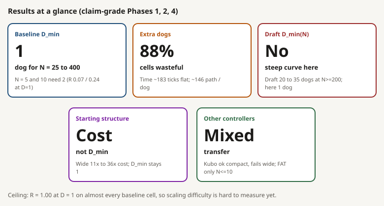

*S23. Read the big number first, then the one-line gloss under it. Numbers below are from Phases 1, 2, and 4 only.*

| Verdict | Finding | Key numbers |
|---|---|---|
| D_min = 1 | Baseline needs one dog from N = 25 to 400 | N = 5, 10 need 2; at D = 1: R = 0.07 / 0.24 |
| Waste | Extra dogs do not help on compact starts | Median time ~183 ticks; ~146 path / dog; 88/100 cells wasteful |
| Not reproduced | Draft steep D_min(N) does not appear here | Draft 20 to 35 dogs at N >= 200; here 1 dog finishes N = 400 in median 168 ticks (sections 2, 3, 11) |
| Cost only | Structure changes cost, not baseline D_min | Wide 11x to 20x ticks, 19x to 36x path; outlier_rich up to 6x / 11x at N = 200 |
| Partial | Controllers transfer unevenly | Kubo matches compact, fails wide (R <= 0.54); FAT reaches R >= 0.90 only for N <= 10 |

**Caveat:** ceiling effect. R = 1.00 at D = 1 on almost every baseline cell, so collective difficulty barely moves. Section 13 lists harder knobs.

## 2. The 2025 draft

Title: *Collective Nudging that Scales. How many dogs do I need to herd sheep?*

**Role in this report.** Section 2 summarises the draft paper only. Those numbers were not re-run in HerdSim. How the draft relates to NetLogo the platform, to HerdSim, and to the runs in this report is section 3. Side-by-side protocol and outcomes: section 4 Table 1 and section 11.

Sources: [sheep-scaling_paper2025.pdf](../../../docs/papers/sheep-scaling_paper2025.pdf); note [sheep-scaling_paper2025.md](../../docs/notes/sheep-scaling_paper2025.md). Platform named in the paper: NetLogo 7.0.3.

### Research questions (draft)

| # | Question | What it measures |
|---|---|---|
| Q1 | How does the viable dog interval `[Dmin, Dmax]` change with flock size N? | Scaling of dog count |
| Q2 | Does required dog count correlate with a flock macro-measure (mean-spread)? | Link to flock structure |
| Q3 | Can sheep keep global cohesion from local information only (density-gradient proxy for GCM)? | Local sensing vs global centre |

### Task on NetLogo (draft model)

Dogs must finish **three phases** in order. Success = every sheep through the gate within **10,000 ticks**.

*S24. Collect, hold 800 ticks, exit through the gate. Random sheep; dogs start in the top-left; containment disk; right-wall gate.*

| Piece | Draft setting |
|---|---|
| Arena | 101 x 71 patches, non-toroidal |
| Containment | `rc = clamp(2.5 * sqrt(N), 23, 27)` |
| Exit gate | 6 patches, middle of the right wall |
| Sheep start | Random scatter (wall and dog buffers) |
| Dog start | Grid in the **top-left corner** |
| Sheep rules | Graze / flee; topological neighbours `ntopo = 7`; local density gradient when fleeing |
| Dog rules | Target, drive, patrol; multi-dog arc + sector patrol in Hold |
| Hold duration | **800 ticks** (with escape limits) |
| Reliability bar | SR >= 90% |

### Experiment design (draft)

One flat **N x D** grid: 110 cells, **100 runs per cell**, **11,000** simulations total, SR >= 90%, Spearman on aggregates, **no bootstrap on Dmin**. Same **D** grid as HerdSim `scaling_v2`; **N** differs (draft has 250 and 350, no 75).

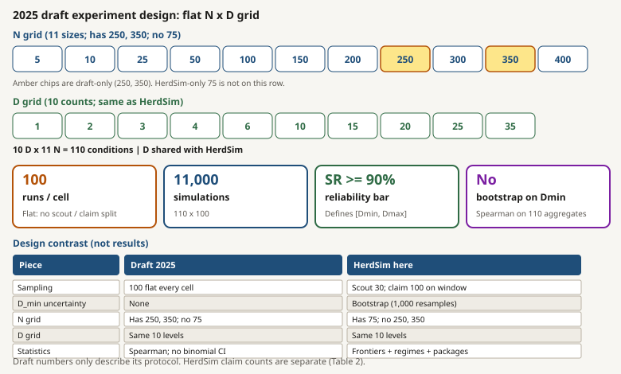

*S26. Amber chips: draft-only N. Bottom table contrasts sampling design only (not result numbers). HerdSim claim totals: Table 2.*

### Main results (draft-reported)

*S27. Visual summary from draft Table A3 and the paper narrative. HerdSim D_min comparison: Table 3 and Figure 3.*

| N | Draft Dmin | Draft Dmax | Max SR |
|---|---|---|---|
| 5 | 1 | not reached | 100% |
| 10 | 1 | 15 | 100% |
| 25 | 1 | 25 | 100% |
| 50 | 1 | 25 | 100% |
| 100 | 1 | not reached | 100% |
| 150 | 3 | not reached | 99% |
| 200 | 20 | 35 | 94% |
| 250 | 25 | not reached | 93% |
| 300 | 20 | not reached | 93% |
| 350 | 35 | not reached | 91% |
| 400 | 35 | not reached | 91% |

*Table A3 at SR >= 90%. "Not reached" means D = 35 still had SR >= 90%. Headline story: one dog works to N = 100 then collapses at N = 150; Dmin rises steeply for large N; overcrowding at high D on small N; 3,089 / 11,000 failures with ~90% stalling in Collect.*

### Follow-up analyses (draft-reported)

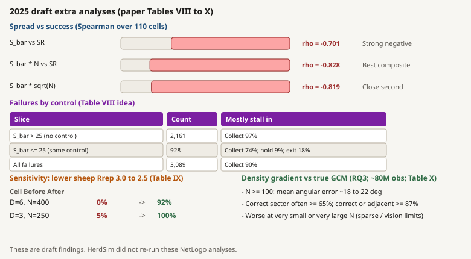

*S28. From draft Tables VIII to X. Not re-run in HerdSim.*

| Analysis | Draft result | Paper table |
|---|---|---|
| `S_bar` vs SR | Spearman rho = -0.701 | spread section |
| Best composite | `S_bar * N`, rho = -0.828 | same |
| Failures by `S_bar` | >25: 2,161 (Collect 97%); <=25: 928 (Collect 74%) | VIII |
| Sensitivity `Rrep` 3.0 to 2.5 | (D=6, N=400) 0% to 92%; (D=3, N=250) 5% to 100% | IX |
| Density gradient vs GCM | ~80M obs; N>=100 error ~18 to 22 deg | X |

## 3. HerdSim, NetLogo, and where the draft fits

Keep three ideas separate:

| Layer | What it is |
|---|---|
| **HerdSim** | Python shepherding stack: shared scenarios, metrics, Experiments, claim pipeline |
| **NetLogo** | General ABM platform (patches, turtles, IDE, BehaviorSpace). Any `.nlogo` model |
| **2025 draft** | One NetLogo model with its own collect / hold / exit task (section 2). Not "NetLogo" in general |

Section 1 states the questions this report answers (Phases 1, 2, 4). Section 2 is the draft reference. Section 4 Table 1 lists every protocol difference in one place.

### HerdSim and protocol `scaling_v2`

HerdSim is a research simulator for multi-agent sheep herding: pick a named method (sheep + dog rules), fix seeds, measure with shared metrics so comparisons stay fair when N, layout, and sensing are controlled.

For this report, everything claim-grade runs under frozen protocol **`scaling_v2`**: same **D** grid and **theta = 0.90** as the draft, plus controlled **X0** layouts, three controllers (`strombom_multi`, `kubo`, `fat`), **scout 30 / claim 100** staging, and **bootstrap on D_min**. Goal: map dogs vs N, test structure and controller, and sit next to the draft without re-running its NetLogo file.

### NetLogo as a platform

NetLogo is a widely used agent-based modeling language and desktop IDE. HerdSim does not execute NetLogo inside Python. The draft happened to be written in NetLogo 7.0.3; that is one model on the platform, not the platform itself.

### Platform vs system design

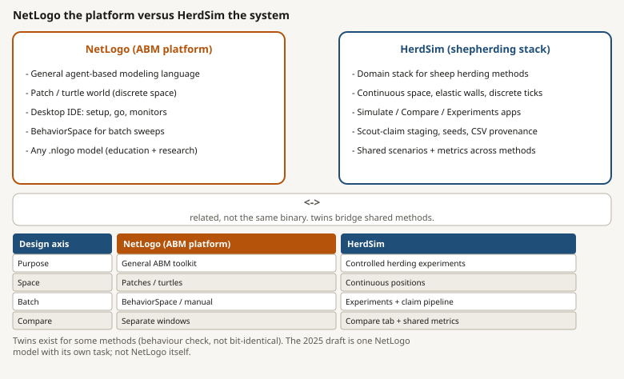

*S22. Left: general ABM toolkit. Right: domain experiment stack. Twins (next subsection) link shared methods only.*

| Design axis | NetLogo (platform) | HerdSim (system) |
|---|---|---|
| Purpose | General ABM toolkit | Controlled herding method experiments |
| Space | Patch / turtle world (discrete) | Continuous positions, elastic walls, discrete ticks |
| Interactive use | Desktop IDE: setup, go, monitors | Simulate tab (metrics, scrub, overlays) |
| Batch | BehaviorSpace or manual | Experiments + scout/claim staging |
| Comparison | Separate windows / export tables | Compare tab + shared metric stack |
| Provenance | Model + BehaviorSpace tables | Seeds, manifests, package CSVs |
| Scope of models | Any `.nlogo` | Named methods on shared scenarios |

Guide: `../../../platform/docs/guide/netlogo.md`.

### NetLogo twins and claim numbers

Some HerdSim methods have a desktop NetLogo **twin** (same Drive-to-Goal family) for visual and behavioural checks. Catalogue: `../../../integrations/netlogo/twins.json`.

| Twin? | Method | Claim-grade here? |
|---|---|---|
| Yes | `strombom_multi` | Yes (Phases 1 and 2 baseline) |
| Yes | `kubo` | Yes (Phase 4) |
| No | `fat` | Yes (Phase 4), HerdSim only |
| Yes | `strombom`, `flocking_dog` | No (not in this scaling claim set) |

The **2025 draft model is not a twin** and was not re-run. Outcome comparison: section 11. Why the stack is still claim-worthy for reviewers who know NetLogo: next subsection.

### Why trust HerdSim (vs NetLogo and similar tools)?

The field mostly runs NetLogo or other established ABM tools. HerdSim is a purpose-built stack we wrote. Trust here is **not** "same IDE as everyone else." It is layered evidence that the algorithms, checks, and protocol can carry a claim, plus an honest list of what is still missing.

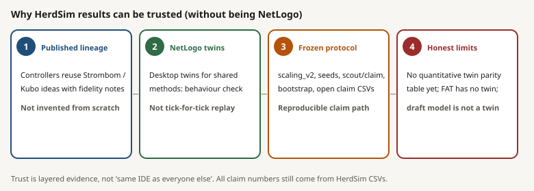

*S30. Read left to right. Layer 4 is part of the argument: saying what we do not claim.*

| We do claim | We do not claim |
|---|---|
| Shared methods reuse published controller ideas (with fidelity notes in method guides) | HerdSim equals NetLogo tick-for-tick, or reproduces every paper table bit-for-bit |
| Twins support **behaviour** cross-checks for methods that have them (`strombom_multi`, `kubo`) | A published quantitative twin-parity score (RMSE / agreement table) already exists |
| Claim numbers come from frozen `scaling_v2`, seeds, scout/claim staging, bootstrap, and open CSVs | FAT has a NetLogo twin (it does not) |
| Draft vs HerdSim differences are protocol/task differences, not "HerdSim is wrong because it is not NetLogo" | The 2025 draft NetLogo model was re-run or twin-validated here |

**What would strengthen trust later (not done here):** a small matched twin study (same N, D, seeds where possible) with agreed metrics and reported deltas; optional BehaviorSpace export next to HerdSim CSV for one baseline cell. Until then, treat twins as behavioural checks and treat all report tables as HerdSim-only.

Guide notes on twin differences: `../../../platform/docs/guide/netlogo.md` (RNG, update order, Kubo sensitivity).

### Draft task vs HerdSim task

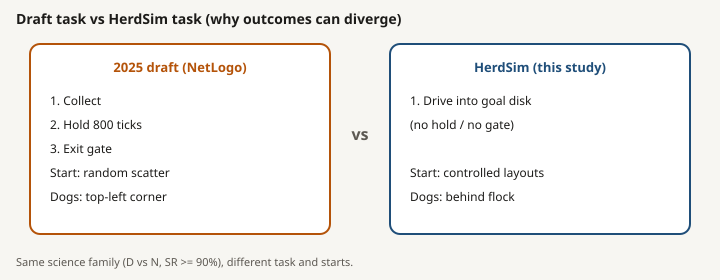

*S19. Same broad science theme (dogs vs N), different task and starts. Main reason the draft's steep D_min(N) need not appear in HerdSim (section 11). Full parameter list: section 4 Table 1.*

### Related literature

HerdSim reuses published controller families under one scenario stack; it does not invent Collect/Drive from scratch. Background: `../../docs/notes/related_work.md`.

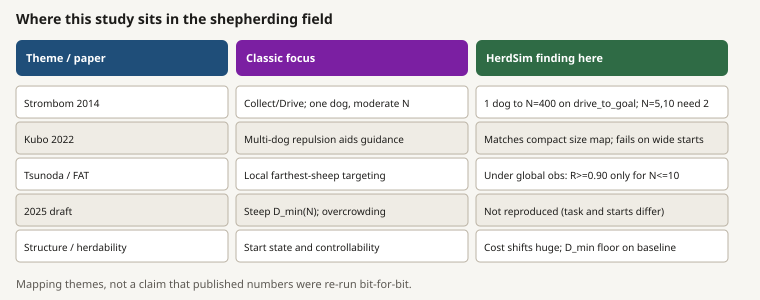

*S21. Theme mapping only. Not bit-for-bit replication of published tables.*

| Theme / paper | Classic focus (short) | What HerdSim found here | Where in this report |
|---|---|---|---|
| Strombom et al. 2014 | Collect/Drive heuristic; one dog herds moderate flocks | Baseline: D_min = 1 for N = 25 to 400; N = 5 and 10 need 2 | Phase 1; Table 3 |
| Kubo et al. 2022 | Dog-dog repulsion; multi-dog guidance | Compact size map shared with baseline; wide starts fail (R <= 0.54) | Phase 4; Table 5 |
| Tsunoda et al. 2018 (FAT idea) | Farthest visible sheep under local sensing | On this task with global obs: R >= 0.90 only for N <= 10 | Phase 4; Figure 1 |
| 2025 draft | Steep D_min(N); overcrowding; NetLogo hold+exit | Not reproduced under drive_to_goal + controlled starts | Section 11 |
| Structure / herdability | Starting state and controllability matter | Cost shifts by 10x to 36x; D_min stays 1 on baseline (floor) | Phase 2; Table 4 |

### What the HerdSim runs add

Beyond demoing another controller on one layout. Read the big number first, then the gloss and the evidence tag.

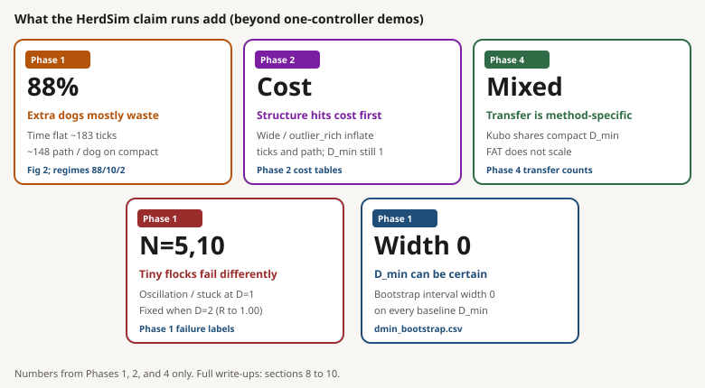

*S29. Phase badge on each card. Full write-ups in sections 8 to 10.*

| Discovery from the runs | Plain reading | Evidence |
|---|---|---|
| Extra dogs are mostly waste on compact starts | Time flat (~183 ticks); path ~146 units per dog | Phase 1; Figure 2; regimes 88/10/2 |
| Structure hits cost before D_min | Wide/outlier_rich inflate ticks and path; D_min still 1 | Phase 2 |
| Transfer is method-specific | Kubo shares compact D_min; FAT does not scale | Phase 4 transfer counts |
| Tiny flocks are a different failure regime | Oscillation/stuck at D = 1; fixed by D = 2 | Phase 1 failure labels |
| D_min uncertainty can be width zero | Bootstrap stable on baseline | `dmin_bootstrap.csv` |

## 4. Setup

| Item | 2025 draft | HerdSim `scaling_v2` |
|---|---|---|
| Engine | NetLogo 7.0.3 (patch grid) | HerdSim (continuous space, discrete ticks) |
| Task | Collect, hold 800 ticks, exit through gate | `drive_to_goal`: every sheep inside a goal disk |
| Success | All sheep through the gate | Fraction of sheep in the goal disk >= 1.0 |
| Arena | 101 x 71 patches, pen at centre | 500 x 500, flock at (250, 250), goal at (370, 250) |
| Goal / containment | `rc = clamp(2.5 * sqrt(N), 23, 27)` | Radius `15 * sqrt(N/50)` (15 at N = 50) |
| Drive length | Collect to centre, then exit | Centre-to-goal 120 units at every N |
| Sheep start | Random scatter (wall and dog buffers) | Layout family: compact / wide / split / outlier_rich |
| Dog start | Top-left corner grid | Behind the flock, opposite the goal (offset 50, jitter +/-5) |
| Speeds (Strombom family) | Paper Table A1 | Sheep 1.0, dog 1.5 per tick |
| Speeds (Kubo) | n/a | Integration `dt = 0.05`, sheep max 5, dog max 10 |
| Timeout | 10,000 ticks | T0 = 10,000 (T1 = 20,000 planned for overcrowding cells) |
| D grid | {1, 2, 3, 4, 6, 10, 15, 20, 25, 35} | Same |
| N grid | Includes 250, 350; no 75 | Includes 75; no 250, 350 |
| Seeds | 100 every cell | Scout 30 on every cell; 100 on claim windows |
| Master seed | not stated | 2026; trial seeds are `2026 + i` |
| Reliability | SR >= 90% | theta = 0.90 (also report 0.50, 0.70) |
| D_min uncertainty | none | Bootstrap over seeds (1,000 resamples) |
| Controllers | One NetLogo collect/drive family | Baseline `strombom_multi`; transfer `kubo`, `fat` |
| Structure factor | Emergent spread; correlate `S_bar` | Set X0 families (four layouts) |
| Metrics | Success, ticks, phase, `S_bar`, path, lost sheep | Success, ticks, path, cohesion, fragmentation, mean_spread, I_dir, failure labels |

*Table 1. Draft versus current protocol.*

*S1. Compact start on the 500 x 500 field. Dogs stand behind the flock, opposite the goal. Source schematic: phase1 guide (`arena_compact.svg`).*

*S2. Goal radius rule `15 * sqrt(N/50)`. Source schematic: phase1 guide (`goal_radius.svg`).*

### Starting layouts (HerdSim)

With protocol spread 30 and measurement radius 5:

| Layout | Definition |
|--------|------------|
| compact | Gaussian, sigma = 0.3 x 30 = 9 |
| wide | Gaussian, sigma = 2.0 x 30 = 60 |
| split | 2 clusters if N < 12, else 3; separation at least 10; per-cluster sigma from the gap |
| outlier_rich | Core ~80% (sigma = 12); ~20% outliers beyond `r_a * N^(2/3)` |

Points that would leave the field or land in the goal are redrawn (up to 400 attempts).

*S3. How sheep and dogs are placed at the start of a trial under each X0 family. Source schematic: phase2 guide (`four_layouts.svg`).*

## 5. Algorithms

Three methods are required. Why these three: one coordinated Collect/Drive baseline, plus two controllers with different decision rules (force-based Kubo; farthest-agent FAT), so transfer asks whether size and structure findings depend on the dog design.

### `strombom_multi` (baseline)

- **Sheep:** Strombom 2014 (graze / respond to nearest dog within `r_s`, local cohesion, repulsion, heading inertia and noise).
- **Dogs:** Collect if any sheep in the dog's view is farther than `f(N) = r_a * N^(2/3)` from that view's centroid; else Drive. Collect assigns dogs to distinct outliers with tangential spacing; Drive places dogs on a circle of radius `4 * r_a` behind the flock. Multi-dog spacing is a HerdSim design, not a published twin of Strombom 2014.
- **Key parameters:** `r_a = 2`, `r_s = 65`, sheep speed 1.0, dog speed 1.5, noise 0.3, inertia 0.5.
- **Paper:** Strombom et al., J. R. Soc. Interface 11(100):20140719, 2014.

*S10. Baseline controller idea. Collect until the flock is cohesive enough; then Drive. Multi-dog spacing keeps dogs from stacking on one point.*

### `kubo`

- **Sheep:** Kubo's own force model (repulsion, alignment, cohesion, dog repulsion inside sensing radius). **Not** Strombom sheep.
- **Dogs:** Continuous forces; each dog targets the in-range sheep farthest from the **goal**; dog-dog repulsion spreads dogs. Integration `p <- p + dt * v` with `dt = 0.05`.
- **Key parameters:** radius 60; sheep gains K_s1..K_s4 = 10, 0.5, 2, 5000; dog gains K_f1..K_f4 = 10, 200, 8, 3000; sheep speed max 5, dog speed max 10.
- **Paper:** Kubo et al., Artificial Life and Robotics 27, 416-427, 2022.
- **Comparability:** tick counts and path are not directly comparable to the Strombom family because of different integration.

*S11. Force-based herding. Aggregation and drive emerge from continuous force sums inside a sensing radius.*

### `fat`

- **Sheep:** Strombom 2014 (same as the baseline).
- **Dogs:** No Collect/Drive switch. Each dog independently targets the sheep **farthest from itself** among observed sheep, stands off `r_a` behind that sheep toward the goal, and applies the Strombom stop rule. Idea from Tsunoda et al. (2018); HerdSim runs a minimal version on Strombom sheep.
- **Observation in Phases 1, 2 and 4:** default `obs_mode=global`, so each FAT dog sees the full flock (local sensing is a later information phase, not run here).
- **Paper idea:** Tsunoda et al., Advanced Robotics 32(23), 2018.

*S12. Farthest-agent targeting. No shared Collect / Drive decision; each dog runs the same local rule on its observation.*

*S13. The word "farthest" points at three different sheep depending on the controller. That difference matters for transfer (section 10).*

## 6. Design choices and why

Each choice is frozen in the protocol and justified in the main plan (section "Why these values").

**N grid.** Ten sizes: {5, 10, 25, 50, 75, 100, 150, 200, 300, 400}. Tighter around 100, where one dog stops being enough in the draft. 75 and 150 locate that change. 300 and 400 give the large-N slope more than one step. Floor is 5: below that there is no collective. 250 and 350 are omitted because each extra N is a full dog sweep.

**D grid.** Steps of 1 from D = 1 to 4, where D_min usually sits. Wider after that ({6, 10, 15, 20, 25, 35}), because the question is whether a large increase helps or hurts, and a 2-dog gap is smaller than the high-D step. Cap 35 is where "a few shepherds" ends. Every integer to 35 would make the scout about 10,500 trials instead of 3,000.

*S14. Why the grids are uneven: precision near the draft change-point in N, and near typical D_min in D.*

**Theta 0.90.** Same reliable band as the draft. 0.50 and 0.70 are reported, not used for D_min.

*S15. Reliability threshold used for every claim frontier in this report.*

**T0 = 10,000.** About 80 straight crossings at speed 1, so timeout means loss of control. T1 = 20,000 is only for overcrowding cells (none on the baseline, so no T1 runs).

**Field 500, drive 120, goal radius `15 * sqrt(N/50)`.** Wide starts and large-N outliers must fit; drive length must stay outside a compact start and past one wide sigma; area per sheep in the goal stays constant so large N does not jam.

*S16. Geometry and time budget frozen with the protocol. Goal radius rule is also in S2.*

**Frontier definitions (HerdSim vs draft).**

| Quantity | Draft | HerdSim |
|----------|-------|---------|
| D_min | Smallest D with SR >= 90% | Smallest D with R >= theta |
| D_overcrowd | Smallest D > Dmin where SR starts decreasing | Smallest D > D_min where this D and the next grid D are both below theta |
| D_max | Smallest D > Dmin with SR < 90%, else ceiling | Largest D still at or above theta and below D_overcrowd; else the largest tested D that still meets theta |
| B* | not defined | (D, T) with R >= theta and minimum median path |

*S17. Conceptual sketch of the frontier labels used in Tables 3 and 5.*

**Failure labels (HerdSim).** The scenario only decides success or fail: all sheep in the goal disk before T0, or not. After a fail, heuristics label *how* it failed (analysis only, not the stop reason). Priority order: stacking, split, scatter, oscillation, stuck, then timeout. First match wins.

| Label | What the metric curve looks like | Seen in claim runs? |
|---|---|---|
| stacking | dogs stay unusually close (needs dog-separation history) | No (not seen here) |
| split | fragmentation stays low (flock in pieces) | Yes (FAT structure) |
| scatter | cohesion stays high (flock spread) | Yes (Kubo/FAT structure) |
| oscillation | `gcm_goal` zigzags with little net progress | Yes (Phase 1 tiny N; FAT) |
| stuck | `gcm_goal` barely drops toward the goal | Yes (Phase 1 N=10; FAT) |
| timeout | no specific pattern; still unfinished at T0 | Yes (Kubo; some FAT) |

*S18. Cards: priority order. Mini plots: what a failed trial tends to look like on `gcm_goal` / cohesion / fragmentation. Aggregate shares: Figure 5.*

## 7. Staging: pilot, scout, claim, T1

A claim-grade map needs precise success rates near frontiers. Running every (N, D) cell at 100 seeds is far more expensive than needed: interior cells that always succeed or always fail teach little at that depth. The staged pipeline spends cheap seeds everywhere, learns which cells matter, then spends expensive seeds only on those cells.

*S4. Pilot (smoke) checks the path; scout maps the full grid cheaply; claim reseeds only the frontier windows; T1 was skipped here (no overcrowding cells). Source schematic: phase1 guide (`pipeline.svg`).*

| Grade | Role | Typical seeds | Cite for claims? |
|-------|------|---------------|------------------|
| Pilot (smoke) | Pipeline check | tiny grid | No |
| Scout | Broad map; choose windows | 30 | No (planning only) |
| Claim | Precision on planned cells | 100 | Yes |
| T1 | Long horizon on overcrowding cells | 100 at 20,000 ticks | Yes, when run |

**Why 30 and 100.** At R = 0.90 the standard error is about 0.055 at 30 seeds (enough to separate a broken cell from a solid one) and about 0.03 at 100. Ten seeds flip the window. 200 is the raise when the D_min interval covers more than one grid step.

*S5. Reliability R is the fraction of seeds that succeed in a cell. Source schematic: phase1 guide (`one_cell_seeds.svg`).*

*S6. Scout map: every frozen cell gets a cheap estimate of R. Source schematic: phase1 guide (`scout_grid.svg`).*

**Claim windows.** Per (method, layout, N), after scout: the scout D_min plus previous and next grid D; if two consecutive D after that candidate stay below theta, those two D and the last D still at or above theta; if no D meets theta, the two largest D.

*S7. Why claim is cheaper than flat 100 seeds everywhere: precision is spent where D_min is decided. Source schematic: phase1 guide (`claim_window.svg`).*

**Merge rule.** On a cell that received claim seeds, analysis uses those 100 only. Other cells keep scout rows. Scout and claim rows are not stacked on the same cell.

**Bootstrap (why it is there).** D_min is estimated from a finite number of seeds. A single point estimate does not say whether that answer would still hold if a few trials had gone the other way. Bootstrap answers that without new simulations: resample the observed seeds within each D (1,000 times), recompute D_min each time, then take the 2.5% and 97.5% percentiles as an interval. Width zero means every resample gave the same D_min (stable). A wide interval (for example Kubo N = 5: [1, 3]) means the frontier is still soft under seed noise.

*S20. Left to right: observed success/fail seeds, many resamples, then the percentile interval on the resulting D_min* values.*

**T1.** Planned at 20,000 ticks on overcrowding cells. The baseline had zero overcrowding cells, so **no T1 simulations were executed** (`../phase1/t1/REPORT.md`, `../phase1/t1/t1_plan.json`).

**Budget.** This study: 34,450 simulations across Phases 1, 2 and 4 (pilot + scout + claim rows). Draft: 11,000 for one size map at flat 100 seeds.

| Phase | Question | Method | Layout | Pilot | Scout | Claim |
|---|---|---|---|---|---|---|
| 1 | Size map | strombom_multi | compact | 150 | 3,000 | 2,200 |
| 2 | Structure | strombom_multi | 4 layouts | 600 | 3,600 | 2,400 |
| 4a | Transfer: size | kubo | compact | - | 3,000 | 2,100 |
| 4a | Transfer: size | fat | compact | - | 3,000 | 2,000 |
| 4b | Transfer: structure | kubo | 4 layouts | - | 3,600 | 2,800 |
| 4b | Transfer: structure | fat | 4 layouts | - | 3,600 | 2,400 |
|  | **Total simulations** |  |  |  |  | **34,450** |

*Table 2. Trials per stage (rows of `trials.csv`). Claim analysis merges hold 29,530 rows in total, fewer than 34,450, because scout rows are dropped on reseeded cells.*

Reading a heatmap: rows are flock size, columns are shepherd count, and each cell is the percentage of seeds that succeeded. D_min is the first column in a row that reaches 90%.

## 8. Phase 1: how many dogs does a flock of size N need?

Goal: map the success rate R(N, D) for the baseline `strombom_multi` controller on a compact start, and from it D_min, D_overcrowd, D_max and the cheapest reliable D.

*Figure 1. Success-rate surface for the three controllers on the compact start. Phase 1 is the left panel; the other two are Phase 4 (section 10). Source: `../phase1/claim/packages/a/reliability.csv`, `../phase4/kubo_size/claim/packages/a/reliability.csv`, `../phase4/fat_size/claim/packages/a/reliability.csv`.*

### What we see (baseline)

**How many dogs?** For compact starts, one dog is enough once the flock has at least 25 sheep. Tiny flocks (N = 5 and 10) need two. The bootstrap interval on every baseline D_min has width zero: every resample gave the same answer.

| Flock size N | D_min | Meaning |
|---|---|---|
| 5, 10 | 2 | One dog is not reliable |
| 25 to 400 | 1 | One dog reaches R >= 0.90 |

**Do extra dogs hurt?** No overcrowding on this map. R stays at or above 0.90 from D_min all the way to D = 35 for every N. So D_overcrowd is undefined, and D_max is just the top of the grid (35).

**Where do the rare failures happen?** Almost only at D = 1 on the two tiny flocks. Overall success across Phase 1 is 96% (169 failures).

| Cell | R at D = 1 | R at D = 2 | Main failure labels |
|---|---|---|---|
| N = 5, D = 1 | 0.07 | 1.00 | oscillation: 93 |
| N = 10, D = 1 | 0.24 | 1.00 | stuck: 58, oscillation: 18 |

Reading tip: if you pool N = 5 and 10, oscillation is the single largest label. At N = 10 alone, stuck is larger than oscillation.

**How are the 100 (N, D) cells labelled?** Most extra dogs are wasted:

| Regime | Count of cells | Plain meaning |
|---|---|---|
| Wasteful overspend | 88 | Already reliable; more dogs only add path |
| Efficient | 10 | Near the useful D |
| Under-resourced | 2 | The two tiny-flock cells at D = 1 |

*S8. How regime labels sit along the dog-count axis. Source schematic: phase1 guide (`regimes.svg`).*

*Figure 2. Cost against D (log-log). Source: `../phase1/claim/merged_trials.csv`.*

### Why

**Time is already short.** Across Phase 1, median finish time is 183 ticks (p90 = 198). On successful trials only: median 182, p90 195. The timeout budget is 10,000 ticks, so the run almost never races the clock.

**Path grows with every added dog.** Each dog walks for the whole trial: about 146 path units per dog for N >= 25. That is why 88 cells are wasteful: after the first reliable dog, every extra dog mostly adds walking cost.

**Why do N = 5 and 10 need two dogs?** Not tested as a mechanism experiment here. A reading that matches the labels (not proved): one dog on a handful of sheep keeps switching between collect and drive and never settles. At N = 5 the dominant label is oscillation; at N = 10 it is stuck (with some oscillation). A second dog removes that failure mode (R jumps to 1.00 at D = 2).

*Figure 3. D_min against N. Source: `../phase1/claim/packages/a/frontier.csv`, `../phase4/*/size/claim/packages/a/frontier.csv`, draft Table A3.*

| N | Strombom | Kubo | FAT | 2025 draft |
|---|---|---|---|---|
| 5 | 2 | 3 | 1 | 1 |
| 10 | 2 | 1 | 1 | 1 |
| 25 | 1 | 1 | none <= 35 | 1 |
| 50 | 1 | 1 | none <= 35 | 1 |
| 75 | 1 | 1 | none <= 35 | n/a |
| 100 | 1 | 1 | none <= 35 | 1 |
| 150 | 1 | 1 | none <= 35 | 3 |
| 200 | 1 | 1 | none <= 35 | 20 |
| 300 | 1 | 1 | none <= 35 | 20 |
| 400 | 1 | 1 | none <= 35 | 35 |

*Table 3. D_min at theta = 0.90 by flock size (compact start). Baseline bootstrap intervals have width zero. Kubo at N = 5 has bootstrap interval [1, 3] (not width zero); R is 0.77 at D = 1, 0.71 at D = 2, 0.97 at D = 6. Draft values from its Table A3. Sources: `../phase1/claim/packages/a/frontier.csv`, `dmin_bootstrap.csv`, `../phase4/{kubo,fat}_size/claim/packages/a/frontier.csv`.*

### Scaling fits (Package F)

**Takeaway.** On the baseline there is no rising D_min(N) curve to fit. Observed D_min is only a two-level step:

| N | Observed D_min |
|---|---|
| 5, 10 | 2 |
| 25 to 400 | 1 |

Four models were compared by leave-one-N-out RMSE (fit on all but one N, score on the held-out N; lower is better):

| Model | Leave-one-N RMSE | Plain reading |
|---|---|---|
| Constant | 0.44 | One flat D_min for every N |
| Linear | 0.44 | Straight line in N |
| Power law | 0.25 | Smooth curve on log-log |
| Piecewise | 0.13 | Two levels with a break at N = 10 |

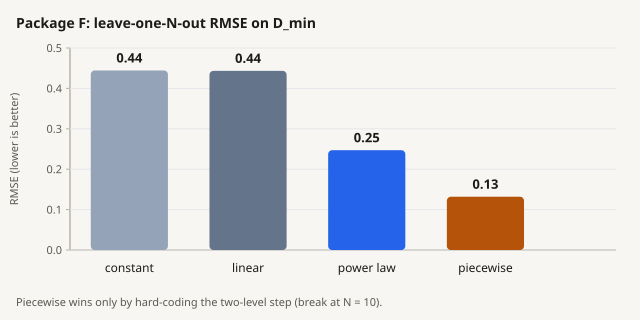

*Figure 8. Package F comparison. Source: `../phase1/claim/packages/f/scaling_cv.csv`.*

**How to read this.** Piecewise looks best only because it hard-codes the step already in the data (break at N = 10). That is not evidence of a scaling law. Claim C6b (log-log slope below 1 in an N band) cannot be tested here: there is no growth to fit.

## 9. Phase 2: does the starting structure change the answer?

Goal: hold N fixed at 50, 100 and 200 and change only the starting layout. The test is whether D_min moves by at least one grid step across layouts (claim C1a).

**Short answer.** Starting structure does **not** change D_min on the baseline. It **does** change cost (ticks and path), by a large factor.

**D_min.** Still 1 for all 12 (layout, N) cells; bootstrap width zero. At D = 1 every cell has R = 1.00, so there is a floor effect: D_min cannot fall below 1, and this controller/task cannot show a structure shift in the reliability frontier.

**Cost.** Success is 100% everywhere at D = 1, but the work differs by an order of magnitude (Table 4 and Figure 4):

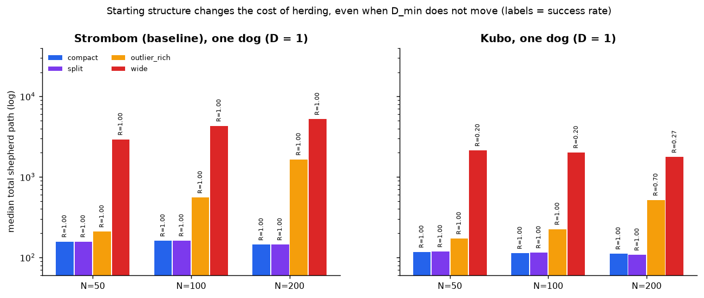

*Figure 4. Median total path at D = 1 by layout. Source: `../phase2/claim/merged_trials.csv` (D = 1).*

| Layout | N | R at D=1 | Median ticks | vs compact | Median path | vs compact |
|---|---|---|---|---|---|---|
| compact | 50 | 1.00 | 195 | 1.0x | 157 | 1.0x |
| compact | 100 | 1.00 | 204 | 1.0x | 161 | 1.0x |
| compact | 200 | 1.00 | 191 | 1.0x | 144 | 1.0x |
| split | 50 | 1.00 | 195 | 1.0x | 158 | 1.0x |
| split | 100 | 1.00 | 205 | 1.0x | 162 | 1.0x |
| split | 200 | 1.00 | 193 | 1.0x | 144 | 1.0x |
| outlier_rich | 50 | 1.00 | 224 | 1.1x | 209 | 1.3x |
| outlier_rich | 100 | 1.00 | 501 | 2.5x | 554 | 3.4x |
| outlier_rich | 200 | 1.00 | 1,228 | 6.4x | 1,647 | 11.4x |
| wide | 50 | 1.00 | 2,138 | 11.0x | 2,925 | 18.6x |
| wide | 100 | 1.00 | 3,074 | 15.1x | 4,319 | 26.8x |
| wide | 200 | 1.00 | 3,870 | 20.3x | 5,213 | 36.2x |

*Table 4. Baseline cost of one dog by layout (100 seeds per cell). Source: `../phase2/claim/merged_trials.csv`.*

What Table 4 shows, in plain terms:

| Layout | What happens | Scale of the cost gap |
|---|---|---|
| wide | Must collect a spread-out flock first | 11x to 20x more ticks; 19x to 36x more path than compact; gap grows with N |
| outlier_rich | Cheap at small N; expensive when many stragglers | About 1.1x ticks at N = 50; 6.4x ticks and 11x path at N = 200 |
| split | Looks like compact here | Medians match compact at N = 50; mean fragmentation ~0.99 for both. Treat as a check, not a finding: the generator may not create a hard sub-flock problem for this controller |
| compact | Reference | 1.0x |

**One place where a second dog pays.** On wide starts, B* = 2 (not 1): path 2,337 at N = 50 versus 2,925 at D = 1. That is the only baseline cell where adding a dog reduces total path enough to matter. Source: `../phase2/claim/packages/b/frontier_by_layout.csv`.

**Interpretation.** Structure hits effort and time long before it moves D_min. A frontier-only readout would miss the story. Report path and ticks next to D_min whenever structure varies.

## 10. Phase 4: do the findings transfer to other controllers?

Goal: repeat the size map and the structure contrast with **Kubo** and **FAT**, and compare with the baseline. A feature is **shared** if both controllers have the same D_min, **shifted** if different, **absent** if one side has none.

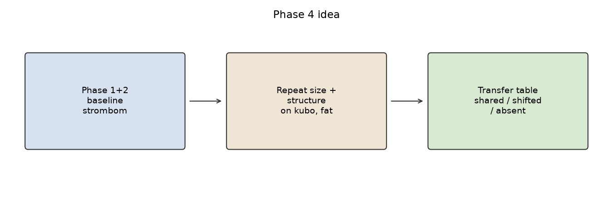

*S9. What Phase 4 compares across methods. Source figure: phase4 guide (`transfer_sketch.png`).*

### Size map (compact start)

**Kubo (mostly shared with baseline).**

| N | D_min | Notes |
|---|---|---|
| 5 | 3 | R = 0.77 at D = 1, 0.71 at D = 2, 0.97 at D = 6 |
| 10 to 400 | 1 | Same as baseline |

Overall success 99%. Failures are all timeouts.

**FAT (does not transfer for large flocks).**

| N | Result |
|---|---|
| 5, 10 | D_min = 1 |
| 25 | best R about 0.6 to 0.8; never reaches 0.90 |
| 50 to 400 | best R about 0.2 to 0.5; never reaches 0.90 |

More dogs do not help. About half of all FAT trials fail: mainly oscillation (39% of trials) and stuck (7%).

**Transfer labels (Package D size).** 8 shared, 7 shifted, 29 absent. The large "absent" count is mostly overcrowding rows (no controller overcrowds on compact starts), so that count is not a disagreement score. Source: `../phase4/package_d/size/transfer_summary.csv`.

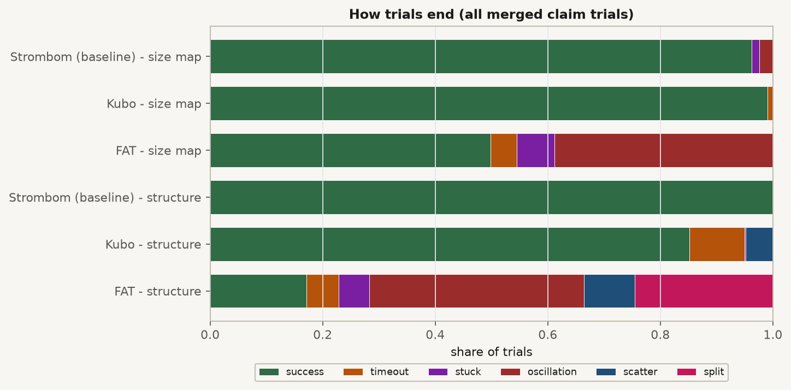

*Figure 5. How trials end. Source: `failure_mode` columns of claim `merged_trials.csv` for phase1, kubo_size and fat_size.*

### Structure at N = 50, 100, 200

| Layout | N | Strombom | Kubo | FAT |
|---|---|---|---|---|
| compact | 50 | 1 | 1 | none (best R=0.47) |
| compact | 100 | 1 | 1 | none (best R=0.40) |
| compact | 200 | 1 | 1 | none (best R=0.47) |
| split | 50 | 1 | 1 | none (best R=0.50) |
| split | 100 | 1 | 1 | none (best R=0.47) |
| split | 200 | 1 | 1 | none (best R=0.40) |
| outlier_rich | 50 | 1 | 1 | none (best R=0.10) |
| outlier_rich | 100 | 1 | 1 | none (best R=0.00) |
| outlier_rich | 200 | 1 | 4, overcrowd at 10 | none (best R=0.00) |
| wide | 50 | 1 | none (best R=0.49) | none (best R=0.00) |
| wide | 100 | 1 | none (best R=0.54) | none (best R=0.00) |
| wide | 200 | 1 | none (best R=0.47) | none (best R=0.00) |

*Table 5. D_min by layout and controller. 'none' = no D <= 35 reaches 0.90; best R over D in brackets. Source: `../phase4/package_d/structure/frontier_by_method_layout.csv`.*

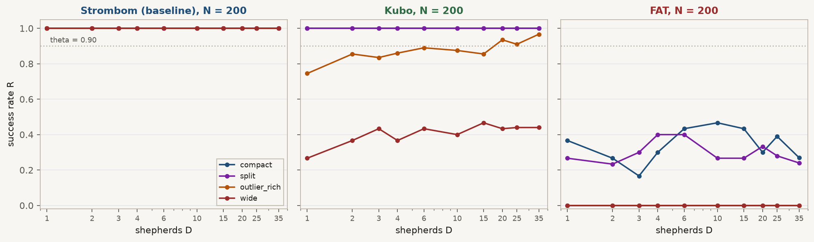

*Figure 6. R against D at N = 200 by layout. Source: `../phase4/package_d/structure/frontier_by_method_layout.csv`.*

**How to read Table 5.** Strombom stays at D_min = 1 everywhere. Kubo matches on compact and split, fails on wide, and only shifts on outlier_rich at N = 200. FAT never reaches the bar at these N.

| Finding | Plain reading | Numbers |
|---|---|---|
| Kubo + wide | Cannot collect a wide flock in time | Best R about 0.42 to 0.54; failures are timeout/scatter; more dogs raise R from ~0.2 toward ~0.5 but not to 0.90 |
| Kubo + outlier_rich, N = 200 | Soft shift, not a collapse | D_min = 4; labelled overcrowded at D = 10; R(D) wobbles around 0.90 (0.70, 0.84, 0.86, 0.93, ...) |
| Soft-cell caveat | D = 4 still has only 30 seeds | Claim window did not reseed that cell (`boundary_cells.csv`); uncertainty on R is about +/-0.11, not +/-0.06. Treat D_overcrowd = 10 as soft until raised |
| FAT on structure | Hard failure | No layout at N >= 50 reaches 0.90; wide/outlier_rich near 0; compact/split around 0.3 |

**Interference (I_dir).** Mean I_dir rises with D then levels off. At N = 100, D = 35: about 0.09 baseline, 0.15 Kubo, 0.48 FAT (means over all D at that N: 0.05, 0.10, 0.40). I_dir is zero at D = 1 by construction, so it is mixed with dog count. The Package D correlation r(I_dir, success) = -0.87 for FAT may mostly mean "FAT fails at large D where I_dir is high," not a proved mechanism.

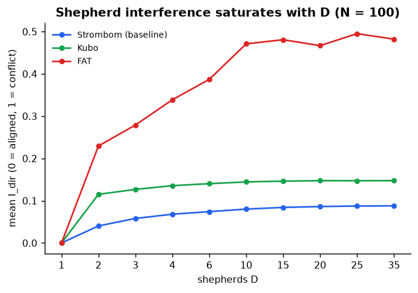

*Figure 7. Interference index against D. Source: `mean_i_dir` in claim `merged_trials.csv` files.*

**Interpretation.** Controller design matters more than dog count once the method cannot collect or finish. Strombom and Kubo are limited by starting structure; FAT is limited by its own rule, and adding dogs does not rescue it under global observation.

## 11. Comparison with the draft

Task and start differences: section 3.6 (S19). Literature map: section 3.7. Why trust HerdSim: section 3.5 (S30). Below: which draft outcomes carry over.

| Element | 2025 draft | HerdSim here |
|---------|------------|--------------|
| Question | How [Dmin, Dmax] scales with N; link to spread; local GCM proxy | How D_min scales with N; whether X0 and controller change it; transfer across methods |
| Engine | NetLogo patch ABM | HerdSim continuous-space ABM |
| Task | Collect + hold 800 + gate exit | Drive into goal disk |
| Sheep start | Random scatter | Controlled layouts |
| Dog start | Top-left corner | Behind flock, opposite goal |
| Controllers | One scheme | Three methods |
| Seeds | Flat 100 | Scout 30 + claim 100 on windows |
| D_min uncertainty | None | Bootstrap |
| Structure | Emergent `S_bar` correlation | Factorial X0 layouts |
| Mechanism analyses | Spread correlation, failure phase, Rrep sensitivity, density gradient | I_dir and coverage (Package C not claim-run); failure labels |

*Table 6a. Element-by-element comparison.*

| Draft finding | HerdSim here | Comment |
|---|---|---|
| One dog suffices up to N ~ 100, then collapses (N = 150, D = 1: SR ~ 1%) | One dog suffices up to N = 400 (R = 1.00 at N = 150 and 400) | Not reproduced. Different task, arena and starts. |
| D_min rises to 20 to 35 for N >= 200 | D_min = 1 | Not reproduced. |
| Overcrowding (e.g. N = 10, D >= 20 worse than fewer) | R = 1.00 at D = 35 for N = 5 to 400 (baseline) | Not reproduced for the baseline; soft evidence for Kubo outlier_rich. |
| Time falls with D and rises with N; distance saturates | Time flat in D and N; path linear in D | Different shape: no saturation here. |
| Spread correlates with failure (rho = -0.70; S_bar * N: -0.83) | Not tested (Phase 3 needs overcrowding cells) | Cohesion/spread metrics are recorded and can be analysed on existing trials. |
| Single scheme, no uncertainty on D_min | Bootstrap interval, three controllers, four layouts | New: width-zero intervals; structure and controller effects. |

*Table 6b. Which draft findings carry over.*

*S19 (again). Keep this sketch in mind when reading the draft comparison above.*

**What the draft has that we lack.** Spearman analysis of mean-spread vs success; density-gradient validation; Rrep sensitivity; failure-phase breakdown tied to hold and exit. Those analyses answer draft RQ2 and RQ3; we have not repeated them at claim grade.

**What we add that the draft lacks.** Bootstrap intervals on D_min; factorial starting layouts; three controllers with a transfer table; staged scout/claim budget; failure-mode taxonomy and interference index; regime labels (wasteful / efficient / under-resourced).

**Why the outcomes diverge (interpretation, not a tested experiment).**

| Factor | Draft | HerdSim here | Effect on "how many dogs?" |
|---|---|---|---|
| Hard phases | Collect + hold 800 ticks + gate exit | Drive into goal only | Draft failures are mostly stuck in collect; we never ask for a long hold |
| Start | Sheep random; dogs in a corner | Controlled layouts; dogs already behind the flock | Draft begins harder; we often start already gatherable |
| Goal geometry | Containment radius then gate | Goal radius scales with N; 120-unit drive | Less need to pack a large flock into a fixed pen |
| Time pressure | Extra dogs help beat the clock | Baseline finishes in ~183 of 10,000 ticks | Time budget almost never binds, so adding dogs buys little |

This reading has not been tested by swapping task or starts in a controlled experiment.

## 12. Claims scorecard

| Claim | Verdict | Evidence | Comment |
|---|---|---|---|
| C1a | REJECTED | Baseline: D_min = 1 for all 4 layouts at N = 50, 100, 200 (bootstrap interval has width 0). | True for the baseline. Not true for Kubo: D_min = 4 on outlier_rich N = 200 and no D_min on wide (Phase 4). |
| C1b | INCONCLUSIVE | No D_min shift on the baseline, so the state-vs-(N, D) comparison has nothing to explain. | Package B reports NaN likelihoods. Cost (path, ticks) does depend on layout, see section 9. |
| C2a | REJECTED | Baseline: no overcrowding cell on the compact map (R >= 0.90 up to D = 35). | Overcrowding appears only for Kubo outlier_rich N = 200 (D_overcrowd = 10), and it is a soft effect (30-seed cell at D = 4). |
| C2b | SKIPPED | No overcrowding cell to extend to T = 20,000. |  |
| C3 | INCONCLUSIVE | Mechanism contrast needs an overcrowding cell; none on the baseline. | Kubo outlier_rich N = 200 is a candidate cell that already exists in the data. |
| C4 | SUPPORTED (partial) | Baseline and Kubo share D_min = 1 for N >= 25 on the size map; FAT does not transfer. Structure: Kubo fails on wide and shifts on outlier_rich N = 200. | Tracker and `discuss/phase4.md` both say partial. |
| C6a | EVALUATED, weak | Piecewise beats power law on leave-one-N-out RMSE (0.13 vs 0.25). | The 'piecewise' fit is just the two levels {2, 1} with a break at N = 10. It is not a scaling law. |
| C5a/b, C6b, C7a/b | UNEVALUATED | Phases 5 and 7 not run; C6b has no stated N band yet. |  |

Verdicts: `../../docs/progress_tracker.md`. Discussion notes: `../../docs/discuss/phase1.md`, `phase2.md`, `phase4.md`.

## 13. Limits and suggested next steps

Status key:

| Tag | Meaning |
|---|---|
| OK | Observation is correct; no re-run needed for this point |
| READY | Data already exists; analysis can proceed without new sims |
| WEAK | Claim or label overstates what the fit/data support |
| UNVERIFIED | Suspected issue; needs a check, not yet confirmed |
| NEEDS RUN | Must reseed or run more trials before the claim is solid |
| SKIPPED | Planned, but blocked by missing contrast (no new numbers invented) |
| NOT RUN | Phase or experiment never executed |
| STALE | Docs disagree with current data files |

| Status | Topic | What is true now | What to do |
|---|---|---|---|
| OK | Ceiling effect | R = 1.00 at D = 1 on almost every baseline cell; the surface is flat, so C1 to C3 are not informative on this setup | Optional later: harder task (shorter T0, longer drive, smaller goal, hold phase, limited observation / Phase 5, draft-like random starts). None of these knobs tried yet |
| NEEDS RUN | Soft frontier (Kubo outlier_rich, N = 200) | D_min = 4 and D_overcrowd = 10 sit on a soft cell: D = 4 still has 30 seeds | Raise that claim window to 200 seeds before treating D_overcrowd = 10 as real |
| WEAK | Tracker label C6a | Recorded as EVALUATED, but the fit is degenerate: only two levels {2, 1} with a break at N = 10 | Keep the numbers; rewrite the verdict wording to "evaluated, weak / no scaling law" |
| READY | Mechanism contrast for C3 | C3 is INCONCLUSIVE for lack of baseline overcrowding, but usable contrast cells already exist: Kubo outlier_rich N = 200, and Kubo wide (R does not rise with D) | Analyse those cells; no new phase required to start |
| UNVERIFIED | Split layout | Cost and D_min look the same as compact; mean fragmentation ~0.99 for both | Confirm the generator creates separated clusters at t = 0, not only a low mean fragmentation over the trial |
| SKIPPED | Phase 3 (mechanism) | Package C blocked: 0 overcrowding cells on baseline | Optional: analyse Kubo outlier_rich N = 200 (READY row above); no invented R |
| NOT RUN | Phase 5 (information) | No `phase5/` scout or claim yet | Obs / range / comm ladders after a harder baseline |
| WEAK | Phase 6 (fits) | Package F / Figure 8 exist; piecewise is only {2, 1} | Keep numbers; not a real scaling law; C6b still open |
| NOT RUN | Phase 7 (early warning) | Package G not run | Needs timeseries + held-out AUROC / lead time |
| STALE | Per-phase reports | Phases 2 and 4 have no `REPORT.md` (guides + packages only). Phase 1 claim `REPORT.md` disagrees with current `merged_trials.csv` (row counts and success rate) | Refresh or regenerate those reports from current CSVs |
| OK | Scope | One task, simulated controllers, one theta | Keep claims limited to this simulation |

## 14. Where the numbers come from

Paths are relative to this folder (`scaling/results/summary/`). Look up by report section, then by table or figure.

### Documents and protocol

| In report | Source |
|---|---|
| Section 2 draft PDF | `../../../docs/papers/sheep-scaling_paper2025.pdf` |
| Draft note (Table A3) | `../../docs/notes/sheep-scaling_paper2025.md` |
| Protocol freeze | `../../configs/canonical_grid.yaml`, `../../docs/main_scaling_plan.md` |
| Staging narrative | `../../docs/experiment_run_strategy.md` |
| Claims scorecard (section 12) | `../../docs/progress_tracker.md`; `../../docs/discuss/phase{1,2,4}.md` |

### Phase 1 (size map, baseline)

| In report | Source |
|---|---|
| Table 2 trial counts | `../phase*/**/trials.csv` (pilot / scout / claim) |
| Figure 1 heatmaps (left panel) | `../phase1/claim/packages/a/reliability.csv` |
| Table 3, Figure 3 (D_min) | `../phase1/claim/packages/a/frontier.csv`, `dmin_bootstrap.csv` |
| Regime counts 88 / 10 / 2 | `../phase1/claim/packages/a/regimes.csv` |
| Failures, ticks, path; Figure 2 | `../phase1/claim/merged_trials.csv` |
| Package F fits; Figure 8 | `../phase1/claim/packages/f/scaling_cv.csv`; chart `figures/f8_scaling_rmse.svg` |
| T1 (no runs) | `../phase1/t1/REPORT.md`, `t1_plan.json` |

### Phase 2 (structure, baseline)

| In report | Source |
|---|---|
| Table 4, Figure 4 (cost at D = 1) | `../phase2/claim/merged_trials.csv` (filter D = 1) |
| B* on wide | `../phase2/claim/packages/b/frontier_by_layout.csv` |

### Phase 4 (transfer)

| In report | Source |
|---|---|
| Figure 1 heatmaps (Kubo / FAT panels) | `../phase4/{kubo,fat}_size/claim/packages/a/reliability.csv` |
| Table 3 D_min (Kubo / FAT columns) | `../phase4/{kubo,fat}_size/claim/packages/a/frontier.csv` |
| Transfer counts; r(I_dir, success) | `../phase4/package_d/size/transfer_summary.csv`, `transfer_table.csv` |
| Table 5, Figure 6 (structure) | `../phase4/package_d/structure/frontier_by_method_layout.csv` |
| Kubo claim windows / soft cell | `../phase4/kubo_structure/claim/boundary_cells.csv` |
| Figures 5 and 7 (failures, I_dir) | `failure_mode` / `mean_i_dir` in claim `merged_trials.csv` (phase1, kubo_size, fat_size) |

### Schematics in this report

| In report | Source |
|---|---|
| S1 to S9 (setup / staging) | `figures/schematics/en/` (from phase1/2/4 guide assets) |
| S10 to S13 (algorithms) | `figures/schematics/en/alg_*.svg` (drawn for this report) |
| S14 to S19 (design / draft compare) | `figures/schematics/en/design_*.svg`, `draft_vs_herdsim.svg` |
| S20 (bootstrap) | `figures/schematics/en/design_bootstrap.svg` |
| S21 (field map) | `figures/schematics/en/field_map.svg` |
| S22 (NetLogo platform vs HerdSim system) | `figures/schematics/en/netlogo_vs_herdsim.svg` |
| S23 (summary at a glance) | `figures/schematics/en/summary_at_a_glance.svg` |
| S24 (draft three phases) | `figures/schematics/en/draft_task_phases.svg` |
| S25 (phase roadmap) | `figures/schematics/en/phase_roadmap.svg` |
| S26 (draft experiment design) | `figures/schematics/en/draft_experiment_design.svg` |
| S27 (draft main results) | `figures/schematics/en/draft_main_results.svg` |
| S28 (draft extra analyses) | `figures/schematics/en/draft_extra_analyses.svg` |
| S29 (HerdSim discoveries) | `figures/schematics/en/herdsim_discoveries.svg` |
| S30 (trust HerdSim) | `figures/schematics/en/trust_herdsim.svg` |
| Related-work note / twins | `../../docs/notes/related_work.md`; `../../../integrations/netlogo/twins.json`; `../../../platform/docs/guide/netlogo.md` |

*Table 7. Provenance by section.*

Tables and figures were computed once from the files above. This report is a snapshot: if the claim-grade results change, it has to be updated by hand.

## Appendix A. Parameter tables

### A1. Frozen protocol (selected)

| Item | Value |
|------|-------|
| Task | `drive_to_goal` |
| Field | 500 x 500 |
| Flock centre | (250, 250) |
| Goal centre | (370, 250) |
| Goal radius | `15 * sqrt(N/50)` |
| Theta | 0.90 |
| Baseline | `strombom_multi` |
| Transfer | `strombom_multi`, `kubo`, `fat` |
| N | {5, 10, 25, 50, 75, 100, 150, 200, 300, 400} |
| D | {1, 2, 3, 4, 6, 10, 15, 20, 25, 35} |
| X0 | compact, wide, split, outlier_rich |
| Structure N | {50, 100, 200} |
| T0 / T1 | 10,000 / 20,000 |
| Scout / claim seeds | 30 / 100 |
| Master seed | 2026 |
| Bootstrap | 1,000 |

### A2. `strombom_multi` defaults

| Parameter | Value |
|-----------|-------|
| r_a | 2 |
| r_s | 65 |
| sheep_speed | 1.0 |
| shepherd_speed | 1.5 |
| noise_strength | 0.3 |
| inertia | 0.5 |
| collect threshold | `r_a * N^(2/3)` |

### A3. `kubo` defaults

| Parameter | Value |
|-----------|-------|
| radius | 60 |
| K_s1..K_s4 | 10, 0.5, 2, 5000 |
| K_f1..K_f4 | 10, 200, 8, 3000 |
| dt | 0.05 |
| sheep_speed_max | 5 |
| dog_speed_max | 10 |

### A4. `fat`

| Parameter | Value |
|-----------|-------|
| Sheep model | Strombom (same as A2) |
| Dog rule | Farthest observed sheep from the dog; stand-off `r_a` toward goal |
| Obs in Phases 1/2/4 | global |

### A5. Layouts (spread = 30)

| Layout | Parameters |
|--------|------------|
| compact | sigma = 9 |
| wide | sigma = 60 |
| split | 2 clusters if N < 12 else 3; gap >= 10 |
| outlier_rich | ~20% beyond `r_a * N^(2/3)` |

## Appendix B. Glossary

| Term | Meaning |
|------|---------|
| N | Flock size (sheep count) |
| D | Shepherd / dog count |
| R | Success rate over seeds |
| theta | Reliability threshold (default 0.90) |
| D_min | Smallest D with R >= theta |
| D_overcrowd | First D where two consecutive grid D stay below theta |
| D_max | Largest reliable D below overcrowding (or grid ceiling) |
| B* | Cheapest reliable (D, T) by median path |
| X0 | Initial layout family |
| GCM | Flock centre of mass |
| S_bar | Mean-spread (variance of distances to GCM) |
| I_dir | Shepherd interference index (0 aligned, 1 conflict) |
| Scout | 30-seed map used to plan claim windows |
| Claim | 100-seed reseed on planned frontier cells |
| Pilot | Smoke check on a tiny grid |
| T1 | 20,000-tick runs on overcrowding cells |
