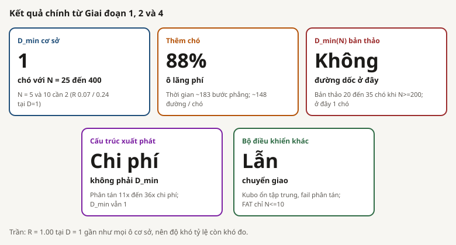
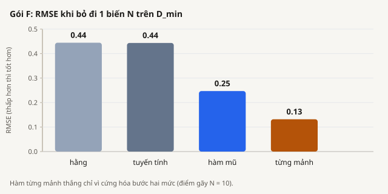
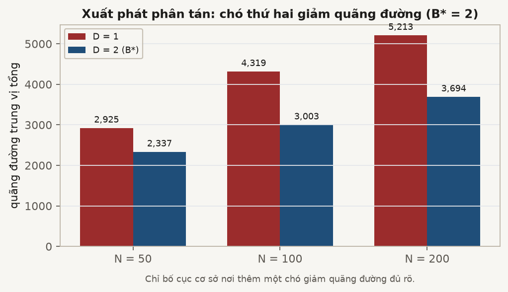
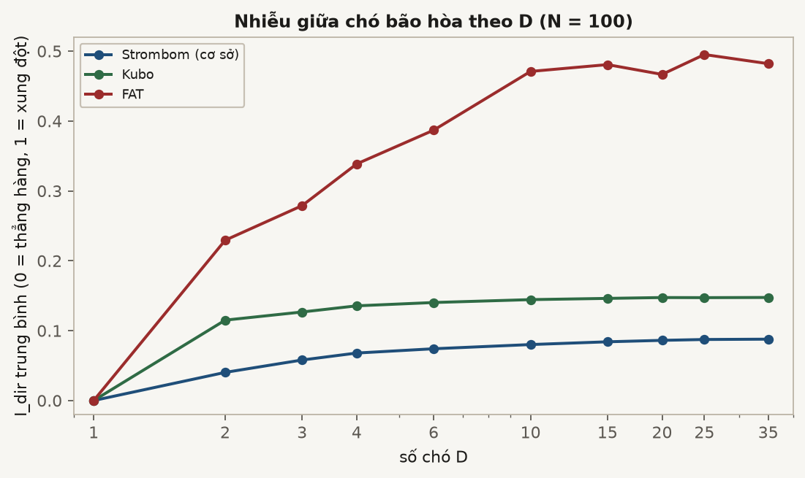
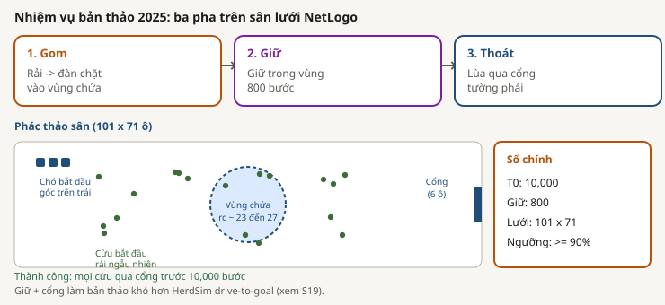
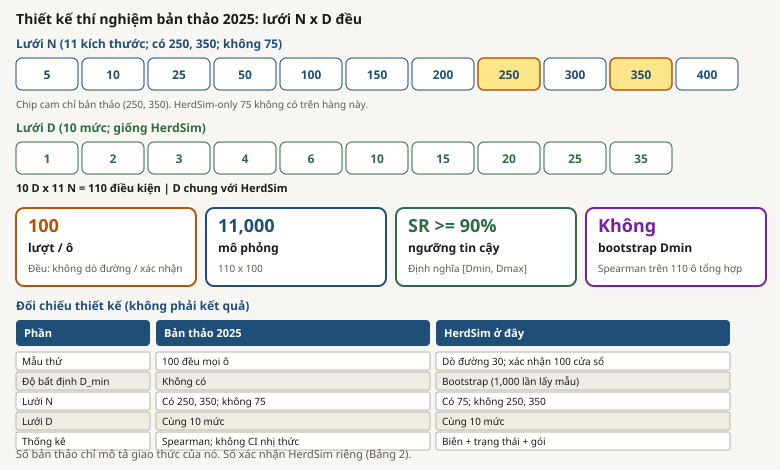
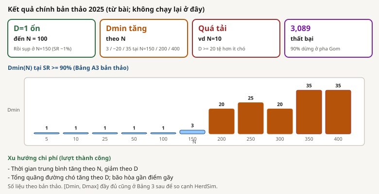
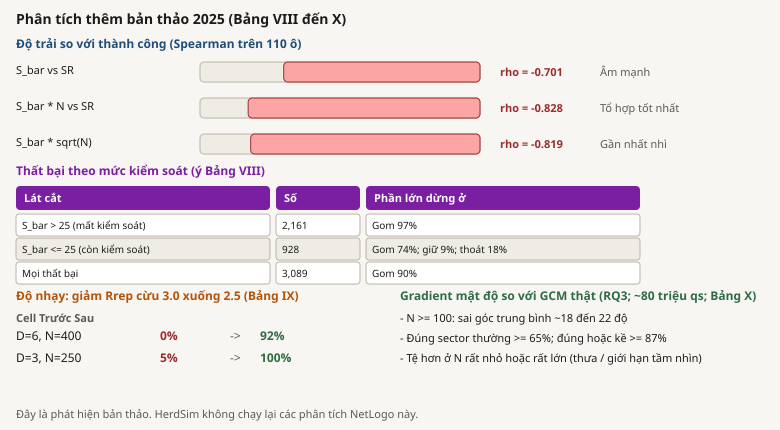
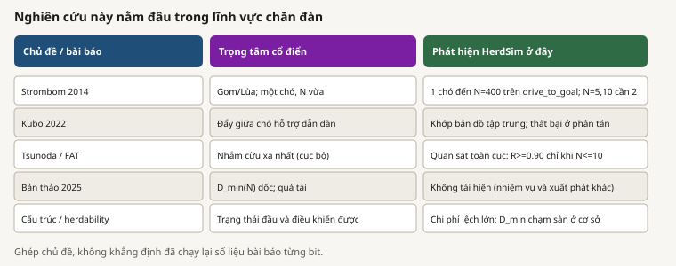

# Một đàn cừu cần bao nhiêu chó?

## 1. Tóm tắt

Chúng tôi hỏi ba câu. Các câu trả lời đủ vững để đứng sau trong báo cáo này đến từ Giai đoạn **1**, **2**, và **4**.

| # | Câu hỏi | Trả lời ở |
|---|---|---|
| Q1 | Đàn lớn hơn thì cần bao nhiêu chó? | Giai đoạn 1 (kích thước đàn) |
| Q2 | Cùng kích thước đàn, xếp cừu lúc đầu khác thì có đổi câu trả lời không? | Giai đoạn 2 (hình dạng lúc bắt đầu) |
| Q3 | Cùng câu trả lời có hiện với luật chó khác không? | Giai đoạn 4 (luật chó khác) |

| Đánh giá | Phát hiện | Số chính |
|---|---|---|
| D_min = 1 | D_min là số chó ít nhất vẫn thường đủ (ít nhất 90% lần lặp). Trên luật chó cơ sở với xuất phát chặt, đàn từ 25 đến 400 cừu đã xong với **một** chó. | Đàn rất nhỏ khó hơn: 5 và 10 cừu cần 2 chó. Chỉ một chó thì tỉ lệ thành công chỉ còn 0.07 (5 cừu) và 0.24 (10 cừu), khoảng 7% và 24% lần lặp xong trước hạn. |
| Lãng phí | Khi đã đủ tin cậy với ít chó, thêm chó trên xuất phát chặt **không** giúp xong nhanh hơn; chó chỉ đi nhiều hơn. | Thời gian xong điển hình khoảng 183 bước; đường mỗi chó khoảng 148 khi đàn từ 25 cừu trở lên. Trong 100 ô (kích thước đàn, số chó), 88 ô lãng phí (đã tin cậy; thêm chó chỉ thêm đường). Định nghĩa bước và đường: Phụ lục B. |
| Không tái hiện | Bản thảo 2025 dự đoán số chó cần tăng mạnh khi đàn lớn. Đường tăng đó **không** xuất hiện ở các lần chạy này. | Bản thảo gợi ý khoảng 20 đến 35 chó khi đàn từ 200 cừu trở lên. Ở đây một chó vẫn xong 400 cừu trong khoảng 168 bước điển hình (chi tiết mục 7). |
| Chỉ chi phí | Đổi cách xếp cừu lúc bắt đầu (chặt / rộng / nhiều cá thể lạc) đổi **độ đắt** của lần chạy (thời gian, đường đi), nhưng **không** đổi D_min trên cơ sở: vẫn một chó. | Xuất phát rộng tốn khoảng 11x đến 20x thời gian và 19x đến 36x đường so với xuất phát chặt. Bố cục nhiều cá thể lạc lên tới khoảng 6x thời gian / 11x đường ở 200 cừu. |
| Một phần | Đổi luật chó (Kubo, FAT) **không** chuyển giao đều từ cơ sở: chỗ khớp, chỗ sụp. | Kubo gần khớp cơ sở trên xuất phát chặt, nhưng thất bại trên rộng (R tốt nhất chỉ khoảng 0.47 đến 0.54). FAT chỉ đạt 90% thành công với đàn nhỏ 10 cừu trở xuống; đàn lớn hơn không vượt thanh. |

**Lưu ý:** hiệu ứng trần. Độ tin cậy R là tỉ lệ các lần lặp độc lập xong nhiệm vụ trước hạn (T0). R = 1.00 nghĩa là mọi lần lặp đều thành công. Ở một chó điều đó đúng trên gần như mọi ô cơ sở, nên việc gần như không trông khó hơn khi đàn lớn. Mục 9 liệt kê các nút khó hơn. Định nghĩa đầy đủ bước, đường, R và các đại lượng mô phỏng khác: Phụ lục B.

## 2. Thiết kế nghiên cứu

Nghiên cứu hỏi gì và dựng thế nào (tách khỏi phần kết quả này): [RESEARCH_PLAN_vi.html](RESEARCH_PLAN_vi.html). So sánh giao thức với bản thảo 2025: Bảng 1. Câu chuyện bản thảo và so sánh kết quả: mục 7. Tin cậy và vị trí NetLogo: mục 8.

### Giao thức đóng băng so với bản thảo 2025

| Mục | Bản thảo 2025 | HerdSim `scaling_v2` |
|---|---|---|
| Động cơ | NetLogo 7.0.3 (lưới ô) | HerdSim (không gian liên tục, bước rời rạc) |
| Nhiệm vụ | Gom, giữ 800 bước, ra cổng | `drive_to_goal`: mọi cừu trong đĩa đích |
| Thành công | Mọi cừu qua cổng | Tỉ lệ cừu trong đĩa đích >= 1.0 |
| Sân | 101 x 71 ô, chuồng giữa | 500 x 500, đàn tại (250, 250), đích tại (370, 250) |
| Đích / bao | `rc = clamp(2.5 * sqrt(N), 23, 27)` | Bán kính `15 * sqrt(N/50)` (15 tại N = 50) |
| Chiều dài lùa | Gom vào giữa rồi ra cổng | Tâm đến đích 120 đơn vị ở mọi N |
| Xuất phát cừu | Rải ngẫu nhiên (đệm tường và chó) | Họ bố cục: compact / wide / split / outlier_rich |
| Xuất phát chó | Lưới góc trên trái | Sau đàn, đối diện đích (lệch 50, nhiễu +/-5) |
| Tốc độ (họ Strombom) | Bảng A1 bản thảo | Cừu 1.0, chó 1.5 mỗi bước |
| Tốc độ (Kubo) | không áp dụng | Tích phân `dt = 0.05`, cừu tối đa 5, chó tối đa 10 |
| Hết giờ | 10,000 bước | T0 = 10,000 (T1 = 20,000 dự kiến cho ô quá tải) |
| Lưới D | {1, 2, 3, 4, 6, 10, 15, 20, 25, 35} | Giống |
| Lưới N | Có 250, 350; không 75 | Có 75; không 250, 350 |
| Mẫu | 100 mọi ô | Dò đường 30 mọi ô; 100 trên cửa sổ xác nhận |
| Hạt giống gốc | không nêu | 2026; hạt thử nghiệm là `2026 + i` |
| Độ tin cậy | SR >= 90% | theta = 0.90 (cũng báo 0.50, 0.70) |
| Bất định D_min | không | Bootstrap trên mẫu (1,000 lần lấy lại) |
| Bộ điều khiển | Một họ gom/lùa NetLogo | Cơ sở `strombom_multi`; chuyển giao `kubo`, `fat` |
| Nhân tố cấu trúc | Độ rải xuất hiện; tương quan `S_bar` | Họ X0 (bốn bố cục) |
| Chỉ số | Thành công, bước, pha, `S_bar`, đường, cừu mất | Thành công, bước, đường, kết dính, phân mảnh, mean_spread, I_dir, nhãn thất bại |

*Bảng 1. Bản thảo so với giao thức hiện tại. Lưới tham số đầy đủ: Phụ lục A.*

**Nhãn hình.** `S1`, `S2`, ... là **sơ đồ khái niệm** (trong `figures/schematics/`). `Hình 1`, `Hình 2`, ... là **biểu đồ dữ liệu** từ CSV đo được. Cụm như "xem S16" trỏ tới sơ đồ mang số chú thích đó.

*S1. Xuất phát chặt trên sân 500 x 500. Chó đứng sau đàn, đối diện đích.*

*S2. Quy tắc bán kính đích `15 * sqrt(N/50)`.*

### Bố cục xuất phát

| Bố cục | Định nghĩa |
|--------|------------|
| compact | Gauss, sigma = 0.3 x 30 = 9 |
| wide | Gauss, sigma = 2.0 x 30 = 60 |
| split | 2 cụm nếu N < 12, không thì 3; tách ít nhất 10 |
| outlier_rich | Lõi ~80% (sigma = 12); ~20% cá thể lạc ngoài `r_a * N^(2/3)` |

*S3. Cách đặt cừu và chó lúc bắt đầu mỗi họ X0.*

### Bộ điều khiển

Ba luật chó trên cùng một nhiệm vụ. Tham số: Phụ lục A2 đến A4. Vai trò ngắn và bảng vòng đích so với ngưỡng chuyển của Strombom: [RESEARCH_PLAN_vi.html](RESEARCH_PLAN_vi.html) mục 4 và 7.

**`strombom_multi` (cơ sở).** Cả đội dùng chung chế độ: gom cá thể lạc, hoặc lùa đàn về đích. Chuyển gom/lùa dùng `f(N) = r_a * N^(2/3)`, rộng hơn vòng đích; chúng tôi không nới đích cho khớp (thất bại không đọc là "cừu không vừa"). Khoảng cách nhiều chó (gán outlier; vòng lùa) là thiết kế HerdSim. Cừu: Strombom 2014.

**`kubo`.** Không chuyển gom/lùa. Lực liên tục trong bán kính cảm (tích phân `dt`). Mỗi chó ép cừu trong tầm xa **đích** nhất; lực đẩy giữa chó xoè thành cung. Cừu: Kubo, không phải Strombom.

**`fat`.** Không chuyển gom/lùa. Cừu vẫn Strombom 2014. Mỗi chó độc lập ép cừu xa **chính nó** nhất, rồi đứng lệch sau con đó về phía đích. Giai đoạn 1/2/4 dùng `obs_mode=global` (thấy cả đàn).

*S13. Strombom Gom: xa nhất so với tâm đàn. Kubo: xa nhất so với đích. FAT: xa nhất so với chó.*

### Lựa chọn thiết kế

*S14. Dày hơn nơi biên thường nằm.*

*S15. Ngưỡng tin cậy cho mọi biên xác nhận.*

*S16. Hình học và thời gian khóa cùng giao thức.*

| Đại lượng | Bản thảo | HerdSim |
|----------|-------|---------|
| D_min | D nhỏ nhất có SR >= 90% | D nhỏ nhất có R >= theta |
| D_overcrowd | D nhỏ nhất > Dmin nơi SR bắt đầu giảm | D nhỏ nhất > D_min nơi D này và D lưới kế tiếp đều dưới theta (hai bước liên tiếp) |
| D_max | D nhỏ nhất > Dmin có SR < 90%, không thì trần | D lớn nhất vẫn đạt theta và dưới D_overcrowd; không thì **trần lưới** (D lớn nhất đã thử, ở đây 35) |
| B* | không định nghĩa | (D, T) có R >= theta và đường trung vị nhỏ nhất |
| Hard failure | (ngầm) | Không D nào trên lưới đạt R >= theta: D_min / D_max / D_overcrowd không xác định |

**Danh sách số chó đã thử.** Chỉ chạy `1, 2, 3, 4, 6, 10, 15, 20, 25, 35`. Không chạy mọi số nguyên. "Trần lưới" / "đỉnh danh sách" = **35**, số lớn nhất trên danh sách đó.

**Vì sao dừng ở 35.** Cùng trần với bản thảo 2025 (dải ít chó), và dày thêm nhiều điểm D cao sẽ làm ngân sách thử nghiệm nổ. Không phải chối mãi số chó lớn hơn: hỏi 50+ chó là câu hỏi khác, để giai đoạn sau nếu vẫn cần tìm chỗ sụp phía trên.

**Quá tải khác lãng phí.** Lãng phí: R vẫn >= 0.90, chó chỉ đi nhiều hơn. Quá tải: đã có dải thắng tốt, rồi khi tăng số chó theo danh sách, **phần trăm lần lặp thắng (R) lại xuống dưới 90%**. Gắn `D_overcrowd` chỉ khi **hai bậc liên tiếp** trên danh sách đều dưới 0.90 (ví dụ giả định: 20 và 25 đều kém thì `D_overcrowd = 20`). Một bậc tụt một mình không đủ.

**Trần lưới.** Nếu từ D_min đến 35 vẫn >= 0.90, ta ghi `D_max = 35` và để trống `D_overcrowd`. Nghĩa là trong phạm vi đã chạy chưa thấy sụp; **không** phải "35 là chỗ bắt đầu hỏng."

*S17a. Cột xanh vẫn >= 90%; cột đỏ dưới 90%. Hai cột đỏ liền => D_overcrowd = 20, D_max = 15. Bản đồ cơ sở thật không có vùng đỏ đến 35.*

*S17. Phác thảo khái niệm D_min, D_overcrowd, D_max và B-sao. Khi không quá tải, D_max nằm ở mép phải của lưới (trần).*

*S18. Sau thất bại, heuristic gắn nhãn cách thất bại (chỉ phân tích). Tỉ lệ gộp: Hình 7.*

### Phân tầng: thử nghiệm, dò đường, xác nhận, T1

*S4. Dò đường lập bản đồ rẻ; xác nhận gieo lại cửa sổ biên; T1 bỏ qua (không có ô quá tải).*

| Cấp | Vai trò | Mẫu điển hình | Trích dẫn kết luận? |
|-------|------|---------------|------------------|
| Thử nghiệm (khói) | Kiểm đường ống | lưới nhỏ | Không |
| Dò đường | Bản đồ rộng; chọn cửa sổ | 30 | Không (chỉ lập kế hoạch) |
| Xác nhận | Độ chính xác trên ô đã lên kế hoạch | 100 | Có |
| T1 | Chân trời dài trên ô quá tải | 100 ở 20,000 bước | Có, khi chạy |

*S5. Độ tin cậy R là tỉ lệ mẫu xong trước T0 (1.00 = mọi mẫu thành công).*

*S6. Mọi ô đóng băng nhận ước lượng R rẻ.*

*S7. Độ chính xác dành cho chỗ quyết định D_min.*

**Quy tắc hợp nhất.** Ô đã nhận mẫu xác nhận thì phân tích chỉ dùng các mẫu xác nhận đó. Ô khác giữ hàng dò đường.

*S20. Lấy lại mẫu trong mỗi D (1,000 lần); phân vị 2.5% và 97.5% tạo khoảng. Độ rộng 0 nghĩa là mọi lần lấy lại cùng D_min.*

**T1.** Dự kiến 20,000 bước trên ô quá tải. Cơ sở không có ô quá tải nên không chạy mô phỏng T1 (`../phase1/t1/README.md`).

| Giai đoạn | Câu hỏi | Phương pháp | Bố cục | Thử nghiệm | Dò đường | Xác nhận |
|---|---|---|---|---|---|---|
| 1 | Bản đồ kích thước | strombom_multi | compact | 150 | 3,000 | 2,200 |
| 2 | Cấu trúc | strombom_multi | 4 bố cục | 600 | 3,600 | 2,400 |
| 4a | Chuyển giao: kích thước | kubo | compact | - | 3,000 | 2,100 |
| 4a | Chuyển giao: kích thước | fat | compact | - | 3,000 | 2,000 |
| 4b | Chuyển giao: cấu trúc | kubo | 4 bố cục | - | 3,600 | 4,000 |
| 4b | Chuyển giao: cấu trúc | fat | 4 bố cục | - | 3,600 | 2,400 |
|  | **Tổng mô phỏng** |  |  |  |  | **35,650** |

*Bảng 2. Số lượt theo tầng (dòng `trials.csv`). Hợp nhất phân tích xác nhận giữ 30,670 dòng, ít hơn 35,650 vì hàng dò đường bị bỏ trên ô đã gieo lại. Xác nhận cấu trúc Kubo có 4,000 dòng (outlier_rich N = 200 ở 200 mẫu với D trong {1,2,3,4,6,10,15,20,25}).*

## 3. Giai đoạn 1: đàn kích thước N cần bao nhiêu chó?

Mục tiêu: lập bản đồ tỉ lệ thành công theo kích thước đàn và số chó, R(N, D), cho luật chó cơ sở `strombom_multi` trên xuất phát chặt, rồi từ đó đọc D_min (ít chó nhất vẫn thường đủ), D_overcrowd (chỗ thêm chó bắt đầu hại), D_max (nhiều chó nhất vẫn thường đủ), và số chó rẻ mà vẫn tin cậy. Bằng chứng: `../phase1/claim/README.md`, `packages/a/`, `packages/f/`.

*Hình 1. Giai đoạn 1 là bảng trái; Kubo và FAT là Giai đoạn 4 (mục 5). Nguồn: `../phase1/claim/packages/a/reliability.csv`, `../phase4/{kubo,fat}_size/claim/packages/a/reliability.csv`.*

### Kết quả nhìn thấy (cơ sở)

| Kích thước đàn N | D_min | D_max | D_overcrowd | Ý nghĩa |
|---|---|---|---|---|
| 5, 10 | 2 | 35 (trần lưới) | không | Một chó không đủ tin cậy; vẫn tin cậy từ D = 2 đến D = 35 |
| 25 đến 400 | 1 | 35 (trần lưới) | không | Một chó đạt R >= 0.90; vẫn tin cậy đến D = 35 |

Khoảng bootstrap mọi D_min cơ sở có độ rộng 0. Nguồn: `../phase1/claim/packages/a/frontier.csv`.

### D_max trên bản đồ này (đọc kỹ)

| Sự kiện | Cách đọc |
|------|---------|
| D_max được báo | **35 với mọi N** trên cơ sở Giai đoạn 1 |
| Vì sao 35? | Không quá tải: R giữ >= 0.90 từ D_min đến D lớn nhất đã thử |
| 35 **không** phải | Không phải sụp đo được ("quá nhiều chó thất bại"). Đó là **trần lưới**: đỉnh của `{1,2,3,4,6,10,15,20,25,35}` |
| Hard failure ở đây? | **Không** trên cơ sở Giai đoạn 1. Hard failure nghĩa là *không* D nào trên lưới đạt theta; khi đó D_min và D_max để trống |

**Vì sao xảy ra.** Trên xuất phát chặt với `drive_to_goal` và luật chó cơ sở `strombom_multi`, sau khi đạt D_min đàn vẫn gom được: thêm chó tăng đường (lãng phí) nhưng không đẩy thành công xuống dưới 90% trong số chó đã thử. Đó cùng hiệu ứng trần với R = 1.00 ở một chó khi đàn từ 25 cừu trở lên.

**Làm gì với D_max = 35.**

| Mục tiêu | Việc làm |
|------|--------|
| Trích nhu cầu chó phía thấp | Dùng **D_min** (và B*); đó là câu trả lời chắc |
| Trích "vẫn tin cậy đến hết lưới" | Báo D_max = 35 **và** ghi rõ trần lưới / không quá tải |
| Tìm sụp phía trên thật | Cần nhiệm vụ hoặc nút khó hơn tạo `D_overcrowd`, hoặc mở rộng số chó quá 35 rồi đo lại; đừng coi 35 là điểm sụp đó |
| Cơ chế quá tải (C3) | Bị chặn trên cơ sở cho đến khi có ô quá tải |

Tỉ lệ thành công tổng trên hợp nhất Giai đoạn 1 là 0.963 (169 thất bại / 4540 dòng). Gần như chỉ tại D = 1 trên hai đàn rất nhỏ:

| Ô | R tại D = 1 | R tại D = 2 | Nhãn thất bại chính |
|---|---|---|---|
| N = 5, D = 1 | 0.07 | 1.00 | dao động: 93 |
| N = 10, D = 1 | 0.24 | 1.00 | kẹt: 58, dao động: 18 |

| Chế độ | Số ô | Ý nghĩa |
|---|---|---|
| Lãng phí quá mức | 88 | Đã tin cậy; thêm chó chỉ thêm đường |
| Hiệu quả | 10 | Gần D hữu ích |
| Thiếu nguồn lực | 2 | Hai ô đàn rất nhỏ tại D = 1 |

*S8. Cách nhãn chế độ nằm dọc trục số chó.*

*Hình 2. Thời gian xong phẳng; đường tỉ lệ với D. Nguồn: `../phase1/claim/merged_trials.csv`.*

Thời gian xong trung vị 183 bước (p90 = 198); chỉ thành công: trung vị 182, p90 195. Với N >= 25, đường trung vị mỗi chó (tổng `shepherd_path` chia D) khoảng 148 đơn vị thế giới. Đó là lý do 88 ô lãng phí.

*Hình 3. Nguồn: `../phase1/claim/packages/a/frontier.csv`, `../phase4/*/size/claim/packages/a/frontier.csv`, Bảng A3 bản thảo.*

| N | Strombom | Kubo | FAT | Bản thảo 2025 |
|---|---|---|---|---|
| 5 | 2 | 3 | 1 | 1 |
| 10 | 2 | 1 | 1 | 1 |
| 25 | 1 | 1 | không <= 35 | 1 |
| 50 | 1 | 1 | không <= 35 | 1 |
| 75 | 1 | 1 | không <= 35 | không có |
| 100 | 1 | 1 | không <= 35 | 1 |
| 150 | 1 | 1 | không <= 35 | 3 |
| 200 | 1 | 1 | không <= 35 | 20 |
| 300 | 1 | 1 | không <= 35 | 20 |
| 400 | 1 | 1 | không <= 35 | 35 |

*Bảng 3. D_min tại theta = 0.90 theo kích thước đàn (xuất phát chặt). Bootstrap cơ sở độ rộng 0. Kubo tại N = 5 có khoảng [1, 3]; R là 0.77 tại D = 1, 0.71 tại D = 2, 0.97 tại D = 6. Nguồn: biên và `dmin_bootstrap.csv` như trên.*

### Khớp tỷ lệ (Gói F)

D_min quan sát chỉ là hai mức: 2 với N trong {5, 10}, 1 với N >= 25. RMSE leave-one-N-out:

| Mô hình | RMSE leave-one-N | Cách đọc thường |
|---|---|---|
| Hằng | 0.44 | Một D_min phẳng mọi N |
| Tuyến tính | 0.44 | Đường thẳng theo N |
| Luỹ thừa | 0.25 | Đường cong mượt trên log-log |
| Từng mảnh | 0.13 | Hai mức với điểm gãy tại N = 10 |

*Hình 4. Từng mảnh trông tốt nhất chỉ vì nó mã hoá cứng bước nhảy. Nguồn: `../phase1/claim/packages/f/scaling_cv.csv`. C6b không kiểm được: không có tăng trưởng để khớp.*

## 4. Giai đoạn 2: hình dạng lúc bắt đầu có đổi câu trả lời không?

Mục tiêu: giữ kích thước đàn ở 50, 100 hoặc 200 cừu và chỉ đổi hình dạng lúc bắt đầu (X0). Kiểm xem D_min (ít chó nhất vẫn thường đủ) có dịch ít nhất một bước trên danh sách số chó không (kết luận C1a). Bằng chứng: `../phase2/claim/README.md`, `packages/b/`.

**Trả lời ngắn.** Hình dạng lúc bắt đầu **không** đổi D_min trên cơ sở. Nó **có** đổi chi phí (thời gian và đường đi).

D_min = 1 với cả 12 ô (bố cục, N); bootstrap độ rộng 0. Tại D = 1 mọi ô có R = 1.00 (mọi mẫu thành công; hiệu ứng sàn). **D_max = 35 (trần lưới) trên mọi ô**; không D_overcrowd. Cùng cách đọc với Giai đoạn 1: vẫn tin cậy đến đỉnh lưới D đã thử, không phải sụp đo được.

*Hình 5. Nguồn: `../phase2/claim/merged_trials.csv` (D = 1).*

| Bố cục | N | R tại D=1 | Bước trung vị | so chặt | Đường trung vị | so chặt |
|---|---|---|---|---|---|---|
| compact | 50 | 1.00 | 195 | 1.0x | 157 | 1.0x |
| compact | 100 | 1.00 | 204 | 1.0x | 161 | 1.0x |
| compact | 200 | 1.00 | 191 | 1.0x | 144 | 1.0x |
| split | 50 | 1.00 | 195 | 1.0x | 158 | 1.0x |
| split | 100 | 1.00 | 205 | 1.0x | 162 | 1.0x |
| split | 200 | 1.00 | 193 | 1.0x | 144 | 1.0x |
| outlier_rich | 50 | 1.00 | 224 | 1.1x | 209 | 1.3x |
| outlier_rich | 100 | 1.00 | 501 | 2.5x | 554 | 3.4x |
| outlier_rich | 200 | 1.00 | 1,228 | 6.4x | 1,647 | 11.4x |
| wide | 50 | 1.00 | 2,138 | 11.0x | 2,925 | 18.6x |
| wide | 100 | 1.00 | 3,074 | 15.1x | 4,319 | 26.8x |
| wide | 200 | 1.00 | 3,870 | 20.3x | 5,213 | 36.2x |

*Bảng 4. Chi phí một chó theo bố cục (100 mẫu mỗi ô).*

| Bố cục | Điều xảy ra |
|---|---|
| wide | Phải gom đàn trải trước: 11x đến 20x bước; 19x đến 36x đường so với chặt |
| outlier_rich | Rẻ ở N nhỏ; đắt khi nhiều cá thể lạc (6.4x bước / 11x đường tại N = 200) |
| split | Trông như chặt ở đây (trung vị khớp; phân mảnh trung bình ~0.99). Coi là kiểm tra, không phải phát hiện |
| compact | Tham chiếu |

**Chó thứ hai trên xuất phát rộng.** B* = 2 (không phải 1) tại N = 50, 100 và 200: đường 2,337 so 2,925; 3,003 so 4,319; 3,694 so 5,213. Đó là **bố cục** cơ sở duy nhất nơi thêm một chó giảm quãng đường đủ rõ. Nguồn: `../phase2/claim/packages/b/frontier_by_layout.csv`.

*Hình 6. Nguồn: `../phase2/claim/merged_trials.csv` (bố cục wide).*

## 5. Giai đoạn 4: các kết quả có chuyển sang luật chó khác không?

Mục tiêu: lặp bản đồ kích thước đàn và hình dạng lúc bắt đầu với Kubo và FAT. Đặc trưng **chia sẻ** nếu hai bên cùng D_min (ít chó nhất vẫn thường đủ), **dịch** nếu số chó khác, **vắng** nếu một bên không bao giờ đạt 90% thành công. Bằng chứng: `../phase4/README.md`, `../phase4/kubo_structure/claim/README.md`, `package_d/`, `outlier_rich_n200_window.json`.

*S9. Cùng lưới và bố cục; gắn nhãn mỗi đặc trưng biên là chia sẻ, dịch, hoặc vắng.*

### Bản đồ kích thước (xuất phát chặt)

**Kubo:** D_min = 3 tại N = 5; D_min = 1 với N = 10 đến 400. **D_max = 35 (trần lưới)** trên mọi ô kích thước; không quá tải. Thành công tổng 0.991; mọi thất bại là hết giờ.

**FAT:** D_min = 1 tại N trong {5, 10}, và hai ô đó cũng có **D_max = 35 (trần lưới)**. Với N >= 25, **hard failure**: không D <= 35 đạt R >= 0.90, nên D_min và D_max **không xác định** (trống trong `frontier.csv`). R tốt nhất theo N với N = 50 đến 400 là 0.40 đến 0.53 (R từng ô cũng xuống tới khoảng 0.17). Khoảng nửa lượt kích thước FAT thất bại: dao động 39%, kẹt 7%.

**Hard failure so với D_max trần lưới.**

| Trường hợp | Trường biên | Nghĩa | Việc làm |
|------|-----------------|---------|------------|
| D_max = 35, không D_overcrowd | Có D_min | Vẫn tin cậy ở đỉnh lưới; chưa thấy sụp trên | Trích D_min; nói D_max chỉ là trần |
| Hard failure | D_min / D_max trống | Bộ điều khiển không bao giờ đạt theta trên lưới này | Đừng bịa D_max; báo R tốt nhất và nhãn thất bại; chỉ đổi nút/nhiệm vụ nếu đó là mục tiêu khoa học |
| Quá tải thật | Có D_overcrowd; D_max dưới trần | Đầu cao của dải khả thi đã đo được | Dùng D_max đó; đối chiếu cơ chế (C3) mới khả thi |

**Vì sao hard failure xuất hiện (Giai đoạn 4).** Trên nhiệm vụ này, FAT (và Kubo trên cấu trúc wide) thường không gom hoặc không xong trước T0: R giữ dưới theta ở mọi D đã thử. Đó là **thiếu biên dưới** (không có D_min), không phải sụp phía trên. Kubo outlier_rich N = 200 khác: D_min = 20 với D_max vẫn 35 (trần); D thấp thất bại, D cao trong lưới vẫn đạt theta.

**Nhãn chuyển giao (Gói D kích thước).** 8 chia sẻ, 7 dịch, 29 vắng. Số "vắng" lớn chủ yếu là hàng quá tải (không bộ điều khiển nào quá tải trên xuất phát chặt). Nguồn: `../phase4/package_d/size/transfer_summary.csv`.

*Hình 7. Nguồn: cột `failure_mode` trong `merged_trials.csv` xác nhận phase1, kubo_size, fat_size.*

### Cấu trúc tại N = 50, 100, 200

| Bố cục | N | Strombom | Kubo | FAT |
|---|---|---|---|---|
| compact | 50 | 1 | 1 | không (R tốt nhất=0.47) |
| compact | 100 | 1 | 1 | không (R tốt nhất=0.40) |
| compact | 200 | 1 | 1 | không (R tốt nhất=0.47) |
| split | 50 | 1 | 1 | không (R tốt nhất=0.50) |
| split | 100 | 1 | 1 | không (R tốt nhất=0.47) |
| split | 200 | 1 | 1 | không (R tốt nhất=0.40) |
| outlier_rich | 50 | 1 | 1 | không (R tốt nhất=0.10) |
| outlier_rich | 100 | 1 | 1 | không (R tốt nhất=0.00) |
| outlier_rich | 200 | 1 | 20 | không (R tốt nhất=0.00) |
| wide | 50 | 1 | không (R tốt nhất=0.49) | không (R tốt nhất=0.00) |
| wide | 100 | 1 | không (R tốt nhất=0.54) | không (R tốt nhất=0.00) |
| wide | 200 | 1 | không (R tốt nhất=0.47) | không (R tốt nhất=0.00) |

*Bảng 5. D_min theo bố cục và bộ điều khiển. 'không' = không D <= 35 đạt 0.90. Nguồn: `../phase4/package_d/structure/frontier_by_method_layout.csv`.*

*Hình 8. Từ hợp nhất cấu trúc hiện tại. Nguồn: các `merged_trials.csv` xác nhận cấu trúc.*

**Kubo outlier_rich N = 200.**

| D | Số mẫu | R | R >= 0.90? |
|---|------:|----:|:----------:|
| 1 | 200 | 0.745 | không |
| 2 | 200 | 0.855 | không |
| 3 | 200 | 0.835 | không |
| 4 | 200 | 0.860 | không |
| 6 | 200 | 0.890 | không |
| 10 | 200 | 0.875 | không |
| 15 | 200 | 0.855 | không |
| 20 | 200 | 0.935 | có |
| 25 | 200 | 0.910 | có |
| 35 | 30 | 0.967 | có |

| Mục | Giá trị |
|------|-------|
| D_min | 20 (D lưới đầu tiên có R >= 0.90 ở 200 mẫu) |
| Bootstrap trên D_min | [2, 20] (`merged_dmin_bootstrap.csv`, `n_seeds_ref` = 200) |
| Quá tải | không |
| Ghi chú khoảng | Rộng phía thấp: vài D < 20 nằm gần 0.90, nên bootstrap có thể tụt dưới 20 |

*Hình 9. Nguồn: `../phase4/kubo_structure/claim/merged_trials.csv`, `merged_dmin_bootstrap.csv`, `outlier_rich_n200_window.json`.*

| Phát hiện | Cách đọc thường |
|---|---|
| Kubo + wide | R tốt nhất 0.47 đến 0.54; thất bại hết giờ/rải; thêm chó nâng R về ~0.5 nhưng không tới 0.90 |
| Kubo + outlier_rich N = 200 | Dịch biên; xem Hình 9 |
| FAT trên cấu trúc | Không bố cục nào tại N >= 50 đạt 0.90 |

**Nhiễu (I_dir).** Định nghĩa và công thức: Phụ lục B4 (sơ đồ S34). Trung bình I_dir tăng theo D rồi ổn. Ảnh chụp tại N = 100:

| Bộ điều khiển | Trung bình I_dir tại D = 35 | Trung bình I_dir trên mọi D tại N = 100 |
|------------|---------------------:|--------------------------------:|
| Cơ sở (`strombom_multi`) | ~0.09 | ~0.05 |
| Kubo | ~0.15 | ~0.10 |
| FAT | ~0.48 | ~0.40 |

| Kiểm tra liên hệ | Giá trị | Cách đọc |
|-------------------|------:|---------|
| Pearson r(I_dir, success) trên hợp nhất kích thước FAT | ~-0.87 | Liên hệ âm mạnh |
| Khẳng định nhân quả? | không | Có thể chủ yếu là "FAT thất bại nơi I_dir cao", chưa chứng minh cơ chế |
| Kiểu nghiên cứu | quan sát | Chỉ diễn giải; không phải thí nghiệm cơ chế có kiểm soát |

*Hình 10. Nguồn: `mean_i_dir` trong các `merged_trials.csv` xác nhận.*

**Diễn giải.** Khi một phương pháp không gom hoặc không xong được, luật chó quan trọng hơn số chó bạn thêm. Chỉ nhìn bản đồ kích thước sẽ làm chuyển giao trông tốt hơn thực tế; bản đồ hình dạng lúc bắt đầu mới là chỗ so sánh bị gãy.

## 6. Tổng hợp và bảng điểm kết luận

*S31. Màu đánh giá khớp bảng dưới. Đường bằng chứng: Gói A/B/D/F và `../../docs/progress_tracker.md`.*

| Kết luận | Đánh giá | Bằng chứng | Nhận xét |
|---|---|---|---|
| C1a | BỊ BÁC BỎ | Giai đoạn 2 Gói B: D_min = 1 cả 4 bố cục tại N = 50, 100, 200 (bootstrap độ rộng 0) | Đúng với cơ sở. Kubo cấu trúc dịch: xem mục 5 |
| C1b | KHÔNG RÕ RÀNG | Không dịch D_min trên cơ sở nên so sánh trạng thái với (N, D) không có gì để giải thích | Gói B báo NLL NaN. Chi phí có phụ thuộc bố cục (mục 4) |
| C2a | BỊ BÁC BỎ | Giai đoạn 1 Gói A: 0 ô quá tải tại theta = 0.90 | Giai đoạn 4 cũng không có |
| C2b | BỎ QUA | Không có ô quá tải để kéo dài đến T = 20,000 |  |
| C3 | KHÔNG RÕ RÀNG | Đối chiếu cơ chế cần ô quá tải; cơ sở không có | Đối chiếu tùy chọn: Kubo wide / outlier_rich N = 200 (mục 5); chưa phải Gói C hoàn chỉnh |
| C4 | ĐƯỢC ỦNG HỘ (một phần) | Gói D: chia sẻ D_min với N >= 25 trên chặt (Strombom/Kubo); FAT vắng; Kubo wide vắng; outlier_rich N = 200 dịch | Hệ thống theo dõi và `discuss/phase4.md` ghi một phần |
| C6a | ĐÃ ĐÁNH GIÁ, yếu | Gói F: RMSE từng mảnh 0.13 so luỹ thừa 0.25 | Khớp chỉ hai mức {2, 1}; không phải luật tỷ lệ |
| C5a/b, C6b, C7a/b | CHƯA ĐÁNH GIÁ | Giai đoạn 5 và 7 chưa chạy; C6b chưa có dải N |  |

## 7. Bản thảo 2025 và so sánh kết quả

Nguồn: [sheep-scaling_paper2025.pdf](../../../docs/papers/sheep-scaling_paper2025.pdf); ghi chú [sheep-scaling_paper2025.md](../../docs/notes/sheep-scaling_paper2025.md). Khác giao thức: Bảng 1. Phác thảo nhiệm vụ:

*S19. Cùng chủ đề khoa học rộng (chó theo N), khác nhiệm vụ và xuất phát. Lý do chính đường D_min(N) dốc của bản thảo không nhất thiết xuất hiện ở đây.*

*S24. Nhiệm vụ theo bản thảo; không chạy lại trong HerdSim.*

*S26. 100 mẫu phẳng x 110 ô = 11,000 mô phỏng. Tổng xác nhận HerdSim: Bảng 2.*

*S27. Tóm tắt hình từ Bảng A3 bản thảo. D_min HerdSim: Bảng 3 và Hình 3.*

| N | Dmin bản thảo | Dmax bản thảo | SR tối đa |
|---|---|---|---|
| 5 | 1 | chưa đạt | 100% |
| 10 | 1 | 15 | 100% |
| 25 | 1 | 25 | 100% |
| 50 | 1 | 25 | 100% |
| 100 | 1 | chưa đạt | 100% |
| 150 | 3 | chưa đạt | 99% |
| 200 | 20 | 35 | 94% |
| 250 | 25 | chưa đạt | 93% |
| 300 | 20 | chưa đạt | 93% |
| 350 | 35 | chưa đạt | 91% |
| 400 | 35 | chưa đạt | 91% |

*Bảng A3 bản thảo tại SR >= 90%. Không chạy lại ở đây.*

*S28. Từ các bảng VIII đến X của bản thảo.*

| Phát hiện bản thảo | HerdSim ở đây | Nhận xét |
|---|---|---|
| Một chó đủ đến N ~ 100 rồi sụp | Một chó đủ đến N = 400 (R = 1.00 tại N = 150 và 400) | Không tái hiện |
| D_min lên 20 đến 35 với N >= 200 | D_min = 1 | Không tái hiện |
| Quá tải ở D cao trên N nhỏ | R = 1.00 tại D = 35 với N = 5 đến 400 (cơ sở) | Không tái hiện |
| Thời gian giảm theo D; khoảng cách bão hòa | Thời gian phẳng; đường tuyến tính theo D | Hình dạng khác |
| Độ rải tương quan với thất bại | Chưa kiểm (Giai đoạn 3 bị chặn) | Chỉ số đã ghi; chưa phân tích mức xác nhận |
| Một sơ đồ, không bất định D_min | Bootstrap; ba bộ điều khiển; bốn bố cục | Bằng chứng mới HerdSim thêm |

*Bảng 6. Phát hiện bản thảo nào còn đúng. Thành phần giao thức: Bảng 1.*

**Vì sao kết quả có thể lệch (diễn giải, chưa kiểm).** Các pha khó (giữ + cổng), cừu rải ngẫu nhiên, chó ở góc, và áp lực thời gian chặt hơn trong bản thảo, so với lùa vào đích với chó đã đứng sau đàn và thời gian xong trung vị ~183 trên 10,000 bước ở đây. Không có thí nghiệm hoán đổi có kiểm soát.

## 8. Tin cậy và vị trí

Giữ ba lớp tách biệt: **HerdSim** (chồng xác nhận Python), **NetLogo** (nền tảng ABM chung), **bản thảo 2025** (một mô hình NetLogo; mục 7).

*S22. Trái: bộ công cụ ABM chung. Phải: chồng thí nghiệm miền chăn.*

| Twin? | Phương pháp | Mức xác nhận ở đây? |
|---|---|---|
| Có | `strombom_multi` | Có (Giai đoạn 1 và 2) |
| Có | `kubo` | Có (Giai đoạn 4) |
| Không | `fat` | Có (Giai đoạn 4), chỉ HerdSim |

Mô hình bản thảo 2025 không phải twin và không được chạy lại.

*S30. Lớp 4 là một phần lập luận: nói rõ điều ta không khẳng định.*

| Ta khẳng định | Ta không khẳng định |
|---|---|
| Phương pháp chung tái dùng ý bộ điều khiển đã công bố | HerdSim bằng NetLogo từng bước |
| Twin hỗ trợ kiểm hành vi khi có | Đã có bảng điểm parity định lượng công bố |
| Số kết luận đến từ `scaling_v2` đóng băng, hạt giống, dò/xác nhận, bootstrap, CSV mở | FAT có twin NetLogo |
| Khác biệt bản thảo và HerdSim là khác giao thức/nhiệm vụ | Bản thảo 2025 đã chạy lại hoặc xác thực twin ở đây |

*S21. Chỉ ánh xạ chủ đề. Không sao chép từng bit bảng đã công bố.*

| Chủ đề / bài | Trọng tâm cổ điển (ngắn) | HerdSim thấy ở đây | Ở đâu |
|---|---|---|---|
| Strombom và cộng sự 2014 | Collect/Drive; một chó chăn đàn vừa | D_min = 1 với N = 25 đến 400; N = 5, 10 cần 2 | Mục 3; Bảng 3 |
| Kubo và cộng sự 2022 | Đẩy giữa chó; dẫn nhiều chó | Chặt chia sẻ; rộng thất bại; outlier_rich N = 200 dịch | Mục 5; Bảng 5 |
| Tsunoda và cộng sự 2018 (ý FAT) | Cừu xa nhất thấy được dưới cảm biến cục bộ | Trên nhiệm vụ này với quan sát toàn cục: R >= 0.90 chỉ khi N <= 10 | Mục 5; Hình 1 |
| Bản thảo 2025 | D_min(N) dốc; quá tải; giữ+ra cổng | Không tái hiện dưới drive_to_goal + xuất phát kiểm soát | Mục 7 |
| Cấu trúc / khả năng chăn | Trạng thái xuất phát quan trọng | Chi phí dịch 10x đến 36x; D_min cơ sở vẫn 1 | Mục 4; Bảng 4 |

## 9. Giới hạn và bước tiếp theo đề xuất

| Nhãn | Ý nghĩa |
|---|---|
| ĐÚNG | Quan sát đúng; điểm này không cần chạy lại |
| SẴN DÙNG | Dữ liệu đã có; có thể phân tích mà không cần mô phỏng mới |
| YẾU | Nhãn / kết luận ghi mạnh hơn mức dữ liệu hỗ trợ |
| CHƯA XÁC NHẬN | Nghi ngờ có vấn đề; cần kiểm tra, chưa chốt |
| BỎ QUA | Đã lên kế hoạch nhưng bị chặn vì thiếu đối chiếu |
| CHƯA CHẠY | Giai đoạn hoặc thí nghiệm chưa từng thực hiện |

| Trạng thái | Chủ đề | Điều đúng hiện nay | Việc cần làm |
|---|---|---|---|
| ĐÚNG | Hiệu ứng trần | R = 1.00 (mọi mẫu thành công) tại D = 1 trên gần như mọi ô cơ sở (mục 1) | Tùy chọn sau: nút nhiệm vụ khó hơn (chưa thử) |
| ĐÚNG | D_max = 35 là trần lưới | Giai đoạn 1/2 và ô Phase 4 còn tin cậy: không quá tải; D_max là đỉnh lưới D, không phải sụp (mục 3) | Trích kèm lời đó; muốn đầu trên thật thì tạo D_overcrowd hoặc mở rộng D |
| ĐÚNG | Hard failure để trống D_max | FAT N >= 25 (kích thước) và FAT / Kubo-wide (cấu trúc): không D_min nên không D_max (mục 5) | Báo R tốt nhất và nhãn thất bại; đừng điền D_max giả |
| YẾU | Khoảng D_min Kubo outlier_rich N = 200 | Điểm D_min = 20 ở 200 mẫu (R = 0.935); bootstrap vẫn [2, 20] vì vài D thấp nằm gần theta (mục 5 / Hình 9) | Giữ ước điểm; trích kèm khoảng rộng |
| YẾU | C6a / Gói F | ĐÃ ĐÁNH GIÁ nhưng khớp hai mức suy biến (mục 3) | Giữ số; lời vẫn "đã đánh giá, yếu" |
| SẴN DÙNG | Đối chiếu cơ chế cho C3 | Không ô quá tải; vẫn còn ô đối chiếu ở mục 5 | Phân tích các ô đó; đừng điền R nếu chưa chạy thêm |
| CHƯA XÁC NHẬN | Bố cục chia cắt | Chi phí và D_min giống chặt | Xác nhận bộ sinh tạo cụm tách tại t = 0 |
| BỎ QUA | Giai đoạn 3 / C2b | 0 ô quá tải | Phân tích SẴN DÙNG tùy chọn ở trên |
| CHƯA CHẠY | Giai đoạn 5 | Chưa có `phase5/` | Thang quan sát / tầm / giao tiếp sau khi làm khó cơ sở |
| CHƯA CHẠY | Giai đoạn 7 | Gói G chưa chạy | Cần chuỗi thời gian + AUROC / thời gian báo trước |
| ĐÚNG | Báo cáo từng giai đoạn | `README.md` Giai đoạn 1/2/4 khớp hợp nhất hiện tại | Giữ đồng bộ nếu hợp nhất đổi |
| ĐÚNG | Phạm vi | Một nhiệm vụ, bộ điều khiển mô phỏng, một theta | Giữ kết luận trong phạm vi mô phỏng này |

## 10. Số liệu đến từ đâu

Đường dẫn tính từ `scaling/results/summary/`.

### Tài liệu và giao thức

| Trong báo cáo | Nguồn |
|---|---|
| Mục 7 PDF bản thảo | `../../../docs/papers/sheep-scaling_paper2025.pdf` |
| Ghi chú bản thảo (Bảng A3) | `../../docs/notes/sheep-scaling_paper2025.md` |
| Đóng băng giao thức | `../../configs/canonical_grid.yaml`, `../../docs/main_scaling_plan.md` |
| Nghiên cứu hỏi gì (hướng dẫn dễ đọc) | [RESEARCH_PLAN_vi.html](RESEARCH_PLAN_vi.html) (từ `RESEARCH_PLAN_vi.md`) |
| Mô tả phân tầng | `../../docs/experiment_run_strategy.md` |
| Bảng điểm kết luận (mục 6) | `../../docs/progress_tracker.md`; `../../docs/discuss/phase{1,2,4}.md` |

### Giai đoạn 1

| Trong báo cáo | Nguồn |
|---|---|
| Bảng 2 số lượt | `../phase*/**/trials.csv` |
| Hình 1 biểu đồ nhiệt (trái) | `../phase1/claim/packages/a/reliability.csv` |
| Bảng 3, Hình 3 | `../phase1/claim/packages/a/frontier.csv`, `dmin_bootstrap.csv` |
| Chế độ 88 / 10 / 2 | `../phase1/claim/packages/a/regimes.csv` |
| Thất bại, bước, đường; Hình 2 | `../phase1/claim/merged_trials.csv` |
| Hình 4 Gói F | `../phase1/claim/packages/f/scaling_cv.csv` |
| README thư mục | `../phase1/claim/README.md` |

### Giai đoạn 2

| Trong báo cáo | Nguồn |
|---|---|
| Bảng 4, Hình 5 | `../phase2/claim/merged_trials.csv` |
| B* / Hình 6 | `../phase2/claim/packages/b/frontier_by_layout.csv` |
| README thư mục | `../phase2/claim/README.md` |

### Giai đoạn 4

| Trong báo cáo | Nguồn |
|---|---|
| README thư mục | `../phase4/README.md`; ghi chú xác nhận cấu trúc Kubo `../phase4/kubo_structure/claim/README.md` |
| Hình 1 bảng Kubo / FAT; cột Bảng 3 | `../phase4/{kubo,fat}_size/claim/packages/a/` |
| Số chuyển giao | `../phase4/package_d/size/transfer_summary.csv` |
| Bảng 5, Hình 8 | `../phase4/package_d/structure/frontier_by_method_layout.csv`; hợp nhất cấu trúc |
| Hình 9 Kubo outlier_rich N = 200 | `../phase4/kubo_structure/claim/merged_trials.csv`, `merged_dmin_bootstrap.csv`, `outlier_rich_n200_window.json` |
| Hình 7 và 10 | `failure_mode` / `mean_i_dir` trong hợp nhất xác nhận |

### Sơ đồ

| Trong báo cáo | Nguồn |
|---|---|
| S1 đến S9, S20 đến S28, S30 | `figures/schematics/vi/` |
| S10 đến S13 | `figures/schematics/vi/alg_*.svg` |
| S31 bảng điểm kết luận | `figures/schematics/vi/claims_scorecard.svg` |
| Related-work / twin | `../../docs/notes/related_work.md`; `../../../integrations/netlogo/twins.json` |

*Bảng 7. Nguồn gốc theo mục. Bản chụp: cập nhật thủ công nếu kết quả mức xác nhận đổi.*

## Phụ lục A. Bảng tham số

### A1. Giao thức đóng băng (chọn lọc)

| Mục | Giá trị |
|------|-------|
| Nhiệm vụ | `drive_to_goal` |
| Sân | 500 x 500 |
| Tâm đàn | (250, 250) |
| Tâm đích | (370, 250) |
| Bán kính đích | `15 * sqrt(N/50)` |
| Theta | 0.90 |
| Cơ sở | `strombom_multi` |
| Chuyển giao | `strombom_multi`, `kubo`, `fat` |
| N | {5, 10, 25, 50, 75, 100, 150, 200, 300, 400} |
| D | {1, 2, 3, 4, 6, 10, 15, 20, 25, 35} |
| X0 | compact, wide, split, outlier_rich |
| N cấu trúc | {50, 100, 200} |
| T0 / T1 | 10,000 / 20,000 |
| Mẫu dò / xác nhận | 30 / 100 |
| Hạt giống gốc | 2026 |
| Bootstrap | 1,000 |

### A2. Mặc định `strombom_multi`

| Tham số | Giá trị |
|-----------|-------|
| r_a | 2 |
| r_s | 65 |
| sheep_speed | 1.0 |
| shepherd_speed | 1.5 |
| noise_strength | 0.3 |
| inertia | 0.5 |
| ngưỡng collect | `r_a * N^(2/3)` |

### A3. Mặc định `kubo`

| Tham số | Giá trị |
|-----------|-------|
| radius | 60 |
| K_s1..K_s4 | 10, 0.5, 2, 5000 |
| K_f1..K_f4 | 10, 200, 8, 3000 |
| dt | 0.05 |
| sheep_speed_max | 5 |
| dog_speed_max | 10 |

### A4. `fat`

| Tham số | Giá trị |
|-----------|-------|
| Mô hình cừu | Strombom (như A2) |
| Luật chó | Cừu quan sát xa chó nhất; đứng lệch `r_a` về phía đích |
| Quan sát Giai đoạn 1/2/4 | global |

### A5. Bố cục (độ rải = 30)

Xem bảng bố cục xuất phát ở mục 2 (cùng định nghĩa).

## Phụ lục B. Các đại lượng mô phỏng

Phụ lục này định nghĩa các số dùng trong báo cáo để bước, đường, độ tin cậy và biên được hiểu thống nhất. Giá trị đóng băng nằm ở Phụ lục A. Hình học sân nằm ở các sơ đồ mục 2: S1 (xuất phát chặt trên sân), S2 (bán kính đích), và S16 (chiều dài lùa và hạn giờ).

### B1. Thời gian và quãng đường chó (chi phí)

*S32. Trái: thời gian rời rạc đến lúc xong hoặc T0. Phải: vết Euclidean tích lũy của chó trên sân.*

| Đại lượng | Nghĩa |
|----------|---------|
| bước (tick) | Một nhịp thời gian rời rạc của mô phỏng. Không phải giây đồng hồ thật. |
| thời gian hoàn thành | Bước khi lượt lần đầu thỏa điều kiện thành công (mọi cừu trong đĩa đích). |
| T0 | Hạn cứng: 10,000 bước. Lượt chưa xong bị thất bại kiểu hết giờ. |
| T1 | Hạn dài hơn (20,000), chỉ lên kế hoạch cho ô quá tải; không dùng trên cơ sở. |
| đường (`shepherd_path`) | Tổng độ dài Euclidean từng bước của **mọi** chó từ đầu đến cuối, theo đơn vị thế giới trên sân 500 x 500. |
| đường / chó | `shepherd_path / D`. Dùng khi so sánh nỗ lực theo D: trên cơ sở xuất phát chặt, số này gần 148 khi N >= 25 trong khi tổng đường tăng theo D. |

Bối cảnh sân và hạn giờ: S16 ở mục 2.

### B2. Thành công và độ tin cậy

*S33. Một ô gồm nhiều mẫu; R là số thành công trước T0 chia cho số mẫu.*

| Đại lượng | Nghĩa |
|----------|---------|
| thành công | Lượt kết thúc với mọi cừu trong đĩa đích trước T0. |
| mẫu (seed) | Một lần chạy ngẫu nhiên độc lập của cùng ô (N, D, bố cục, phương pháp). |
| R | Tỉ lệ mẫu thành công trước T0. R = 1.00 nghĩa là mọi mẫu thành công. |
| theta | Ngưỡng tin cậy cho biên xác nhận (mặc định 0.90). Cũng báo cáo ở 0.50 và 0.70. |
| D_min | Số chó D nhỏ nhất trên lưới có R >= theta. |

Cách các mẫu lấp một ô: S5 ở mục 2.

### B3. Nhãn biên và chế độ

**Quá tải (định nghĩa + ví dụ).** Danh sách số chó: `1, 2, 3, 4, 6, 10, 15, 20, 25, 35`. Sau D_min, nhìn R ở từng bậc. Hình S17a (mục 2) minh họa ví dụ giả định bên dưới.

Ví dụ giả định (theta = 0.90): 1 đến 15 chó đều R >= 0.90; 20 chó R = 0.80; 25 chó R = 0.70. Khi đó `D_overcrowd = 20` (hai bậc liên tiếp kém; lấy bậc đầu), `D_max = 15` (bậc cuối vẫn đạt thanh trước chỗ sụp). Nếu chỉ 20 chó kém rồi 25 chó lại >= 0.90, **không** gắn quá tải. Nếu cả danh sách đến 35 vẫn >= 0.90, không có quá tải; `D_max = 35` chỉ là số lớn nhất đã chạy. Hỏi tiếp ở 50+ chó là giai đoạn khác, không nằm trong bản đồ đóng băng này.

| Đại lượng | Nghĩa |
|----------|---------|
| D_overcrowd | Bậc đầu của cặp hai bậc liên tiếp trên danh sách, cả hai đều R < theta, và nằm sau D_min. Trống nếu không có cặp đó. |
| Trần lưới | Số 35: bậc lớn nhất trên danh sách đã thử. Không phải giới hạn nông trại. |
| D_max | Bậc lớn nhất vẫn R >= theta và nằm trước D_overcrowd. **Không có quá tải** thì D_max = 35 (trần). |
| Hard failure | Không bậc nào đạt R >= theta. D_min, D_max, D_overcrowd đều trống. Khác với D_max = 35. |
| B* | Cặp (D, T) đạt R >= theta với đường trung vị nhỏ nhất (hòa: D nhỏ hơn, rồi nhanh hơn). |
| lãng phí quá mức | Ô đã R >= theta nhưng đường trung vị cao hơn ít nhất 20% so với nỗ lực hiệu quả tại B* / D_min. Không phải quá tải. |
| thiếu nguồn | R dưới theta ở D thấp (thiếu chó), trước khi có dải chạy tốt. |
| overcrowding_collapse | R < theta ở D >= D_overcrowd (quá nhiều chó sau dải chạy tốt). |

| Cách đọc D_max được báo | |
|------------------------------|---|
| D_max = 35 và D_overcrowd trống | Mới chạy đến 35; chưa thấy sụp phía trên |
| D_max < 35 và có D_overcrowd | Đã đo được chỗ hết dải tin cậy (ví dụ D_max = 15) |
| D_max trống (kèm hard failure) | Không có D khả thi trên lưới; đừng bịa D_max |

Định nghĩa hình: S17 / hình biên thiết kế ở mục 2. Kết quả giai đoạn: mục 3 (cơ sở), mục 5 (chuyển giao / hard failure).

### B4. Trạng thái đàn và nhiễu

| Đại lượng | Nghĩa |
|----------|---------|
| N | Số cừu (kích thước đàn). |
| D | Số chó / người chăn. |
| X0 | Họ bố cục xuất phát: compact, wide, split, outlier_rich. |
| GCM | Tâm khối đàn. |
| cohesion | Khoảng cách trung bình từ cừu tới GCM (thấp hơn = đàn chặt hơn). |
| fragmentation | Kích thước thành phần liên thông lớn nhất chia N (1.0 = một đàn). |
| mean_spread | Điểm độ rải trung bình dùng trong xuất dữ liệu (bố cục và cảnh báo sớm). |

**I_dir (nhiễu giữa chó).** Xung đột hướng tức thời giữa các chó đang chuyển động:

`I_dir = 1 - ||sum u_i|| / M_active`

trong đó `u_i` là hướng vận tốc đơn vị của các chó có tốc độ trên `1e-6`, và `M_active` là số chó đang chạy. Nếu không ai chạy, I_dir = 0. Dùng vận tốc thực tế (sau ràng buộc), nên nảy tường có thể làm I_dir tăng gần biên sân.

| Đại lượng liên quan | Nghĩa |
|------------------|---------|
| I_dir = 0 | Mọi chó đang chạy cùng một hướng (thẳng hàng). |
| I_dir = 1 | Các hướng triệt tiêu nhau (xung đột cực đại). |
| `mean_i_dir` | Trung bình theo bước của I_dir trong một lượt (cột dùng ở Hình 10 và bảng mục 5). |
| Trung bình I_dir tại (N, D) cố định | Trung bình `mean_i_dir` trên các mẫu của ô đó. |
| Trung bình I_dir trên mọi D tại N | Trung bình trên lưới D ở kích thước đàn đó (cùng bộ điều khiển). |
| Pearson r(I_dir, success) | Tương quan giữa `mean_i_dir` của lượt và thành công nhị phân trên một hợp nhất (ở đây: bản đồ kích thước FAT). Âm nghĩa nhiễu cao đi cùng thất bại; tự nó không chứng minh nhân quả. |

*S34. Cùng công thức với plugin chỉ số `shepherd_interference`. Mục 5 chỉ báo trung bình ô và một tương quan FAT.*

### B5. Nhãn thất bại

Khi một lượt thất bại, phân tích có thể gắn nhãn chế độ (stacking, split, scatter, oscillation, stuck, timeout). Thứ tự ưu tiên và phác thảo chỉ số: `figures/schematics/vi/design_failures.svg` (cùng họ hình mục 2).

### B6. Cấp phân tầng

| Cấp | Nghĩa |
|-------|---------|
| Thử nghiệm (Pilot) | Lưới khói rất nhỏ; không dùng để khẳng định. |
| Dò đường (Scout) | Bản đồ rộng 30 mẫu; chỉ để lập kế hoạch. |
| Xác nhận (Claim) | Gieo lại chính xác (100 mẫu) trên cửa sổ đã chọn; trích dẫn cho khẳng định. |
| T1 | Chạy dài trên ô quá tải khi có. |

### B7. Thuật ngữ nhanh

| Thuật ngữ | Nghĩa ngắn |
|------|---------|
| N, D | Số cừu; số chó |
| R, theta | Tỉ lệ thành công trên mẫu; ngưỡng tin cậy |
| bước, T0 | Nhịp mô phỏng; hạn số bước |
| đường, đường / chó | Tổng quãng đường chó; đường mỗi chó |
| D_min, B* | Số chó tối thiểu tại theta; điểm (D, T) hiệu quả nhất |
| X0, GCM | Họ bố cục xuất phát; tâm khối đàn |
| I_dir | Xung đột hướng chó (0 thẳng hàng, 1 xung đột); công thức đầy đủ ở B4 |
| Dò đường / Xác nhận | Bản đồ rẻ / gieo lại chính xác |
| S1, S2, ... | Mã sơ đồ khái niệm, không phải biểu đồ dữ liệu |
| Hình 1, ... | Mã biểu đồ dữ liệu từ CSV đo được |
