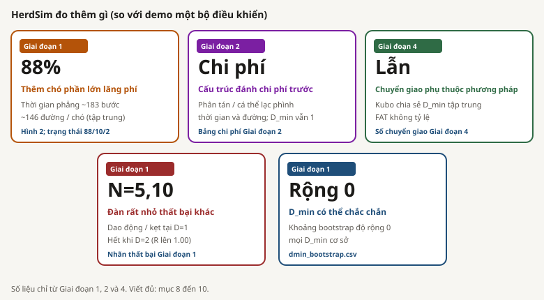

# Một đàn cừu cần bao nhiêu người chăn?

## 1. Tóm tắt

Nghiên cứu hỏi ba câu liên kết. Câu trả lời mức xác nhận đến từ Giai đoạn **1**, **2**, và **4**.

| # | Câu hỏi | Giai đoạn xác nhận |
|---|---|---|
| Q1 | Cần bao nhiêu chó khi kích thước đàn N tăng? | Giai đoạn 1 (kích thước) |
| Q2 | Cấu trúc xuất phát có đổi câu trả lời đó không? | Giai đoạn 2 (cấu trúc) |
| Q3 | Bộ điều khiển chó có đổi câu trả lời đó không? | Giai đoạn 4 (chuyển giao) |

*S25. Xanh: đã xác nhận. Cam: bỏ qua. Tím: đã phân tích nhưng yếu. Xám: chưa chạy. Các hàng còn lại chỉ ghi câu hỏi dự kiến; không bịa R hay D_min.*

| Giai đoạn | Trạng thái | Câu hỏi dự kiến | Có kết quả ở đây? |
|---|---|---|---|
| 3 | BỎ QUA | Ô hiệu quả so với ô quá tải trên I_dir / phân mảnh | Không: 0 ô quá tải trên cơ sở |
| 5 | CHƯA CHẠY | Thang obs / tầm / giao tiếp: một bước có hạ D_min? | Chưa có thư mục dò đường/xác nhận |
| 6 | ĐÃ PHÂN TÍCH (yếu) | Khớp leave-one-N-out; C6b dải độ dốc còn mở | Gói F / Hình 8 đã có; không phải luật tỷ lệ thật |
| 7 | CHƯA CHẠY | AUROC trạng thái và thời gian báo trước trên lượt thất bại | Gói G chưa chạy |

*S23. Đọc số lớn trước, rồi dòng chú thích ngay dưới. Số liệu dưới đây chỉ từ Giai đoạn 1, 2 và 4.*

| Kết luận | Phát hiện | Số liệu chính |
|---|---|---|
| D_min = 1 | Cơ sở cần một chó từ N = 25 đến 400 | N = 5, 10 cần 2; tại D = 1: R = 0.07 / 0.24 |
| Lãng phí | Thêm chó không giúp trên xuất phát tập trung | Trung vị thời gian ~183 bước; ~146 đường / chó; 88/100 ô lãng phí |
| Không tái hiện | Đường D_min(N) dốc của bản thảo không xuất hiện ở đây | Bản thảo 20 đến 35 chó khi N >= 200; ở đây 1 chó hoàn thành N = 400 với trung vị 168 bước (mục 2, 3, 11) |
| Chỉ chi phí | Cấu trúc đổi chi phí, không đổi D_min cơ sở | Phân tán 11x đến 20x thời gian, 19x đến 36x quãng đường; nhiều cá thể lạc đến 6x / 11x tại N = 200 |
| Một phần | Bộ điều khiển chuyển giao không đều | Kubo khớp tập trung, thất bại phân tán (R <= 0.54); FAT chỉ đạt R >= 0.90 khi N <= 10 |

**Lưu ý:** hiệu ứng trần. R = 1.00 tại D = 1 gần như mọi ô cơ sở, nên độ khó tập thể gần như không dịch. Mục 13 nêu các nút làm bài khó hơn.

## 2. Bản thảo 2025

Tiêu đề: *Collective Nudging that Scales. How many dogs do I need to herd sheep?*

**Vai trò trong báo cáo.** Mục 2 chỉ tóm tắt bản thảo. Các số đó không được chạy lại trong HerdSim. Quan hệ bản thảo với NetLogo (nền tảng), với HerdSim và với các lần chạy ở đây nằm ở mục 3. So sánh giao thức và kết quả: Bảng 1 mục 4 và mục 11.

Nguồn: [sheep-scaling_paper2025.pdf](../../../docs/papers/sheep-scaling_paper2025.pdf); ghi chú [sheep-scaling_paper2025.md](../../docs/notes/sheep-scaling_paper2025.md). Nền tảng trong bài: NetLogo 7.0.3.

### Câu hỏi nghiên cứu (bản thảo)

| # | Câu hỏi | Đo gì |
|---|---|---|
| Q1 | Khoảng chó khả dụng `[Dmin, Dmax]` đổi theo kích thước đàn N thế nào? | Tỷ lệ số chó |
| Q2 | Số chó cần có tương quan với chỉ số vĩ mô của đàn (độ trải trung bình) không? | Liên với cấu trúc đàn |
| Q3 | Cừu giữ kết đàn toàn cục chỉ từ thông tin cục bộ thế nào (xấp xỉ gradient mật độ cho GCM)? | Cảm biến cục bộ so với tâm toàn cục |

### Nhiệm vụ trên NetLogo (mô hình bản thảo)

Chó phải hoàn thành **ba pha** theo thứ tự. Thành công = mọi cừu qua cổng trong **10,000 bước thời gian**.

*S24. Gom, giữ 800 bước, thoát qua cổng. Cừu rải; chó góc trên trái; đĩa chứa; cổng tường phải.*

| Phần | Thiết lập bản thảo |
|---|---|
| Sân | 101 x 71 ô, không xoắn |
| Vùng chứa | `rc = clamp(2.5 * sqrt(N), 23, 27)` |
| Cổng thoát | 6 ô, giữa tường phải |
| Cừu bắt đầu | Rải ngẫu nhiên (đệm tường và chó) |
| Chó bắt đầu | Lưới ở **góc trên trái** |
| Luật cừu | Ăn cỏ / chạy; láng giềng tôpô `ntopo = 7`; gradient mật độ cục bộ khi chạy |
| Luật chó | Nhắm, lùa, tuần tra; đa chó cung + tuần tra cung khi Giữ |
| Thời gian giữ | **800 bước** (có giới hạn thoát) |
| Ngưỡng tin cậy | SR >= 90% |

### Thiết kế thí nghiệm (bản thảo)

Một lưới **N x D** đều: **110** ô, **100 lượt/ô**, tổng **11,000** mô phỏng, SR >= 90%, Spearman trên ô tổng hợp, **không bootstrap Dmin**. Cùng lưới **D** với HerdSim `scaling_v2`; **N** lệch (bản thảo có 250 và 350, không 75).

*S26. Chip cam: N chỉ bản thảo. Bảng dưới chỉ đối chiếu thiết kế mẫu (không phải số kết quả). Tổng xác nhận HerdSim: Bảng 2.*

### Kết quả chính (theo bản thảo)

*S27. Tóm tắt trực quan từ Bảng A3 và lời bài. So D_min HerdSim: Bảng 3 và Hình 3.*

| N | Dmin bản thảo | Dmax bản thảo | Max SR |
|---|---|---|---|
| 5 | 1 | chưa đạt | 100% |
| 10 | 1 | 15 | 100% |
| 25 | 1 | 25 | 100% |
| 50 | 1 | 25 | 100% |
| 100 | 1 | chưa đạt | 100% |
| 150 | 3 | chưa đạt | 99% |
| 200 | 20 | 35 | 94% |
| 250 | 25 | chưa đạt | 93% |
| 300 | 20 | chưa đạt | 93% |
| 350 | 35 | chưa đạt | 91% |
| 400 | 35 | chưa đạt | 91% |

*Bảng A3 tại SR >= 90%. "Chưa đạt" nghĩa là D = 35 vẫn SR >= 90%. Ý chính: một chó ổn đến N = 100 rồi sụp ở N = 150; Dmin tăng mạnh khi N lớn; quá tải khi D cao trên N nhỏ; 3,089 / 11,000 thất bại, ~90% dừng ở pha Gom.*

### Phân tích bổ sung (theo bản thảo)

*S28. Từ Bảng VIII đến X. Không chạy lại trong HerdSim.*

| Phân tích | Kết quả bản thảo | Bảng bài |
|---|---|---|
| `S_bar` vs SR | Spearman rho = -0.701 | mục độ trải |
| Tổ hợp tốt nhất | `S_bar * N`, rho = -0.828 | cùng |
| Thất bại theo `S_bar` | >25: 2,161 (Gom 97%); <=25: 928 (Gom 74%) | VIII |
| Độ nhạy `Rrep` 3.0 xuống 2.5 | (D=6, N=400) 0% lên 92%; (D=3, N=250) 5% lên 100% | IX |
| Gradient mật độ vs GCM | ~80 triệu qs; N>=100 sai ~18 đến 22 độ | X |

## 3. HerdSim, NetLogo và chỗ của bản thảo

Giữ ba lớp tách nhau:

| Lớp | Là gì |
|---|---|
| **HerdSim** | Chồng chăn đàn Python: kịch bản, chỉ số, Experiments, đường ống xác nhận |
| **NetLogo** | Nền tảng ABM tổng quát (ô, rùa, IDE, BehaviorSpace). Mọi mô hình `.nlogo` |
| **Bản thảo 2025** | Một mô hình NetLogo với nhiệm vụ gom / giữ / thoát (mục 2). Không phải "NetLogo" nói chung |

Mục 1 nêu câu hỏi báo cáo này trả lời (Giai đoạn 1, 2, 4). Mục 2 là tham chiếu bản thảo. Bảng 1 mục 4 liệt kê mọi khác biệt giao thức một chỗ.

### HerdSim và giao thức `scaling_v2`

HerdSim là mô phỏng nghiên cứu chăn đàn đa tác nhân: chọn phương pháp có tên (luật cừu + chó), khóa hạt giống, đo bằng chỉ số chung để so sánh công bằng khi N, bố cục và cảm biến được kiểm soát.

Trong báo cáo này, mọi thứ mức xác nhận chạy dưới giao thức đóng băng **`scaling_v2`**: cùng lưới **D** và **theta = 0.90** với bản thảo, thêm bố cục **X0** kiểm soát, ba bộ điều khiển (`strombom_multi`, `kubo`, `fat`), phân tầng **dò đường 30 / xác nhận 100**, và **bootstrap trên D_min**. Mục tiêu: lập bản đồ chó theo N, thử cấu trúc và bộ điều khiển, đặt cạnh bản thảo mà không chạy lại tệp NetLogo của nó.

### NetLogo như nền tảng

NetLogo là ngôn ngữ mô phỏng đa tác nhân và IDE máy tính dùng rộng. HerdSim không chạy NetLogo bên trong Python. Bản thảo viết trên NetLogo 7.0.3: đó là một mô hình trên nền tảng, không phải bản thân nền tảng.

### Đối chiếu thiết kế: nền tảng vs hệ thống

*S22. Trái: bộ công cụ ABM tổng quát. Phải: chồng thí nghiệm miền. Twin (mục dưới) chỉ nối phương pháp dùng chung.*

| Trục thiết kế | NetLogo (nền tảng) | HerdSim (hệ thống) |
|---|---|---|
| Mục đích | Bộ công cụ ABM tổng quát | Thí nghiệm phương pháp chăn đàn kiểm soát |
| Không gian | Thế giới ô / rùa (rời rạc) | Vị trí liên tục, tường đàn hồi, bước thời gian rời |
| Dùng tương tác | IDE máy tính: setup, go, monitor | Tab Simulate (chỉ số, scrub, overlay) |
| Hàng loạt | BehaviorSpace hoặc tay | Experiments + phân tầng dò đường/xác nhận |
| So sánh | Cửa sổ riêng / bảng xuất | Tab Compare + chồng chỉ số chung |
| Nguồn gốc | Mô hình + bảng BehaviorSpace | Hạt giống, manifest, CSV gói |
| Phạm vi mô hình | Mọi `.nlogo` | Phương pháp có tên trên kịch bản chung |

Hướng dẫn: `../../../platform/docs/guide/netlogo.md`.

### Twin NetLogo và nguồn số kết luận

Một số phương pháp HerdSim có **twin** NetLogo máy tính (cùng họ Drive-to-Goal) để kiểm hình ảnh và hành vi. Danh mục: `../../../integrations/netlogo/twins.json`.

| Có twin? | Phương pháp | Mức xác nhận ở đây? |
|---|---|---|
| Có | `strombom_multi` | Có (cơ sở Giai đoạn 1 và 2) |
| Có | `kubo` | Có (Giai đoạn 4) |
| Không | `fat` | Có (Giai đoạn 4), chỉ HerdSim |
| Có | `strombom`, `flocking_dog` | Không (không trong tập xác nhận tỷ lệ này) |

**Mô hình bản thảo 2025 không phải twin** và chưa chạy lại. So kết quả: mục 11. Vì sao chồng này vẫn đáng tin với người quen NetLogo: mục kế.

### Tại sao tin HerdSim (so với NetLogo và công cụ tương tự)?

Trong lĩnh vực, hầu hết chạy NetLogo hoặc ABM có sẵn. HerdSim là chồng tự viết. Tin cậy ở đây **không** phải "cùng IDE với mọi người". Nó là bằng chứng xếp lớp: thuật toán, kiểm chéo, giao thức mang được kết luận, cộng danh sách trung thực những gì còn thiếu.

*S30. Đọc trái sang phải. Lớp 4 cũng là phần lập luận: nói rõ điều không khẳng định.*

| Có khẳng định | Không khẳng định |
|---|---|
| Phương pháp chung tái dùng ý bộ điều khiển đã công bố (có ghi chú fidelity trong hướng dẫn phương pháp) | HerdSim bằng NetLogo từng bước, hoặc tái hiện mọi bảng bài báo từng bit |
| Twin hỗ trợ kiểm **hành vi** cho phương pháp có twin (`strombom_multi`, `kubo`) | Đã có bảng parity định lượng twin (RMSE / thỏa thuận) công bố |
| Số kết luận đến từ `scaling_v2` đóng băng, hạt giống, dò đường/xác nhận, bootstrap, và CSV mở | FAT có twin NetLogo (không có) |
| Khác biệt bản thảo vs HerdSim là khác giao thức/nhiệm vụ, không phải "HerdSim sai vì không phải NetLogo" | Mô hình NetLogo bản thảo 2025 đã chạy lại hoặc được xác nhận twin ở đây |

**Điều sẽ tăng tin cậy sau (chưa làm ở đây):** một nghiên cứu twin khớp nhỏ (cùng N, D, hạt giống khi được) với chỉ số thống nhất và delta báo cáo; tùy chọn xuất BehaviorSpace cạnh CSV HerdSim cho một ô cơ sở. Trước đó, coi twin là kiểm hành vi và mọi bảng báo cáo là chỉ HerdSim.

Ghi chú khác biệt twin: `../../../platform/docs/guide/netlogo.md` (RNG, thứ tự cập nhật, Kubo nhạy).

### Bản thảo so với HerdSim (khác nhiệm vụ)

*S19. Cùng chủ đề rộng (chó theo N), khác nhiệm vụ và xuất phát. Lý do chính đường D_min(N) dốc của bản thảo có thể không xuất hiện ở HerdSim (mục 11). Tham số đầy đủ: Bảng 1 mục 4.*

### Bối cảnh tài liệu

HerdSim tái sử dụng các họ bộ điều khiển đã công bố dưới một chồng kịch bản; không invent Gom/Lùa từ đầu. Nền: `../../docs/notes/related_work.md`.

*S21. Chỉ ghép chủ đề. Không khẳng định tái hiện bảng số bài báo từng bit.*

| Chủ đề / bài báo | Trọng tâm cổ điển (ngắn) | HerdSim phát hiện ở đây | Chỗ trong báo cáo |
|---|---|---|---|
| Strombom et al. 2014 | Heuristic Gom/Lùa; một chó chăn đàn vừa | Cơ sở: D_min = 1 với N = 25 đến 400; N = 5 và 10 cần 2 | Giai đoạn 1; Bảng 3 |
| Kubo et al. 2022 | Đẩy giữa chó; dẫn đàn đa chó | Bản đồ kích thước tập trung dùng chung với cơ sở; xuất phát phân tán thất bại (R <= 0.54) | Giai đoạn 4; Bảng 5 |
| Tsunoda et al. 2018 (ý FAT) | Nhắm cừu xa nhất nhìn thấy dưới cảm biến cục bộ | Trên nhiệm vụ này với quan sát toàn cục: R >= 0.90 chỉ khi N <= 10 | Giai đoạn 4; Hình 1 |
| Bản thảo 2025 | D_min(N) dốc; quá tải; NetLogo giữ+thoát | Không tái hiện dưới drive_to_goal + xuất phát kiểm soát | Mục 11 |
| Cấu trúc / herdability | Trạng thái đầu và điều khiển được quan trọng | Chi phí lệch 10x đến 36x; D_min vẫn 1 trên cơ sở (sàn) | Giai đoạn 2; Bảng 4 |

### HerdSim đo thêm gì (so với demo một bộ điều khiển)

Đọc số lớn trước, rồi dòng chú thích và nhãn bằng chứng.

*S29. Mỗi thẻ có nhãn giai đoạn. Viết đủ ở mục 8 đến 10.*

| Phát hiện từ các lần chạy | Đọc ngắn | Bằng chứng |
|---|---|---|
| Thêm chó phần lớn lãng phí trên xuất phát tập trung | Thời gian phẳng (~183 bước); quãng đường ~146 đơn vị mỗi chó | Giai đoạn 1; Hình 2; trạng thái 88/10/2 |
| Cấu trúc đánh vào chi phí trước D_min | Phân tán / nhiều cá thể lạc phình thời gian và quãng đường; D_min vẫn 1 | Giai đoạn 2 |
| Chuyển giao phụ thuộc phương pháp | Kubo chia sẻ D_min tập trung; FAT không tỷ lệ | Số chuyển giao Giai đoạn 4 |
| Đàn rất nhỏ là chế độ thất bại khác | Dao động/kẹt tại D = 1; hết khi D = 2 | Nhãn thất bại Giai đoạn 1 |
| Độ bất định D_min có thể độ rộng 0 | Bootstrap ổn định trên cơ sở | `dmin_bootstrap.csv` |

## 4. Thiết lập

| Mục | Bản thảo 2025 | HerdSim `scaling_v2` |
|---|---|---|
| Động cơ | NetLogo 7.0.3 (lưới ô) | HerdSim (không gian liên tục, bước thời gian rời rạc) |
| Nhiệm vụ | Gom, giữ 800 bước, thoát qua cổng | `drive_to_goal`: mọi con cừu nằm trong đĩa đích |
| Thành công | Mọi cừu qua cổng | Tỷ lệ cừu trong đĩa đích >= 1.0 |
| Sân | 101 x 71 ô, chuồng ở giữa | 500 x 500, đàn tại (250, 250), đích tại (370, 250) |
| Đích / vùng chứa | `rc = clamp(2.5 * sqrt(N), 23, 27)` | Bán kính `15 * sqrt(N/50)` (15 tại N = 50) |
| Quãng đường lùa | Gom về tâm, rồi thoát | Tâm đến đích 120 đơn vị mọi N |
| Cừu bắt đầu | Rải ngẫu nhiên (đệm tường và chó) | Họ gia đình bố cục: tập trung / phân tán / chia cắt / nhiều cá thể lạc |
| Chó bắt đầu | Lưới góc trên trái | Sau đàn, ngược hướng đích (lệch 50, nhiễu +/-5) |
| Tốc độ (họ Strombom) | Bảng A1 | Cừu 1.0, chó 1.5 mỗi bước |
| Tốc độ (Kubo) | không có | Tích phân `dt = 0.05`, cừu tối đa 5, chó tối đa 10 |
| Giới hạn thời gian | 10,000 bước | T0 = 10,000 (T1 = 20,000 dự định cho ô quá tải) |
| Lưới D | {1, 2, 3, 4, 6, 10, 15, 20, 25, 35} | Giống |
| Lưới N | Có 250, 350; không 75 | Có 75; không 250, 350 |
| Mẫu thử | 100 mỗi ô | Dò đường 30 mỗi ô; 100 ở cửa sổ xác nhận |
| Hạt giống chủ | không ghi | 2026; hạt giống mỗi lượt là `2026 + i` |
| Tin cậy | SR >= 90% | theta = 0.90 (cũng báo cáo 0.50, 0.70) |
| Độ bất định D_min | không có | Bootstrap trên mẫu thử (1,000 lần lấy mẫu) |
| Bộ điều khiển | Một họ gom-lùa NetLogo | Cơ sở `strombom_multi`; chuyển giao `kubo`, `fat` |
| Yếu tố cấu trúc | Độ trải nội sinh; tương quan `S_bar` | Đặt họ X0 (bốn bố cục) |
| Chỉ số | Thành công, bước, pha, `S_bar`, quãng đường, cừu lạc | Thành công, bước, quãng đường, kết đàn, phân mảnh, độ trải, I_dir, nhãn thất bại |

*Bảng 1. Bản thảo so với giao thức hiện tại.*

*S1. Xuất phát tập trung trên sân 500 x 500. Chó đứng sau đàn, ngược hướng đích. Nguồn sơ đồ: hướng dẫn giai đoạn 1 (`arena_compact.svg`).*

*S2. Quy tắc bán kính đích `15 * sqrt(N/50)`. Nguồn sơ đồ: hướng dẫn giai đoạn 1 (`goal_radius.svg`).*

### Bố cục xuất phát (HerdSim)

Với độ rải giao thức 30 và bán kính đo 5:

| Bố cục | Định nghĩa |
|--------|------------|
| tập trung | Gauss, sigma = 0.3 x 30 = 9 |
| phân tán | Gauss, sigma = 2.0 x 30 = 60 |
| chia cắt | 2 cụm nếu N < 12, không thì 3; khoảng cách ít nhất 10; sigma mỗi cụm theo khe |
| nhiều cá thể lạc | Lõi ~80% (sigma = 12); ~20% lạc ngoài `r_a * N^(2/3)` |

Điểm sẽ ra khỏi sân hoặc rơi vào đĩa đích được vẽ lại (tối đa 400 lần).

*S3. Cách đặt cừu và chó lúc bắt đầu mỗi lượt theo từng họ X0. Nguồn sơ đồ: hướng dẫn giai đoạn 2 (`four_layouts.svg`).*

## 5. Thuật toán

Ba phương pháp bắt buộc. Vì sao ba cái này: một cơ sở gom-lùa phối hợp, cộng hai bộ điều khiển quyết định khác (Kubo theo lực; FAT nhắm cá thể xa nhất), để chuyển giao hỏi liệu kết quả kích thước và cấu trúc có phụ thuộc thiết kế chó không.

### `strombom_multi` (cơ sở)

- **Cừu:** Strombom 2014 (ăn cỏ / phản ứng với chó gần nhất trong `r_s`, kết đàn cục bộ, đẩy, quán tính hướng và nhiễu).
- **Chó:** Gom nếu bất kỳ cừu nào trong tầm nhìn của chó xa hơn `f(N) = r_a * N^(2/3)` so với tâm nhóm đó; không thì Lùa. Gom gán chó cho các cá thể lạc khác nhau với khoảng cách tiếp tuyến; Lùa đặt chó trên vòng bán kính `4 * r_a` sau đàn. Khoảng cách nhiều chó là thiết kế HerdSim, không phải bản sao công bố của Strombom 2014.
- **Tham số chính:** `r_a = 2`, `r_s = 65`, tốc độ cừu 1.0, tốc độ chó 1.5, nhiễu 0.3, quán tính 0.5.
- **Bài báo:** Strombom et al., J. R. Soc. Interface 11(100):20140719, 2014.

*S10. Ý tưởng bộ điều khiển cơ sở. Gom đến khi đàn đủ kết; rồi Lùa. Khoảng cách nhiều chó tránh chồng lên một điểm.*

### `kubo`

- **Cừu:** Mô hình lực riêng của Kubo (đẩy, căn chỉnh, kết đàn, đẩy chó trong bán kính cảm). **Không** phải cừu Strombom.
- **Chó:** Lực liên tục; mỗi chó nhắm cừu trong tầm xa nhất so với **đích**; đẩy chó-chó để xoè đội. Tích phân `p <- p + dt * v` với `dt = 0.05`.
- **Tham số chính:** bán kính 60; hệ số cừu K_s1..K_s4 = 10, 0.5, 2, 5000; hệ số chó K_f1..K_f4 = 10, 200, 8, 3000; tốc độ cừu tối đa 5, chó tối đa 10.
- **Bài báo:** Kubo et al., Artificial Life and Robotics 27, 416-427, 2022.
- **So sánh:** số bước thời gian và quãng đường không so sánh trực tiếp với họ Strombom vì tích phân khác.

*S11. Chăn đàn theo lực. Kết đàn và lùa nổi lên từ tổng lực liên tục trong bán kính cảm.*

### `fat`

- **Cừu:** Strombom 2014 (giống cơ sở).
- **Chó:** Không chuyển chế độ Gom/Lùa. Mỗi chó độc lập nhắm cừu **xa nhất so với chính nó** trong tập quan sát, đứng lệch `r_a` sau cừu đó về phía đích, và áp dụng quy tắc dừng Strombom. Ý tưởng từ Tsunoda et al. (2018); HerdSim chạy bản tối thiểu trên cừu Strombom.
- **Quan sát ở Giai đoạn 1, 2 và 4:** mặc định `obs_mode=global`, nên mỗi chó FAT thấy cả đàn (cảm cục bộ là giai đoạn thông tin sau, chưa chạy ở đây).
- **Ý tưởng bài báo:** Tsunoda et al., Advanced Robotics 32(23), 2018.

*S12. Nhắm cá thể xa nhất. Không quyết định Gom / Lùa chung; mỗi chó chạy cùng một quy tắc trên quan sát của mình.*

*S13. Cùng chữ "xa nhất" nhưng chỉ ba con cừu khác nhau tùy bộ điều khiển. Sự khác đó quan trọng cho chuyển giao (mục 10).*

## 6. Lựa chọn thiết kế và vì sao

Mỗi lựa chọn được đóng băng trong giao thức và giải thích trong kế hoạch chính (mục "Why these values").

**Lưới N.** Mười kích thước: {5, 10, 25, 50, 75, 100, 150, 200, 300, 400}. Dày hơn quanh 100, nơi một chó không còn đủ trong bản thảo. 75 và 150 định vị thay đổi đó. 300 và 400 cho độ dốc N lớn hơn một bước. Sàn 5: dưới đó không còn tập thể. 250 và 350 bị bỏ vì mỗi N thêm là một quét chó đầy đủ.

**Lưới D.** Bước 1 từ D = 1 đến 4, nơi D_min thường nằm. Sau đó rộng hơn ({6, 10, 15, 20, 25, 35}), vì câu hỏi là một tăng lớn có giúp hay hại không, và khe 2 chó nhỏ hơn bước D cao. Trần 35 là nơi "vài người chăn" kết thúc. Mọi số nguyên đến 35 sẽ làm dò đường khoảng 10,500 lượt thay vì 3,000.

*S14. Vì sao lưới không đều: độ chi tiết gần điểm đổi của bản thảo theo N, và gần D_min điển hình theo D.*

**Theta 0.90.** Cùng dải tin cậy với bản thảo. 0.50 và 0.70 được báo cáo, không dùng cho D_min.

*S15. Ngưỡng tin cậy dùng cho mọi biên kết luận trong báo cáo này.*

**T0 = 10,000.** Khoảng 80 lần đi thẳng ở tốc độ 1, nên hết thời gian nghĩa là mất kiểm soát. T1 = 20,000 chỉ cho ô quá tải (không có ở mức cơ sở, nên không chạy T1).

**Sân 500, quãng đường lùa 120, bán kính đích `15 * sqrt(N/50)`.** Xuất phát phân tán và cá thể lạc N lớn phải vừa; quãng đường lùa phải nằm ngoài xuất phát tập trung và quá một sigma phân tán; diện tích mỗi cừu trong đích giữ không đổi để N lớn không bị kẹt.

*S16. Hình học và ngân sách thời gian đóng băng cùng giao thức. Quy tắc bán kính đích cũng ở S2.*

**Định nghĩa biên (HerdSim so với bản thảo).**

| Đại lượng | Bản thảo | HerdSim |
|-----------|----------|---------|
| D_min | D nhỏ nhất với SR >= 90% | D nhỏ nhất với R >= theta |
| D_overcrowd | D nhỏ nhất > Dmin nơi SR bắt đầu giảm | D nhỏ nhất > D_min nơi D này và D lưới kế tiếp đều dưới theta |
| D_max | D nhỏ nhất > Dmin với SR < 90%, không thì trần | D lớn nhất vẫn >= theta và dưới D_overcrowd; không thì D lớn nhất đã thử vẫn đạt theta |
| B* | không định nghĩa | (D, T) với R >= theta và trung vị quãng đường nhỏ nhất |

*S17. Phác thảo khái niệm các nhãn biên dùng trong Bảng 3 và 5.*

**Nhãn thất bại (HerdSim).** Kịch bản chỉ quyết định thành công hay thất bại: mọi cừu trong đĩa đích trước T0, hoặc không. Sau khi thất bại, heuristic gắn nhãn *cách* thất bại (chỉ để phân tích, không phải lý do dừng). Thứ tự ưu tiên: chồng chất, tách, tán, dao động, kẹt, rồi hết giờ. Nhãn khớp đầu tiên thắng.

| Nhãn | Đường cong chỉ số nhìn ra sao | Có trong dữ liệu xác nhận? |
|---|---|---|
| chồng chất | chó đứng sát nhau bất thường (cần lịch sử khoảng cách chó) | Không (không thấy ở đây) |
| tách | fragmentation giữ thấp (đàn còn nhiều mảnh) | Có (FAT cấu trúc) |
| tán | cohesion giữ cao (đàn rải) | Có (Kubo/FAT cấu trúc) |
| dao động | `gcm_goal` zigzag mà tiến ròng ít | Có (Giai đoạn 1 đàn nhỏ; FAT) |
| kẹt | `gcm_goal` hầu như không hạ về đích | Có (Giai đoạn 1 N=10; FAT) |
| hết giờ | không mẫu riêng; vẫn chưa xong tại T0 | Có (Kubo; một phần FAT) |

*S18. Thẻ: thứ tự ưu tiên. Đồ thị nhỏ: lượt thất bại thường nhìn thế nào trên `gcm_goal` / cohesion / fragmentation. Tỉ lệ gộp: Hình 5.*

## 7. Phân tầng: thử nghiệm, dò đường, xác nhận, T1

Bản đồ mức xác nhận cần tỉ lệ thành công chính xác gần biên. Chạy mọi ô (N, D) ở 100 mẫu thử đắt hơn nhiều so với cần: ô nội thất luôn thành công hoặc luôn thất bại ít dạy ở độ sâu đó. Đường ống theo tầng chi tiêu mẫu rẻ mọi nơi, học ô nào quan trọng, rồi chỉ tiêu mẫu đắt ở các ô đó.

*S4. Thử nghiệm (khởi động) kiểm đường chạy; dò đường lập bản đồ rẻ trên cả lưới; xác nhận chạy lại chỉ cửa sổ biên; T1 bị bỏ ở đây (không có ô quá tải). Nguồn sơ đồ: hướng dẫn giai đoạn 1 (`pipeline.svg`).*

| Mức | Vai trò | Mẫu thử điển hình | Trích dẫn cho kết luận? |
|-----|---------|-------------------|-------------------------|
| Thử nghiệm (khởi động) | Kiểm tra đường chạy | lưới nhỏ | Không |
| Dò đường | Bản đồ rộng; chọn cửa sổ | 30 | Không (chỉ lập kế hoạch) |
| Xác nhận | Độ chính xác trên ô đã chọn | 100 | Có |
| T1 | Chân trời dài trên ô quá tải | 100 ở 20,000 bước | Có, khi chạy |

**Vì sao 30 và 100.** Tại R = 0.90, sai số chuẩn khoảng 0.055 ở 30 mẫu (đủ để tách ô hỏng khỏi ô chắc) và khoảng 0.03 ở 100. Mười mẫu lật cửa sổ. 200 là mức nâng khi khoảng D_min phủ hơn một bước lưới.

*S5. Tỉ lệ tin cậy R là phần mẫu thử thành công trong một ô. Nguồn sơ đồ: hướng dẫn giai đoạn 1 (`one_cell_seeds.svg`).*

*S6. Bản đồ dò đường: mọi ô đã đóng băng nhận ước lượng R rẻ. Nguồn sơ đồ: hướng dẫn giai đoạn 1 (`scout_grid.svg`).*

**Cửa sổ xác nhận.** Với mỗi (phương pháp, bố cục, N), sau dò đường: D_min dò đường cộng D lưới trước và sau; nếu hai D liên tiếp sau ứng viên đó đều dưới theta, hai D đó và D cuối vẫn trên theta; nếu không D nào đạt theta, hai D lớn nhất.

*S7. Vì sao xác nhận rẻ hơn 100 mẫu đều mọi nơi: độ chính xác được chi nơi quyết định D_min. Nguồn sơ đồ: hướng dẫn giai đoạn 1 (`claim_window.svg`).*

**Quy tắc gộp.** Trên ô đã nhận mẫu xác nhận, phân tích chỉ dùng 100 mẫu đó. Ô khác giữ hàng dò đường. Không chồng hàng dò đường lên hàng xác nhận trên cùng một ô.

**Bootstrap (vì sao cần).** D_min được ước lượng từ số mẫu hữu hạn. Một điểm ước lượng đơn không cho biết câu trả lời có còn đúng nếu vài lượt chạy đi theo hướng khác. Bootstrap trả lời điều đó mà không cần mô phỏng mới: lấy mẫu lại các hạt giống đã quan sát trong mỗi D (1,000 lần), tính lại D_min mỗi lần, rồi lấy phân vị 2.5% và 97.5% làm khoảng. Độ rộng 0 nghĩa là mọi lần lấy mẫu cho cùng D_min (ổn định). Khoảng rộng (ví dụ Kubo N = 5: [1, 3]) nghĩa là biên vẫn mềm dưới nhiễu mẫu.

*S20. Từ trái sang phải: hạt giống thành công/thất bại đã quan sát, nhiều lần lấy mẫu lại, rồi khoảng phân vị trên các giá trị D_min* thu được.*

**T1.** Dự định 20,000 bước trên ô quá tải. Mức cơ sở không có ô quá tải, nên **không có mô phỏng T1 nào được chạy** (`../phase1/t1/REPORT.md`, `../phase1/t1/t1_plan.json`).

**Ngân sách.** Nghiên cứu này: 34,450 mô phỏng qua Giai đoạn 1, 2 và 4 (hàng thử nghiệm + dò đường + xác nhận). Bản thảo: 11,000 cho một bản đồ kích thước ở 100 mẫu đều.

| Giai đoạn | Câu hỏi | Phương pháp | Bố cục | Thử nghiệm | Dò đường | Xác nhận |
|---|---|---|---|---|---|---|
| 1 | Bản đồ kích thước | strombom_multi | tập trung | 150 | 3,000 | 2,200 |
| 2 | Cấu trúc | strombom_multi | 4 bố cục | 600 | 3,600 | 2,400 |
| 4a | Chuyển giao: kích thước | kubo | tập trung | - | 3,000 | 2,100 |
| 4a | Chuyển giao: kích thước | fat | tập trung | - | 3,000 | 2,000 |
| 4b | Chuyển giao: cấu trúc | kubo | 4 bố cục | - | 3,600 | 2,800 |
| 4b | Chuyển giao: cấu trúc | fat | 4 bố cục | - | 3,600 | 2,400 |
|  | **Tổng số lượt mô phỏng** |  |  |  |  | **34,450** |

*Bảng 2. Số lượt theo từng giai đoạn (số dòng `trials.csv`). Các tệp gộp phân tích xác nhận gồm 29,530 dòng, ít hơn 34,450, vì hàng dò đường bị bỏ trên ô đã chạy lại.*

Cách đọc biểu đồ nhiệt: hàng là kích thước đàn, cột là số chó, mỗi ô là phần trăm mẫu thử thành công. D_min là cột đầu tiên trong hàng đạt 90%.

## 8. Giai đoạn 1: đàn kích thước N cần bao nhiêu chó?

Mục tiêu: lập bản đồ tỉ lệ thành công R(N, D) cho bộ điều khiển cơ sở `strombom_multi` với xuất phát tập trung, từ đó suy ra D_min, D_overcrowd, D_max và D rẻ nhất mà vẫn đáng tin.

*Hình 1. Bề mặt tỉ lệ thành công của ba bộ điều khiển với xuất phát tập trung. Giai đoạn 1 là bảng bên trái; hai bảng kia thuộc Giai đoạn 4 (mục 10). Nguồn: `../phase1/claim/packages/a/reliability.csv`, `../phase4/kubo_size/claim/packages/a/reliability.csv`, `../phase4/fat_size/claim/packages/a/reliability.csv`.*

### Kết quả (cơ sở)

**Cần bao nhiêu chó?** Với xuất phát tập trung, một chó đủ khi đàn có từ 25 con trở lên. Đàn rất nhỏ (N = 5 và 10) cần hai chó. Khoảng bootstrap của mọi D_min cơ sở có độ rộng 0: mỗi lần lấy mẫu lại đều cho cùng một đáp án.

| Kích thước đàn N | D_min | Ý nghĩa |
|---|---|---|
| 5, 10 | 2 | Một chó chưa đáng tin |
| 25 đến 400 | 1 | Một chó đạt R >= 0.90 |

**Thêm chó có hại không?** Không có quá tải trên bản đồ này. R giữ >= 0.90 từ D_min đến D = 35 với mọi N. Vì thế D_overcrowd không xác định, và D_max chỉ là trần lưới (35).

**Thất bại hiếm xảy ra ở đâu?** Gần như chỉ tại D = 1 trên hai đàn nhỏ. Tỉ lệ thành công chung Giai đoạn 1 là 96% (169 thất bại).

| Ô | R tại D = 1 | R tại D = 2 | Nhãn thất bại chính |
|---|---|---|---|
| N = 5, D = 1 | 0.07 | 1.00 | dao động: 93 |
| N = 10, D = 1 | 0.24 | 1.00 | kẹt: 58, dao động: 18 |

Mẹo đọc: nếu gộp N = 5 và 10, dao động là nhãn đơn lẻ lớn nhất. Chỉ riêng N = 10 thì kẹt nhiều hơn dao động.

**100 ô (N, D) được gán nhãn thế nào?** Hầu hết chó thêm đều lãng phí:

| Trạng thái | Số ô | Ý nghĩa thường |
|---|---|---|
| Lãng phí | 88 | Đã đáng tin; thêm chó chỉ tăng quãng đường |
| Hiệu quả | 10 | Gần mức D hữu ích |
| Thiếu nguồn lực | 2 | Hai ô đàn nhỏ tại D = 1 |

*S8. Các nhãn trạng thái nằm thế nào trên trục số chó. Nguồn sơ đồ: hướng dẫn giai đoạn 1 (`regimes.svg`).*

*Hình 2. Chi phí theo D (thang lôgarit hai trục). Nguồn: `../phase1/claim/merged_trials.csv`.*

### Vì sao

**Thời gian vốn đã ngắn.** Trên Giai đoạn 1, trung vị hoàn thành là 183 bước (phân vị 90 = 198). Chỉ trên lượt thành công: trung vị 182, phân vị 90 = 195. Ngân sách hết giờ là 10,000 bước, nên hầu như không bao giờ đụng tới trần thời gian.

**Quãng đường tăng theo mỗi chó thêm.** Mỗi chó di chuyển suốt lượt chạy: khoảng 146 đơn vị đường mỗi chó với N >= 25. Vì thế 88 ô bị gán lãng phí: sau con chó đầu tiên đã đáng tin, mỗi chó thêm chủ yếu chỉ tăng chi phí đi bộ.

**Vì sao N = 5 và 10 cần hai chó?** Chưa kiểm tra như một thí nghiệm cơ chế ở đây. Cách đọc khớp với nhãn (chưa chứng minh): một chó trên vài con cừu cứ chuyển qua lại giữa gom và lùa mà không ổn định. Ở N = 5 nhãn chủ đạo là dao động; ở N = 10 là kẹt (kèm một ít dao động). Chó thứ hai loại bỏ chế độ thất bại đó (R nhảy lên 1.00 tại D = 2).

*Hình 3. D_min theo N. Nguồn: `../phase1/claim/packages/a/frontier.csv`, `../phase4/*/size/claim/packages/a/frontier.csv`, Bảng A3 bản thảo.*

| N | Strombom | Kubo | FAT | Bản thảo 2025 |
|---|---|---|---|---|
| 5 | 2 | 3 | 1 | 1 |
| 10 | 2 | 1 | 1 | 1 |
| 25 | 1 | 1 | không có <= 35 | 1 |
| 50 | 1 | 1 | không có <= 35 | 1 |
| 75 | 1 | 1 | không có <= 35 | không có số liệu |
| 100 | 1 | 1 | không có <= 35 | 1 |
| 150 | 1 | 1 | không có <= 35 | 3 |
| 200 | 1 | 1 | không có <= 35 | 20 |
| 300 | 1 | 1 | không có <= 35 | 20 |
| 400 | 1 | 1 | không có <= 35 | 35 |

*Bảng 3. D_min tại theta = 0.90 theo kích thước đàn (xuất phát tập trung). Khoảng bootstrap cơ sở có độ rộng 0. Kubo tại N = 5 có khoảng bootstrap [1, 3] (không độ rộng 0); R là 0.77 tại D = 1, 0.71 tại D = 2, 0.97 tại D = 6. Giá trị bản thảo từ Bảng A3. Nguồn: `../phase1/claim/packages/a/frontier.csv`, `dmin_bootstrap.csv`, `../phase4/{kubo,fat}_size/claim/packages/a/frontier.csv`.*

### Khớp dữ liệu tỷ lệ (Gói F)

**Ý chính.** Trên cơ sở không có đường D_min(N) tăng để khớp. D_min quan sát chỉ là bước hai mức:

| N | D_min quan sát |
|---|---|
| 5, 10 | 2 |
| 25 đến 400 | 1 |

Bốn mô hình được so sánh bằng RMSE khi bỏ đi 1 biến N (khớp trên mọi N trừ một, chấm trên N bị giữ lại; thấp hơn thì tốt hơn):

| Mô hình | RMSE bỏ-1-N | Đọc ngắn |
|---|---|---|
| Hàm hằng | 0.44 | Một D_min phẳng cho mọi N |
| Tuyến tính | 0.44 | Đường thẳng theo N |
| Hàm mũ | 0.25 | Đường cong mượt trên thang lôgarit |
| Hàm từng mảnh | 0.13 | Hai mức với điểm gãy tại N = 10 |

*Hình 8. So sánh Gói F. Nguồn: `../phase1/claim/packages/f/scaling_cv.csv`.*

**Cách đọc.** Hàm từng mảnh trông tốt nhất chỉ vì nó cứng hóa bước đã có trong dữ liệu (điểm gãy tại N = 10). Đó không phải bằng chứng của một quy luật tỷ lệ. Kết luận C6b (độ dốc lôgarit dưới 1 trong một dải N) không kiểm tra được ở đây: không có sự tăng trưởng để khớp.

## 9. Giai đoạn 2: cấu trúc xuất phát có đổi câu trả lời không?

Mục tiêu: giữ N cố định ở 50, 100 và 200 và chỉ đổi bố cục xuất phát. Phép thử là D_min có dịch ít nhất một bước trên lưới giữa các bố cục không (kết luận C1a).

**Trả lời ngắn.** Cấu trúc xuất phát **không** đổi D_min trên cơ sở. Nó **có** đổi chi phí (thời gian và quãng đường), và đổi rất mạnh.

**D_min.** Vẫn bằng 1 ở cả 12 ô (bố cục, N); độ rộng bootstrap = 0. Tại D = 1 mọi ô có R = 1.00, nên có hiệu ứng sàn: D_min không thể xuống dưới 1, và bộ điều khiển/nhiệm vụ này không thể hiện sự dịch chuyển cấu trúc trên biên tin cậy.

**Chi phí.** Thành công 100% mọi nơi tại D = 1, nhưng công sức khác nhau một bậc độ lớn (Bảng 4 và Hình 4):

*Hình 4. Tổng quãng đường trung vị tại D = 1 theo bố cục. Nguồn: `../phase2/claim/merged_trials.csv` (D = 1).*

| Bố cục | N | R tại D=1 | Thời gian trung vị | so với tập trung | Quãng đường trung vị | so với tập trung |
|---|---|---|---|---|---|---|
| tập trung | 50 | 1.00 | 195 | 1.0x | 157 | 1.0x |
| tập trung | 100 | 1.00 | 204 | 1.0x | 161 | 1.0x |
| tập trung | 200 | 1.00 | 191 | 1.0x | 144 | 1.0x |
| chia cắt | 50 | 1.00 | 195 | 1.0x | 158 | 1.0x |
| chia cắt | 100 | 1.00 | 205 | 1.0x | 162 | 1.0x |
| chia cắt | 200 | 1.00 | 193 | 1.0x | 144 | 1.0x |
| nhiều cá thể lạc | 50 | 1.00 | 224 | 1.1x | 209 | 1.3x |
| nhiều cá thể lạc | 100 | 1.00 | 501 | 2.5x | 554 | 3.4x |
| nhiều cá thể lạc | 200 | 1.00 | 1,228 | 6.4x | 1,647 | 11.4x |
| phân tán | 50 | 1.00 | 2,138 | 11.0x | 2,925 | 18.6x |
| phân tán | 100 | 1.00 | 3,074 | 15.1x | 4,319 | 26.8x |
| phân tán | 200 | 1.00 | 3,870 | 20.3x | 5,213 | 36.2x |

*Bảng 4. Chi phí của một chó ở mức cơ sở theo bố cục (100 mẫu thử mỗi ô). Nguồn: `../phase2/claim/merged_trials.csv`.*

Bảng 4 nói gì, bằng lời thường:

| Bố cục | Điều gì xảy ra | Quy mô khoảng cách chi phí |
|---|---|---|
| phân tán | Phải gom đàn đang rải rộng trước | 11x đến 20x thời gian; 19x đến 36x quãng đường so với tập trung; khoảng cách tăng theo N |
| nhiều cá thể lạc | Rẻ khi N nhỏ; đắt khi nhiều cừu lạc | Khoảng 1.1x thời gian tại N = 50; 6.4x thời gian và 11x quãng đường tại N = 200 |
| chia cắt | Ở đây trông giống tập trung | Trung vị khớp tập trung tại N = 50; độ phân mảnh trung bình ~0.99 cho cả hai. Coi là điều cần kiểm tra lại, không phải phát hiện: bộ sinh có thể chưa tạo bài toán đàn con khó cho bộ điều khiển này |
| tập trung | Mốc tham chiếu | 1.0x |

**Một chỗ chó thứ hai đáng tiền.** Ở xuất phát phân tán, B* = 2 (không phải 1): quãng đường 2,337 tại N = 50 so với 2,925 tại D = 1. Đây là ô cơ sở duy nhất mà thêm chó giảm đủ tổng quãng đường để có ý nghĩa. Nguồn: `../phase2/claim/packages/b/frontier_by_layout.csv`.

**Diễn giải.** Cấu trúc đánh vào công sức và thời gian từ rất lâu trước khi nó dịch D_min. Đọc chỉ theo biên tin cậy sẽ bỏ sót câu chuyện. Hãy báo cáo quãng đường và thời gian bên cạnh D_min mỗi khi đổi cấu trúc.

## 10. Giai đoạn 4: các kết quả có chuyển sang bộ điều khiển khác không?

Mục tiêu: lặp lại bản đồ kích thước và phép đối chiếu cấu trúc với **Kubo** và **FAT**, rồi so với cơ sở. Một đặc trưng là **dùng chung** nếu hai bộ điều khiển có cùng D_min, **chệch** nếu khác nhau, **không có** nếu một bên không có.

*S9. Phase 4 so sánh gì giữa các phương pháp. Nguồn hình: hướng dẫn giai đoạn 4 (`transfer_sketch.png`).*

### Bản đồ kích thước (xuất phát tập trung)

**Kubo (phần lớn dùng chung với cơ sở).**

| N | D_min | Ghi chú |
|---|---|---|
| 5 | 3 | R = 0.77 tại D = 1, 0.71 tại D = 2, 0.97 tại D = 6 |
| 10 đến 400 | 1 | Giống cơ sở |

Tỉ lệ thành công chung 99%. Mọi thất bại đều là hết thời gian.

**FAT (không chuyển giao với đàn lớn).**

| N | Kết quả |
|---|---|
| 5, 10 | D_min = 1 |
| 25 | R tốt nhất khoảng 0.6 đến 0.8; không bao giờ đạt 0.90 |
| 50 đến 400 | R tốt nhất khoảng 0.2 đến 0.5; không bao giờ đạt 0.90 |

Thêm chó không giúp. Khoảng một nửa số lượt FAT thất bại: chủ yếu dao động (39% số lượt) và kẹt (7%).

**Nhãn chuyển giao (Gói D, kích thước).** 8 dùng chung, 7 chệch, 29 không có. Số "không có" lớn chủ yếu là các hàng quá tải (không bộ điều khiển nào quá tải ở xuất phát tập trung), nên con số đó không phải điểm số bất đồng. Nguồn: `../phase4/package_d/size/transfer_summary.csv`.

*Hình 5. Các lượt chạy kết thúc ra sao. Nguồn: cột `failure_mode` của `merged_trials.csv` xác nhận cho phase1, kubo_size và fat_size.*

### Cấu trúc tại N = 50, 100, 200

| Bố cục | N | Strombom | Kubo | FAT |
|---|---|---|---|---|
| tập trung | 50 | 1 | 1 | không có (R tốt nhất=0.47) |
| tập trung | 100 | 1 | 1 | không có (R tốt nhất=0.40) |
| tập trung | 200 | 1 | 1 | không có (R tốt nhất=0.47) |
| chia cắt | 50 | 1 | 1 | không có (R tốt nhất=0.50) |
| chia cắt | 100 | 1 | 1 | không có (R tốt nhất=0.47) |
| chia cắt | 200 | 1 | 1 | không có (R tốt nhất=0.40) |
| nhiều cá thể lạc | 50 | 1 | 1 | không có (R tốt nhất=0.10) |
| nhiều cá thể lạc | 100 | 1 | 1 | không có (R tốt nhất=0.00) |
| nhiều cá thể lạc | 200 | 1 | 4, quá tải ở 10 | không có (R tốt nhất=0.00) |
| phân tán | 50 | 1 | không có (R tốt nhất=0.49) | không có (R tốt nhất=0.00) |
| phân tán | 100 | 1 | không có (R tốt nhất=0.54) | không có (R tốt nhất=0.00) |
| phân tán | 200 | 1 | không có (R tốt nhất=0.47) | không có (R tốt nhất=0.00) |

*Bảng 5. D_min theo bố cục và bộ điều khiển. 'không có' = không có D <= 35 nào đạt 0.90. Nguồn: `../phase4/package_d/structure/frontier_by_method_layout.csv`.*

*Hình 6. R theo D tại N = 200 cho từng bố cục. Nguồn: `../phase4/package_d/structure/frontier_by_method_layout.csv`.*

**Cách đọc Bảng 5.** Strombom giữ D_min = 1 mọi nơi. Kubo khớp ở tập trung và chia cắt, thất bại ở phân tán, và chỉ chệch ở nhiều cá thể lạc tại N = 200. FAT không bao giờ đạt ngưỡng ở các N này.

| Phát hiện | Đọc bằng lời thường | Số liệu |
|---|---|---|
| Kubo + phân tán | Không gom kịp đàn rải rộng | R tốt nhất khoảng 0.42 đến 0.54; thất bại do hết giờ / tán loạn; thêm chó nâng R từ ~0.2 lên ~0.5 nhưng không tới 0.90 |
| Kubo + nhiều cá thể lạc, N = 200 | Chệch mềm, không phải sụp | D_min = 4; gán quá tải tại D = 10; R(D) dao động quanh 0.90 (0.70, 0.84, 0.86, 0.93, ...) |
| Lưu ý ô mềm | D = 4 vẫn chỉ có 30 mẫu | Cửa sổ xác nhận không chạy lại ô đó (`boundary_cells.csv`); độ bất định trên R khoảng +/-0.11, không phải +/-0.06. Coi D_overcrowd = 10 là mềm đến khi nâng mẫu |
| FAT trên cấu trúc | Thất bại cứng | Không bố cục nào tại N >= 50 đạt 0.90; phân tán / nhiều cá thể lạc gần 0; tập trung / chia cắt quanh 0.3 |

**Giao thoa (I_dir).** Trung bình I_dir tăng theo D rồi đi ngang. Tại N = 100, D = 35: khoảng 0.09 cơ sở, 0.15 Kubo, 0.48 FAT (trung bình trên mọi D ở N đó: 0.05, 0.10, 0.40). I_dir bằng 0 tại D = 1 theo cấu tạo, nên bị lẫn với số chó. Hệ số Gói D r(I_dir, success) = -0.87 của FAT có thể chủ yếu nghĩa là "FAT thất bại ở D lớn nơi I_dir cao," chưa phải cơ chế đã chứng minh.

*Hình 7. Chỉ số giao thoa theo D. Nguồn: `mean_i_dir` trong các tệp `merged_trials.csv` xác nhận.*

**Diễn giải.** Kiến trúc bộ điều khiển quan trọng hơn số chó khi phương pháp không gom hoặc không hoàn thành được. Strombom và Kubo bị giới hạn bởi cấu trúc xuất phát; FAT bị giới hạn bởi quy tắc của chính nó, và thêm chó không cứu được dưới quan sát toàn cục.

## 11. So sánh với bản thảo 2025

Khác nhiệm vụ và xuất phát: mục 3.6 (S19). Bối cảnh tài liệu: mục 3.7. Tại sao tin HerdSim: mục 3.5 (S30). Phần dưới: kết quả bản thảo còn mang sang hay không.

| Phần tử | Bản thảo 2025 | HerdSim ở đây |
|---------|---------------|---------------|
| Câu hỏi | [Dmin, Dmax] tỷ lệ theo N; liên với độ trải; xấp xỉ GCM cục bộ | D_min tỷ lệ theo N; X0 và bộ điều khiển có đổi nó không; chuyển giao giữa phương pháp |
| Động cơ | NetLogo ABM lưới ô | HerdSim ABM không gian liên tục |
| Nhiệm vụ | Gom + giữ 800 + thoát cổng | Lùa vào đĩa đích |
| Cừu bắt đầu | Rải ngẫu nhiên | Bố cục kiểm soát |
| Chó bắt đầu | Góc trên trái | Sau đàn, ngược đích |
| Bộ điều khiển | Một sơ đồ | Ba phương pháp |
| Mẫu thử | 100 đều | Dò đường 30 + xác nhận 100 trên cửa sổ |
| Độ bất định D_min | Không | Bootstrap |
| Cấu trúc | Tương quan `S_bar` nội sinh | Bố cục X0 theo yếu tố |
| Phân tích cơ chế | Tương quan độ trải, pha thất bại, độ nhạy Rrep, gradient mật độ | I_dir và bao phủ (Gói C chưa chạy xác nhận); nhãn thất bại |

*Bảng 6a. So sánh từng phần tử.*

| Phát hiện của bản thảo | HerdSim ở đây | Nhận xét |
|---|---|---|
| Một chó đủ đến N ~ 100, rồi sụp đổ (N = 150, D = 1: SR ~ 1%) | Một chó đủ đến N = 400 (R = 1.00 tại N = 150 và 400) | Không tái hiện. Nhiệm vụ, sân và xuất phát khác. |
| D_min tăng lên 20 đến 35 với N >= 200 | D_min = 1 | Không tái hiện. |
| Quá tải (ví dụ: N = 10, D >= 20 tệ hơn ít chó) | R = 1.00 tại D = 35 với N = 5 đến 400 (cơ sở) | Không tái hiện ở mức cơ sở; bằng chứng yếu ở Kubo nhiều cá thể lạc. |
| Thời gian giảm theo D và tăng theo N; quãng đường bão hòa | Thời gian phẳng theo D và N; quãng đường tăng tuyến tính theo D | Hình dạng khác: ở đây không có trạng thái bão hòa. |
| Độ trải liên quan đến thất bại (rho = -0.70; S_bar * N: -0.83) | Chưa kiểm tra (Giai đoạn 3 cần ô quá tải) | Chỉ số kết đàn / độ trải đã được ghi và có thể phân tích trên dữ liệu hiện có. |
| Một sơ đồ duy nhất, không tính độ bất định cho D_min | Tính khoảng thống kê, ba bộ điều khiển, bốn bố cục | Điểm mới: độ rộng thống kê bằng 0; đo hiệu ứng cấu trúc và bộ điều khiển. |

*Bảng 6b. Phát hiện nào của bản thảo còn đúng ở đây.*

*S19 (lặp). Giữ phác thảo này khi đọc phần so sánh bản thảo ở trên.*

**Bản thảo có mà chúng tôi thiếu.** Phân tích Spearman của độ trải trung bình so với thành công; kiểm chứng gradient mật độ; độ nhạy Rrep; phân rã pha thất bại gắn với giữ và thoát. Các phân tích đó trả lời câu hỏi 2 và 3 của bản thảo; chúng tôi chưa lặp lại ở mức xác nhận.

**Chúng tôi thêm mà bản thảo thiếu.** Khoảng bootstrap trên D_min; bố cục xuất phát theo yếu tố; ba bộ điều khiển với bảng chuyển giao; ngân sách dò đường / xác nhận; phân loại chế độ thất bại và chỉ số giao thoa; nhãn trạng thái (lãng phí / hiệu quả / thiếu nguồn lực).

**Vì sao kết quả lệch (diễn giải, không phải thí nghiệm đã kiểm).**

| Yếu tố | Bản thảo | HerdSim ở đây | Ảnh hưởng lên "cần bao nhiêu chó?" |
|---|---|---|---|
| Pha khó | Gom + giữ 800 bước + thoát cổng | Chỉ lùa vào đích | Thất bại bản thảo phần lớn kẹt ở gom; ta không yêu cầu giữ lâu |
| Xuất phát | Cừu ngẫu nhiên; chó ở góc | Bố cục kiểm soát; chó đã đứng sau đàn | Bản thảo bắt đầu khó hơn; ta thường đã ở trạng thái có thể gom |
| Hình học đích | Bán kính chứa rồi cổng | Bán kính đích tỷ lệ theo N; lộ trình 120 đơn vị | Ít cần nén đàn lớn vào chuồng cố định |
| Áp lực thời gian | Thêm chó giúp thắng đồng hồ | Cơ sở hoàn thành ~183 trên 10,000 bước | Ngân sách thời gian hầu như không ràng buộc, nên thêm chó ít ích |

Cách đọc này chưa được kiểm bằng cách đổi nhiệm vụ hoặc xuất phát trong một phép đối chiếu kiểm soát.

## 12. Bảng điểm kết luận

| Kết luận | Đánh giá | Bằng chứng | Nhận xét |
|---|---|---|---|
| C1a | BỊ BÁC BỎ | Cơ sở: D_min = 1 ở cả 4 bố cục tại N = 50, 100, 200 (khoảng thống kê có độ rộng 0). | Đúng với bộ cơ sở. Không đúng với Kubo: D_min = 4 ở nhiều cá thể lạc N = 200 và không có D_min ở phân tán (Giai đoạn 4). |
| C1b | KHÔNG RÕ RÀNG | Cơ sở không có D_min thay đổi nên phép so sánh trạng thái với (N, D) không có gì để giải thích. | Gói B báo lỗi tính toán xác suất. Chi phí (quãng đường, thời gian) có phụ thuộc vào bố cục, xem mục 9. |
| C2a | BỊ BÁC BỎ | Cơ sở: không có ô quá tải trên bản đồ tập trung (R >= 0.90 đến D = 35). | Quá tải chỉ xuất hiện ở Kubo nhiều cá thể lạc N = 200 (D_overcrowd = 10), và là hiệu ứng mềm (ô 30 mẫu tại D = 4). |
| C2b | BỎ QUA | Không có ô quá tải để kéo dài bài toán đến giới hạn T = 20,000. |  |
| C3 | KHÔNG RÕ RÀNG | Việc kiểm tra cơ chế cần một ô quá tải; ở mức cơ sở không có. | Kubo nhiều cá thể lạc N = 200 là một ô ứng viên đã có sẵn trong dữ liệu. |
| C4 | ĐƯỢC ỦNG HỘ (một phần) | Cơ sở và Kubo dùng chung D_min = 1 với N >= 25 trên bản đồ kích thước; FAT không thể chuyển giao. Cấu trúc: Kubo thất bại ở phân tán và chệch ở nhiều cá thể lạc N = 200. | Hệ thống theo dõi và `discuss/phase4.md` đều ghi một phần. |
| C6a | ĐÃ ĐÁNH GIÁ (yếu) | Hàm từng mảnh tốt hơn hàm mũ về chỉ số sai số chéo (0.13 so với 0.25). | Mô hình 'từng mảnh' thực chất chỉ là hai mức {2, 1} với điểm gãy tại N = 10. Đó không phải là một quy luật tỷ lệ thực sự. |
| C5a/b, C6b, C7a/b | CHƯA ĐÁNH GIÁ | Giai đoạn 5 và 7 chưa chạy; C6b chưa có dải biến số nào được đưa ra. |  |

Kết luận: `../../docs/progress_tracker.md`. Ghi chú thảo luận: `../../docs/discuss/phase1.md`, `phase2.md`, `phase4.md`.

## 13. Giới hạn và bước tiếp theo đề xuất

Chú giải trạng thái:

| Nhãn | Ý nghĩa |
|---|---|
| ĐÚNG | Quan sát đúng; điểm này không cần chạy lại |
| SẴN DÙNG | Dữ liệu đã có; có thể phân tích mà không cần mô phỏng mới |
| YẾU | Nhãn / kết luận ghi mạnh hơn mức dữ liệu hỗ trợ |
| CHƯA XÁC NHẬN | Nghi ngờ có vấn đề; cần kiểm tra, chưa chốt |
| CẦN CHẠY | Phải chạy lại / tăng mẫu trước khi kết luận chắc |
| BỎ QUA | Đã lên kế hoạch nhưng bị chặn vì thiếu đối chiếu (không bịa số mới) |
| CHƯA CHẠY | Giai đoạn hoặc thí nghiệm chưa từng thực hiện |
| LỖI THỜI | Tài liệu không khớp tệp dữ liệu hiện tại |

| Trạng thái | Chủ đề | Điều đúng hiện nay | Việc cần làm |
|---|---|---|---|
| ĐÚNG | Hiệu ứng trần | R = 1.00 tại D = 1 ở gần như mọi ô cơ sở; bề mặt phẳng nên C1 đến C3 không có ý nghĩa trên thiết lập này | Tùy chọn sau: bài toán khó hơn (T0 ngắn hơn, lộ trình dài hơn, đích nhỏ hơn, pha giữ, quan sát hạn chế / Giai đoạn 5, xuất phát ngẫu nhiên kiểu bản thảo). Các nút này chưa thử |
| CẦN CHẠY | Biên mềm (Kubo nhiều cá thể lạc, N = 200) | D_min = 4 và D_overcrowd = 10 nằm trên ô mềm: D = 4 vẫn chỉ 30 mẫu | Nâng cửa sổ xác nhận đó lên 200 mẫu trước khi coi D_overcrowd = 10 là thật |
| YẾU | Nhãn theo dõi C6a | Ghi ĐÃ ĐÁNH GIÁ, nhưng phép khớp suy biến: chỉ hai mức {2, 1} với điểm gãy tại N = 10 | Giữ số liệu; sửa lời kết luận thành "đã đánh giá, yếu / không có quy luật tỷ lệ" |
| SẴN DÙNG | Phép đối chiếu cơ chế cho C3 | C3 ghi KHÔNG RÕ RÀNG vì thiếu ô quá tải cơ sở, nhưng đã có ô dùng được: Kubo nhiều cá thể lạc N = 200, và Kubo phân tán (R không tăng theo D) | Phân tích các ô đó; không cần giai đoạn mới để bắt đầu |
| CHƯA XÁC NHẬN | Bố cục chia cắt | Chi phí và D_min giống tập trung; độ phân mảnh trung bình ~0.99 cho cả hai | Xác nhận bộ sinh tạo cụm tách biệt tại t = 0, không chỉ dựa vào phân mảnh trung bình thấp trong cả lượt |
| BỎ QUA | Giai đoạn 3 (cơ chế) | Gói C bị chặn: 0 ô quá tải trên cơ sở | Tùy chọn: phân tích Kubo nhiều cá thể lạc N = 200 (hàng SẴN DÙNG); không bịa R |
| CHƯA CHẠY | Giai đoạn 5 (thông tin) | Chưa có `phase5/` dò đường hoặc xác nhận | Thang obs / tầm / giao tiếp sau khi nâng độ khó cơ sở |
| YẾU | Giai đoạn 6 (khớp tỷ lệ) | Gói F / Hình 8 đã có; từng mảnh chỉ {2, 1} | Giữ số; không phải luật tỷ lệ thật; C6b còn mở |
| CHƯA CHẠY | Giai đoạn 7 (cảnh báo sớm) | Gói G chưa chạy | Cần chuỗi thời gian + AUROC / thời gian báo trước |
| LỖI THỜI | Báo cáo từng giai đoạn | Giai đoạn 2 và 4 không có `REPORT.md` (chỉ hướng dẫn + gói). `REPORT.md` xác nhận Giai đoạn 1 lệch `merged_trials.csv` hiện tại (số dòng và tỉ lệ thành công) | Làm mới / sinh lại báo cáo từ CSV hiện tại |
| ĐÚNG | Phạm vi | Một nhiệm vụ, bộ điều khiển mô phỏng, một theta | Giữ kết luận trong phạm vi mô phỏng này |

## 14. Số liệu đến từ đâu

Đường dẫn tính từ thư mục này (`scaling/results/summary/`). Tra theo mục báo cáo, rồi theo bảng hoặc hình.

### Tài liệu và giao thức

| Trong báo cáo | Nguồn |
|---|---|
| Mục 2 PDF bản thảo | `../../../docs/papers/sheep-scaling_paper2025.pdf` |
| Ghi chú bản thảo (Bảng A3) | `../../docs/notes/sheep-scaling_paper2025.md` |
| Đóng băng giao thức | `../../configs/canonical_grid.yaml`, `../../docs/main_scaling_plan.md` |
| Mô tả phân tầng | `../../docs/experiment_run_strategy.md` |
| Bảng điểm kết luận (mục 12) | `../../docs/progress_tracker.md`; `../../docs/discuss/phase{1,2,4}.md` |

### Giai đoạn 1 (bản đồ kích thước, cơ sở)

| Trong báo cáo | Nguồn |
|---|---|
| Bảng 2 số lượt | `../phase*/**/trials.csv` (thử nghiệm / dò đường / xác nhận) |
| Hình 1 biểu đồ nhiệt (bảng trái) | `../phase1/claim/packages/a/reliability.csv` |
| Bảng 3, Hình 3 (D_min) | `../phase1/claim/packages/a/frontier.csv`, `dmin_bootstrap.csv` |
| Số trạng thái 88 / 10 / 2 | `../phase1/claim/packages/a/regimes.csv` |
| Thất bại, thời gian, quãng đường; Hình 2 | `../phase1/claim/merged_trials.csv` |
| Khớp Gói F; Hình 8 | `../phase1/claim/packages/f/scaling_cv.csv`; biểu đồ `figures/f8_scaling_rmse_vi.svg` |
| T1 (không chạy) | `../phase1/t1/REPORT.md`, `t1_plan.json` |

### Giai đoạn 2 (cấu trúc, cơ sở)

| Trong báo cáo | Nguồn |
|---|---|
| Bảng 4, Hình 4 (chi phí tại D = 1) | `../phase2/claim/merged_trials.csv` (lọc D = 1) |
| B* trên phân tán | `../phase2/claim/packages/b/frontier_by_layout.csv` |

### Giai đoạn 4 (chuyển giao)

| Trong báo cáo | Nguồn |
|---|---|
| Hình 1 biểu đồ nhiệt (bảng Kubo / FAT) | `../phase4/{kubo,fat}_size/claim/packages/a/reliability.csv` |
| Bảng 3 D_min (cột Kubo / FAT) | `../phase4/{kubo,fat}_size/claim/packages/a/frontier.csv` |
| Số chuyển giao; r(I_dir, success) | `../phase4/package_d/size/transfer_summary.csv`, `transfer_table.csv` |
| Bảng 5, Hình 6 (cấu trúc) | `../phase4/package_d/structure/frontier_by_method_layout.csv` |
| Cửa sổ xác nhận Kubo / ô mềm | `../phase4/kubo_structure/claim/boundary_cells.csv` |
| Hình 5 và 7 (thất bại, I_dir) | `failure_mode` / `mean_i_dir` trong `merged_trials.csv` xác nhận (phase1, kubo_size, fat_size) |

### Sơ đồ trong báo cáo này

| Trong báo cáo | Nguồn |
|---|---|
| S1 đến S9 (thiết lập / phân tầng) | `figures/schematics/vi/` (từ tài nguyên hướng dẫn giai đoạn 1/2/4) |
| S10 đến S13 (thuật toán) | `figures/schematics/vi/alg_*.svg` (vẽ cho báo cáo này) |
| S14 đến S19 (thiết kế / so sánh bản thảo) | `figures/schematics/vi/design_*.svg`, `draft_vs_herdsim.svg` |
| S20 (bootstrap) | `figures/schematics/vi/design_bootstrap.svg` |
| S21 (bản đồ lĩnh vực) | `figures/schematics/vi/field_map.svg` |
| S22 (NetLogo nền tảng vs HerdSim hệ thống) | `figures/schematics/vi/netlogo_vs_herdsim.svg` |
| S23 (tóm tắt nhìn một phát) | `figures/schematics/vi/summary_at_a_glance.svg` |
| S24 (ba pha bản thảo) | `figures/schematics/vi/draft_task_phases.svg` |
| S25 (lộ trình giai đoạn) | `figures/schematics/vi/phase_roadmap.svg` |
| S26 (thiết kế thí nghiệm bản thảo) | `figures/schematics/vi/draft_experiment_design.svg` |
| S27 (kết quả chính bản thảo) | `figures/schematics/vi/draft_main_results.svg` |
| S28 (phân tích thêm bản thảo) | `figures/schematics/vi/draft_extra_analyses.svg` |
| S29 (phát hiện HerdSim) | `figures/schematics/vi/herdsim_discoveries.svg` |
| S30 (tin cậy HerdSim) | `figures/schematics/vi/trust_herdsim.svg` |
| Ghi chú related-work / twin | `../../docs/notes/related_work.md`; `../../../integrations/netlogo/twins.json`; `../../../platform/docs/guide/netlogo.md` |

*Bảng 7. Nguồn gốc theo mục.*

Các bảng và hình được tính một lần từ các tệp ở trên. Báo cáo này là một bản chụp tại một thời điểm: nếu kết quả mức xác nhận thay đổi thì báo cáo này phải được cập nhật thủ công.

## Phụ lục A. Bảng tham số

### A1. Giao thức đóng băng (chọn lọc)

| Mục | Giá trị |
|------|---------|
| Nhiệm vụ | `drive_to_goal` |
| Sân | 500 x 500 |
| Tâm đàn | (250, 250) |
| Tâm đích | (370, 250) |
| Bán kính đích | `15 * sqrt(N/50)` |
| Theta | 0.90 |
| Cơ sở | `strombom_multi` |
| Chuyển giao | `strombom_multi`, `kubo`, `fat` |
| N | {5, 10, 25, 50, 75, 100, 150, 200, 300, 400} |
| D | {1, 2, 3, 4, 6, 10, 15, 20, 25, 35} |
| X0 | tập trung, phân tán, chia cắt, nhiều cá thể lạc |
| N cấu trúc | {50, 100, 200} |
| T0 / T1 | 10,000 / 20,000 |
| Mẫu dò đường / xác nhận | 30 / 100 |
| Hạt giống chủ | 2026 |
| Bootstrap | 1,000 |

### A2. Mặc định `strombom_multi`

| Tham số | Giá trị |
|-----------|-------|
| r_a | 2 |
| r_s | 65 |
| sheep_speed | 1.0 |
| shepherd_speed | 1.5 |
| noise_strength | 0.3 |
| inertia | 0.5 |
| ngưỡng gom | `r_a * N^(2/3)` |

### A3. Mặc định `kubo`

| Tham số | Giá trị |
|-----------|-------|
| radius | 60 |
| K_s1..K_s4 | 10, 0.5, 2, 5000 |
| K_f1..K_f4 | 10, 200, 8, 3000 |
| dt | 0.05 |
| sheep_speed_max | 5 |
| dog_speed_max | 10 |

### A4. `fat`

| Tham số | Giá trị |
|-----------|-------|
| Mô hình cừu | Strombom (giống A2) |
| Quy tắc chó | Cừu quan sát xa nhất so với chó; lệch `r_a` về đích |
| Quan sát ở Giai đoạn 1/2/4 | global |

### A5. Bố cục (độ rải = 30)

| Bố cục | Tham số |
|--------|------------|
| tập trung | sigma = 9 |
| phân tán | sigma = 60 |
| chia cắt | 2 cụm nếu N < 12, không thì 3; khe >= 10 |
| nhiều cá thể lạc | ~20% ngoài `r_a * N^(2/3)` |

## Phụ lục B. Bảng thuật ngữ

| Thuật ngữ | Nghĩa |
|------|---------|
| N | Kích thước đàn (số cừu) |
| D | Số người chăn / chó |
| R | Tỉ lệ thành công trên mẫu thử |
| theta | Ngưỡng tin cậy (mặc định 0.90) |
| D_min | D nhỏ nhất với R >= theta |
| D_overcrowd | D đầu tiên nơi hai D lưới liên tiếp đều dưới theta |
| D_max | D tin cậy lớn nhất dưới quá tải (hoặc trần lưới) |
| B* | (D, T) tin cậy rẻ nhất theo trung vị quãng đường |
| X0 | Họ gia đình bố cục ban đầu |
| GCM | Tâm khối đàn |
| S_bar | Độ trải trung bình (phương sai khoảng cách đến GCM) |
| I_dir | Chỉ số giao thoa người chăn (0 căn chỉnh, 1 xung đột) |
| Dò đường | Bản đồ 30 mẫu dùng để lập cửa sổ xác nhận |
| Xác nhận | Chạy lại 100 mẫu trên ô biên đã chọn |
| Thử nghiệm | Kiểm tra khởi động trên lưới nhỏ |
| T1 | Chạy 20,000 bước trên ô quá tải |
